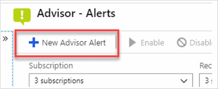

# Create Azure Advisor alerts on new recommendations by using the Azure portal

This article shows you how to set up an alert for new recommendations from Azure Advisor by using the Azure portal. 

Whenever Advisor detects a new recommendation for one of your resources, an event is stored in the [Azure activity log](../azure-monitor/essentials/platform-logs-overview.md). You can set up alerts for these events from Advisor by using a recommendation-specific alerts creation experience. You can select a subscription and optionally a resource group to specify the resources that you want to receive alerts on.

You can also determine the types of recommendations by using these properties:

* Category
* Impact level
* Recommendation type

You can also configure the action that takes place when an alert is triggered by:

* Selecting an existing action group.
* Creating a new action group.

To learn more about action groups, see [Create and manage action groups](../azure-monitor/alerts/action-groups.md).

> [!NOTE]
> Advisor alerts are currently only available for High Availability, Performance, and Cost recommendations. Security recommendations aren't supported.

## Create an alert rule

Follow these steps to create an alert rule.

1. In the [Azure portal](https://portal.azure.com), select **Advisor**.

    

1. In the **Monitoring** section on the left menu, select **Alerts**.

    

1. Select **New Advisor Alert**.

    

1. In the **Scope** section, select the subscription and optionally the resource group that you want to be alerted on.

    

1. In the condition section, select the method you want to use for configuring your alert. If you want to alert for all recommendations for a certain category or impact level, select **Category and impact level**. If you want to alert for all recommendations of a certain type, select **Recommendation type**.

    

1. Depending on the **Configured by** option that you select, you can specify the criteria. If you want all recommendations, leave the remaining fields blank.

    

1. In the action groups section, choose **Select existing** to use an action group that you already created or select **Create new** to set up a new [action group](../azure-monitor/alerts/action-groups.md).

    

1. In the alert details section, give your alert a name and short description. If you want your alert to be enabled, leave the **Enable rule upon creation** selection set to **Yes**. Then select the resource group to save your alert to. This setting won't affect the targeting scope of the recommendation.

    :::image type="content" source="./media/advisor-alerts/create8.png" alt-text="Screenshot that shows the alert details section.":::

## Configure recommendation alerts to use a webhook

This section shows you how to configure Advisor alerts to send recommendation data through webhooks to your existing systems.

You can set up alerts to be notified when you have a new Advisor recommendation on one of your resources. These alerts can notify you through email or text message. They can also be used to integrate with your existing systems through a webhook.

### Use the Advisor recommendation alert payload

If you want to integrate Advisor alerts into your own systems by using a webhook, you need to parse the JSON payload that's sent from the notification.

When you set up your action group for this alert, you select if you want to use the common alert schema. If you select the common alert schema, your payload looks like this example:

```json
{  
   "schemaId":"azureMonitorCommonAlertSchema",
   "data":{  
      "essentials":{  
         "alertId":"/subscriptions/<subid>/providers/Microsoft.AlertsManagement/alerts/<alerted>",
         "alertRule":"Webhhook-test",
         "severity":"Sev4",
         "signalType":"Activity Log",
         "monitorCondition":"Fired",
         "monitoringService":"Activity Log - Recommendation",
         "alertTargetIDs":[  
            "/subscriptions/<subid>/resourcegroups/<resource group name>/providers/microsoft.dbformariadb/servers/<resource name>"
         ],
         "originAlertId":"001d8b40-5d41-4310-afd7-d65c9d4428ed",
         "firedDateTime":"2019-07-17T23:00:57.3858656Z",
         "description":"A new recommendation is available.",
         "essentialsVersion":"1.0",
         "alertContextVersion":"1.0"
      },
      "alertContext":{  
         "channels":"Operation",
         "claims":"{\"http://schemas.xmlsoap.org/ws/2005/05/identity/claims/emailaddress\":\"Microsoft.Advisor\"}",
         "caller":"Microsoft.Advisor",
         "correlationId":"8554b847-2a72-48ef-9776-600aca3c3aab",
         "eventSource":"Recommendation",
         "eventTimestamp":"2019-07-17T22:28:54.1566942+00:00",
         "httpRequest":"{\"clientIpAddress\":\"0.0.0.0\"}",
         "eventDataId":"001d8b40-5d41-4310-afd7-d65c9d4428ed",
         "level":"Informational",
         "operationName":"Microsoft.Advisor/recommendations/available/action",
         "properties":{  
            "recommendationSchemaVersion":"1.0",
            "recommendationCategory":"Performance",
            "recommendationImpact":"Medium",
            "recommendationName":"Increase the MariaDB server vCores",
            "recommendationResourceLink":"https://portal.azure.com/#blade/Microsoft_Azure_Expert/RecommendationListBlade/source/ActivityLog/recommendationTypeId/a5f888e3-8cf4-4491-b2ba-b120e14eb7ce/resourceId/%2Fsubscriptions%<subscription id>%2FresourceGroups%2<resource group name>%2Fproviders%2FMicrosoft.DBforMariaDB%2Fservers%2F<resource name>",
            "recommendationType":"a5f888e3-8cf4-4491-b2ba-b120e14eb7ce"
         },
         "status":"Active",
         "subStatus":"",
         "submissionTimestamp":"2019-07-17T22:28:54.1566942+00:00"
      }
   }
}
  ```

If you don't use the common schema, your payload looks like the following example:

```json
{  
   "schemaId":"Microsoft.Insights/activityLogs",
   "data":{  
      "status":"Activated",
      "context":{  
         "activityLog":{  
            "channels":"Operation",
            "claims":"{\"http://schemas.xmlsoap.org/ws/2005/05/identity/claims/emailaddress\":\"Microsoft.Advisor\"}",
            "caller":"Microsoft.Advisor",
            "correlationId":"3ea7320f-c002-4062-adb8-96d3bd92a5f4",
            "description":"A new recommendation is available.",
            "eventSource":"Recommendation",
            "eventTimestamp":"2019-07-17T20:36:39.3966926+00:00",
            "httpRequest":"{\"clientIpAddress\":\"0.0.0.0\"}",
            "eventDataId":"a12b8e59-0b1d-4003-bfdc-3d8152922e59",
            "level":"Informational",
            "operationName":"Microsoft.Advisor/recommendations/available/action",
            "properties":{  
               "recommendationSchemaVersion":"1.0",
               "recommendationCategory":"Performance",
               "recommendationImpact":"Medium",
               "recommendationName":"Increase the MariaDB server vCores",
               "recommendationResourceLink":"https://portal.azure.com/#blade/Microsoft_Azure_Expert/RecommendationListBlade/source/ActivityLog/recommendationTypeId/a5f888e3-8cf4-4491-b2ba-b120e14eb7ce/resourceId/%2Fsubscriptions%2F<subscription id>%2FresourceGroups%2F<resource group name>%2Fproviders%2FMicrosoft.DBforMariaDB%2Fservers%2F<resource name>",
               "recommendationType":"a5f888e3-8cf4-4491-b2ba-b120e14eb7ce"
            },
            "resourceId":"/subscriptions/<subscription id>/resourcegroups/<resource group name>/providers/microsoft.dbformariadb/servers/<resource name>",
            "resourceGroupName":"<resource group name>",
            "resourceProviderName":"MICROSOFT.DBFORMARIADB",
            "status":"Active",
            "subStatus":"",
            "subscriptionId":"<subscription id>",
            "submissionTimestamp":"2019-07-17T20:36:39.3966926+00:00",
            "resourceType":"MICROSOFT.DBFORMARIADB/SERVERS"
         }
      },
      "properties":{  
 
      }
   }
}
```

In either schema, you can identify Advisor recommendation events by looking for `eventSource` is `Recommendation` and `operationName` is `Microsoft.Advisor/recommendations/available/action`.

Some of the other important fields that you might want to use are:

* `alertTargetIDs` (in the common schema) or `resourceId` (legacy schema)
* `recommendationType`
* `recommendationName`
* `recommendationCategory`
* `recommendationImpact`
* `recommendationResourceLink`

## Manage your alerts

From Advisor, you can edit, delete, or disable and enable your recommendations alerts.

1. In the [Azure portal](https://portal.azure.com), select **Advisor**.

    :::image type="content" source="./media/advisor-alerts/create1.png" alt-text="Screenshot that shows the Azure portal menu with Advisor selected.":::

1. In the **Monitoring** section on the left menu, select **Alerts**.

    :::image type="content" source="./media/advisor-alerts/create2.png" alt-text="Screenshot that shows the Azure portal menu with Alerts selected.":::

1. To edit an alert, select the alert name to open the alert and edit the fields you want to edit.

1. To delete, enable, or disable an alert, select the ellipse at the end of the row. Then select the action you want to take.

## Related content

- Get an [overview of activity log alerts](../azure-monitor/alerts/alerts-overview.md) and learn how to receive alerts.
- Learn more about [action groups](../azure-monitor/alerts/action-groups.md).
