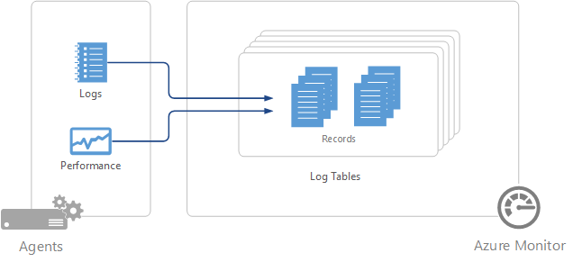
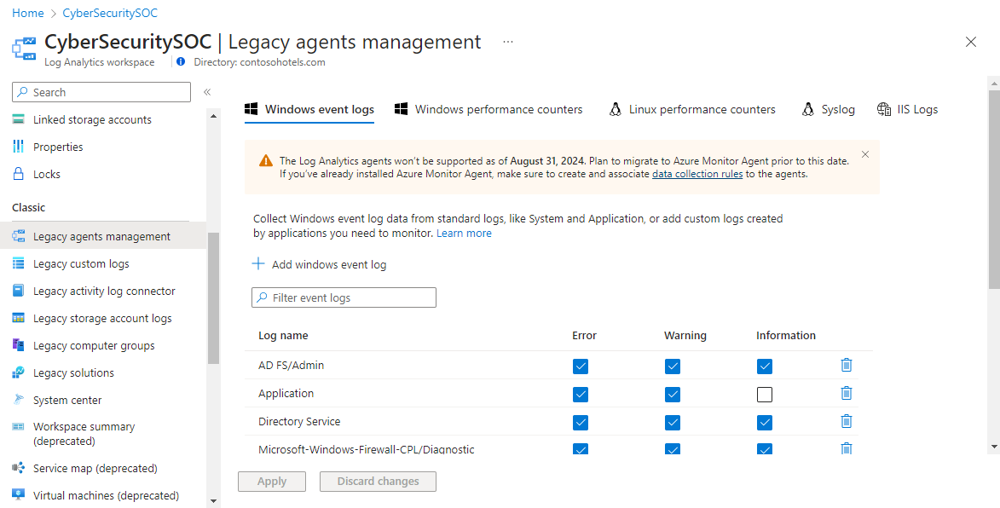

# Log Analytics agent data sources in Azure Monitor
The data that Azure Monitor collects from virtual machines with the legacy [Log Analytics](./log-analytics-agent.md) agent is defined by the data sources that you configure on the [Log Analytics workspace](../logs/data-platform-logs.md).   Each data source creates records of a particular type with each type having its own set of properties.

> [!IMPORTANT]
> This article only covers data sources for the legacy [Log Analytics agent](./log-analytics-agent.md) which is one of the agents used by Azure Monitor. This agent **will be deprecated by August, 2024**. Please plan to [migrate to Azure Monitor agent](./azure-monitor-agent-migration.md) before that. Other agents collect different data and are configured differently. See [Overview of Azure Monitor agents](agents-overview.md) for a list of the available agents and the data they can collect.

> [!IMPORTANT]
> The data sources described in this article apply only to virtual machines running the Log Analytics agent. 

## Summary of data sources
The following table lists the agent data sources that are currently available with the Log Analytics agent.  Each has a link to a separate article providing detail for that data source.   It also provides information on their method and frequency of collection. 

| Data source | Platform | Log analytics agent | Operations Manager agent | Azure storage | Operations Manager required? | Operations Manager agent data sent via management group | Collection frequency |
| --- | --- | --- | --- | --- | --- | --- | --- |
| [Custom logs](data-sources-custom-logs.md) | Windows |&#8226; |  | |  |  | on arrival |
| [Custom logs](data-sources-custom-logs.md) | Linux   |&#8226; |  | |  |  | on arrival |
| [IIS logs](data-sources-iis-logs.md) | Windows |&#8226; |&#8226; |&#8226; |  |  |depends on Log File Rollover setting |
| [Performance counters](data-sources-performance-counters.md) | Windows |&#8226; |&#8226; |  |  |  |as scheduled, minimum of 10 seconds |
| [Performance counters](data-sources-performance-counters.md) | Linux |&#8226; |  |  |  |  |as scheduled, minimum of 10 seconds |
| [Syslog](data-sources-syslog.md) | Linux |&#8226; |  |  |  |  |from Azure storage: 10 minutes; from agent: on arrival |
| [Windows Event logs](data-sources-windows-events.md) |Windows |&#8226; |&#8226; |&#8226; |  |&#8226; | on arrival |

## Configuring data sources
To configure data sources for Log Analytics agents, go to the **Log Analytics workspaces** menu in the Azure portal and select a workspace. Click on **Agents configuration**. Select the tab for the data source you want to configure. You can follow the links in the table above to documentation for each data source and details on their configuration.

Any configuration is delivered to all agents connected to that workspace.  You cannot exclude any connected agents from this configuration.

## Data collection
Data source configurations are delivered to agents that are directly connected to Azure Monitor within a few minutes.  The specified data is collected from the agent and delivered directly to Azure Monitor at intervals specific to each data source.  See the documentation for each data source for these specifics.

For System Center Operations Manager agents in a connected management group, data source configurations are translated into management packs and delivered to the management group every 5 minutes by default.  The agent downloads the management pack like any other and collects the specified data. Depending on the data source, the data will be either sent to a management server which forwards the data to the Azure Monitor, or the agent will send the data to Azure Monitor without going through the management server. See [Data collection details for monitoring solutions in Azure](../monitor-reference.md) for details.  You can read about details of connecting Operations Manager and Azure Monitor and modifying the frequency that configuration is delivered at [Configure Integration with System Center Operations Manager](./om-agents.md).

If the agent is unable to connect to Azure Monitor or Operations Manager, it will continue to collect data that it will deliver when it establishes a connection.  Data can be lost if the amount of data reaches the maximum cache size for the client, or if the agent is not able to establish a connection within 24 hours.

## Log records
All log data collected by Azure Monitor is stored in the workspace as records.  Records collected by different data sources will have their own set of properties and be identified by their **Type** property.  See the documentation for each data source and solution for details on each record type.

## Next steps
* Learn about [monitoring solutions](../insights/solutions.md) that add functionality to Azure Monitor and also collect data into the workspace.
* Learn about [log queries](../logs/log-query-overview.md) to analyze the data collected from data sources and monitoring solutions.  
* Configure [alerts](../alerts/alerts-overview.md) to proactively notify you of critical data collected from data sources and monitoring solutions.
