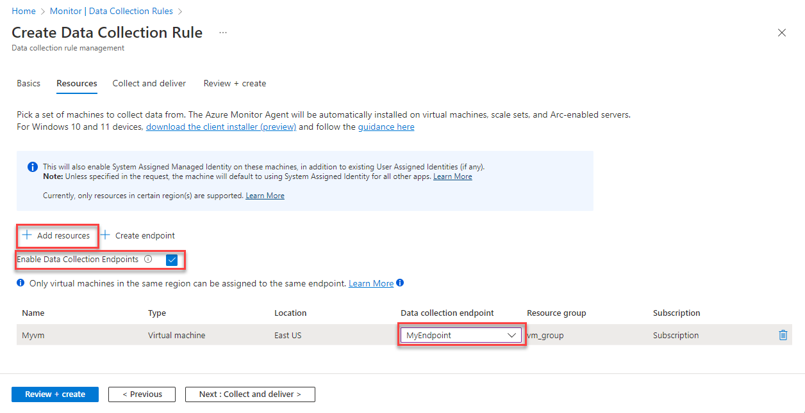
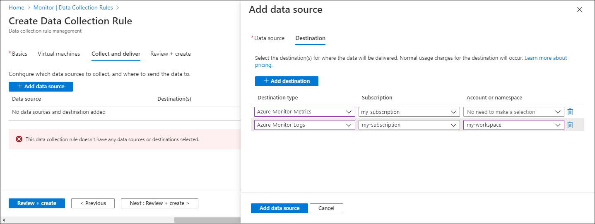
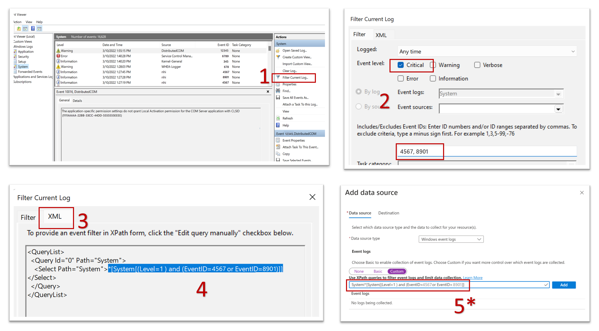

# Collect data from virtual machines with Azure Monitor Agent

This article describes how to collect events and performance counters from virtual machines by using Azure Monitor Agent.

To collect data from virtual machines by using Azure Monitor Agent, you'll:

1. Create [data collection rules (DCRs)](../essentials/data-collection-rule-overview.md) that define which data Azure Monitor Agent sends to which destinations.
1. Associate the data collection rule to specific virtual machines.

    You can associate virtual machines to multiple data collection rules. Define each data collection rule to address a particular requirement. Associate one or more data collection rules to a virtual machine based on the specific data you want the machine to collect.

## Create data collection rule and association

To send data to Log Analytics, create the data collection rule in the *same region* as your Log Analytics workspace. You can still associate the rule to machines in other supported regions.

### [Portal](#tab/portal)

1. On the **Monitor** menu, select **Data Collection Rules**.
1. Select **Create** to create a new data collection rule and associations.

    [  ](media/data-collection-rule-azure-monitor-agent/data-collection-rules-updated.png#lightbox)

1. Enter a **Rule name** and specify a **Subscription**, **Resource Group**, **Region**, and **Platform Type**:

    - **Region** specifies where the DCR will be created. The virtual machines and their associations can be in any subscription or resource group in the tenant.
    - **Platform Type** specifies the type of resources this rule can apply to. The **Custom** option allows for both Windows and Linux types.

    [  ](media/data-collection-rule-azure-monitor-agent/data-collection-rule-basics-updated.png#lightbox)

1. On the **Resources** tab, add the resources to which to associate the data collection rule. Resources can be virtual machines, virtual machine scale sets, and Azure Arc for servers. The Azure portal installs Azure Monitor Agent on resources that don't already have it installed. The portal also enables Azure Managed Identity.

    > [!IMPORTANT]
    > The portal enables system-assigned managed identity on the target resources, along with existing user-assigned identities, if there are any. For existing applications, unless you specify the user-assigned identity in the request, the machine defaults to using system-assigned identity instead.

    If you need network isolation using private links, select existing endpoints from the same region for the respective resources or [create a new endpoint](../essentials/data-collection-endpoint-overview.md).

    [  ](media/data-collection-rule-azure-monitor-agent/data-collection-rule-virtual-machines-with-endpoint.png#lightbox)

1. On the **Collect and deliver** tab, select **Add data source** to add a data source and set a destination.
1. Select a **Data source type**.
1. Select which data you want to collect. For performance counters, you can select from a predefined set of objects and their sampling rate. For events, you can select from a set of logs and severity levels.

    [  ](media/data-collection-rule-azure-monitor-agent/data-collection-rule-data-source-basic-updated.png#lightbox)

1. Select **Custom** to collect logs and performance counters that aren't [currently supported data sources](azure-monitor-agent-overview.md#data-sources-and-destinations) or to [filter events by using XPath queries](#filter-events-using-xpath-queries). You can then specify an [XPath](https://www.w3schools.com/xml/xpath_syntax.asp) to collect any specific values. For an example, see [Sample DCR](data-collection-rule-sample-agent.md).

    [  ](media/data-collection-rule-azure-monitor-agent/data-collection-rule-data-source-custom-updated.png#lightbox)

1. On the **Destination** tab, add one or more destinations for the data source. You can select multiple destinations of the same or different types. For instance, you can select multiple Log Analytics workspaces, which is also known as multihoming.

    You can send Windows event and Syslog data sources to Azure Monitor Logs only. You can send performance counters to both Azure Monitor Metrics and Azure Monitor Logs.

    [  ](media/data-collection-rule-azure-monitor-agent/data-collection-rule-destination.png#lightbox)

1. Select **Add data source** and then select **Review + create** to review the details of the data collection rule and association with the set of virtual machines.
1. Select **Create** to create the data collection rule.

> [!NOTE]
> It might take up to 5 minutes for data to be sent to the destinations after you create the data collection rule and associations.

### [API](#tab/api)

1. Create a DCR file by using the JSON format shown in [Sample DCR](data-collection-rule-sample-agent.md).

1. Create the rule by using the [REST API](/rest/api/monitor/datacollectionrules/create#examples).

1. Create an association for each virtual machine to the data collection rule by using the [REST API](/rest/api/monitor/datacollectionruleassociations/create#examples).

### [PowerShell](#tab/powershell)

**Data collection rules**

| Action | Command |
|:---|:---|
| Get rules | [Get-AzDataCollectionRule](/powershell/module/az.monitor/get-azdatacollectionrule?view=azps-5.4.0&preserve-view=true) |
| Create a rule | [New-AzDataCollectionRule](/powershell/module/az.monitor/new-azdatacollectionrule?view=azps-6.0.0&viewFallbackFrom=azps-5.4.0&preserve-view=true) |
| Update a rule | [Set-AzDataCollectionRule](/powershell/module/az.monitor/set-azdatacollectionrule?view=azps-6.0.0&viewFallbackFrom=azps-5.4.0&preserve-view=true) |
| Delete a rule | [Remove-AzDataCollectionRule](/powershell/module/az.monitor/remove-azdatacollectionrule?view=azps-6.0.0&viewFallbackFrom=azps-5.4.0&preserve-view=true) |
| Update "Tags" for a rule | [Update-AzDataCollectionRule](/powershell/module/az.monitor/update-azdatacollectionrule?view=azps-6.0.0&viewFallbackFrom=azps-5.4.0&preserve-view=true) |

**Data collection rule associations**

| Action | Command |
|:---|:---|
| Get associations | [Get-AzDataCollectionRuleAssociation](/powershell/module/az.monitor/get-azdatacollectionruleassociation?view=azps-6.0.0&viewFallbackFrom=azps-5.4.0&preserve-view=true) |
| Create an association | [New-AzDataCollectionRuleAssociation](/powershell/module/az.monitor/new-azdatacollectionruleassociation?view=azps-6.0.0&viewFallbackFrom=azps-5.4.0&preserve-view=true) |
| Delete an association | [Remove-AzDataCollectionRuleAssociation](/powershell/module/az.monitor/remove-azdatacollectionruleassociation?view=azps-6.0.0&viewFallbackFrom=azps-5.4.0&preserve-view=true) |

### [Azure CLI](#tab/cli)

This capability is enabled as part of the Azure CLI monitor-control-service extension. [View all commands](/cli/azure/monitor/data-collection/rule).

### [Resource Manager template](#tab/arm)

For sample templates, see [Azure Resource Manager template samples for data collection rules in Azure Monitor](./resource-manager-data-collection-rules.md).

---
## Filter events using XPath queries

You're charged for any data you collect in a Log Analytics workspace, so collect only the data you need. The basic configuration in the Azure portal provides you with a limited ability to filter out events. There are two methods that you can use to further filter event data from the agent. Both of these methods are specified in the data collection rule.

- [XPath queries](#xpath-queries) filter data collected from the agent before it's sent to Azure Monitor.
- [Transformations](#transformations) apply a KQL query to data sent from the agent that further filters or transforms the data before it's stored in the Log Analytics workspace.

:::image type="content" source="media/data-collection-rule-azure-monitor-agent/agent-filter-methods.png" alt-text="Diagram showing XPath query on agent sending filtered data to Azure Monitor where a transformation is applied and then transformed data sent to Log Analytics workspace." lightbox="media/data-collection-rule-azure-monitor-agent/agent-filter-methods.png":::


### XPath queries
Specify XPath queries in the **custom** configuration and specify an XPath that filters out the events you don't need. XPath entries are written in the form `LogName!XPathQuery`. For example, you might want to return only events from the Application event log with an event ID of 1035. The `XPathQuery` for these events would be `*[System[EventID=1035]]`. Because you want to retrieve the events from the Application event log, the XPath is `Application!*[System[EventID=1035]]`

One method to build XPath queries is using the Windows Event Viewer to extract XPath queries as shown in the screenshots below. When you paste the XPath query into the field on the **Add data source** screen, as shown in step 5, you must append the log type category followed by an exclamation point (!).

[  ](media/data-collection-rule-azure-monitor-agent/data-collection-rule-extract-xpath.png#lightbox)

For a list of limitations in the XPath supported by Windows event log, see [XPath 1.0 limitations](/windows/win32/wes/consuming-events#xpath-10-limitations).

> [!TIP]
> You can use the PowerShell cmdlet `Get-WinEvent` with the `FilterXPath` parameter to test the validity of an XPath query locally on your machine first. The following script shows an example:
>
> ```powershell
> $XPath = '*[System[EventID=1035]]'
> Get-WinEvent -LogName 'Application' -FilterXPath $XPath
> ```
>
> - In the preceding cmdlet, the value of the `-LogName` parameter is the initial part of the XPath query until the exclamation point (!). The rest of the XPath query goes into the `$XPath` parameter.
> - If the script returns events, the query is valid.
> - If you receive the message "No events were found that match the specified selection criteria," the query might be valid but there are no matching events on the local machine.
> - If you receive the message "The specified query is invalid," the query syntax is invalid.

Examples of using a custom XPath to filter events:

| Description |  XPath |
|:---|:---|
| Collect only System events with Event ID = 4648 |  `System!*[System[EventID=4648]]`
| Collect Security Log events with Event ID = 4648 and a process name of consent.exe | `Security!*[System[(EventID=4648)]] and *[EventData[Data[@Name='ProcessName']='C:\Windows\System32\consent.exe']]` |
| Collect all Critical, Error, Warning, and Information events from the System event log except for Event ID = 6 (Driver loaded) |  `System!*[System[(Level=1 or Level=2 or Level=3) and (EventID != 6)]]` |
| Collect all success and failure Security events except for Event ID 4624 (Successful logon) |  `Security!*[System[(band(Keywords,13510798882111488)) and (EventID != 4624)]]` |


### Transformations
Use transformations when you need more granular criteria than you can define in an XPath query, or when you want to reduce data size by removing columns that you don't need. [Transformations](../essentials/data-collection-transformations.md) in Azure Monitor allow you to filter or modify incoming data before it's sent to a Log Analytics workspace. Transformations use a [Kusto Query Language (KQL) statement](../essentials/data-collection-transformations-structure.md) that is applied individually to each entry in the incoming data. Because of the flexibility of KQL queries, you can use complex criteria to both filter records and individual columns from the incoming data.

You can't currently define a transformation for the Azure Monitor agent in the Azure portal. You must manually edit the DCR to add the transformation. Use the following procedure to add a transformation to a data collection rule.

1. Use the process described above to create a data collection rule that collects events. Wait several minutes for the DCR to deploy and collect some events that you can use to test your transformation query.

2. Use [Log Analytics](../logs/log-analytics-overview.md) to create and test the query. This will typically use the [Event](/azure/azure-monitor/reference/tables/event) or [Syslog](/azure/azure-monitor/reference/tables/syslog) table which is where Azure Monitor agent sends data collected from the client machine. The below example shows a query that uses the `Event` table and filters records based on a particular string in the `RenderedDescription` column and removes three columns.

    :::image type="content" source="media/data-collection-rule-azure-monitor-agent/transformation-log-analytics.png" alt-text="Screenshot of Log Analytics with transformation query." lightbox="media/data-collection-rule-azure-monitor-agent/transformation-log-analytics.png":::

3. Replace the table name in the query with `source`. You can't run this query in Log Analytics since this isn't the name od a table in the Log Analytics workspace. When the query is run in the transformation though, `source` is used in place of the table name.

4. Use the process at [Editing Data Collection Rules](../essentials/data-collection-rule-edit.md) to edit the DCR. Copy and paste the log query into the DCR before applying the changes. The query is used in the `transformKQL` entry which should be added to the `dataFlows` section as shown in the following sample code snippet. 


    ```json
    "dataFlows": [
      {
        "streams": [
          "Microsoft-InsightsMetrics"
        ],
        "destinations": [
          "azureMonitorMetrics-default"
        ]
      },
      {
        "streams": [
          "Microsoft-Event"
        ],
        "destinations": [
          "la-2147195954"
        ],
        "transformKql": "source | where RenderedDescription contains \"success\" | project-away TenantId, ManagementGroupName, Type"
      }
    ],
    "provisioningState": "Succeeded"
    ```


## Next steps

- [Collect text logs by using Azure Monitor Agent](data-collection-text-log.md).
- Learn more about [Azure Monitor Agent](azure-monitor-agent-overview.md).
- Learn more about [data collection rules](../essentials/data-collection-rule-overview.md).
