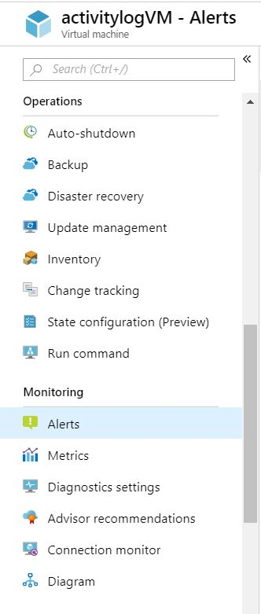

# Manage alert instances with unified alerts

With the [unified alerts experience](./alerts-overview.md) in Azure Monitor, you can see all your different types of alerts across Azure. Unified alerts span multiple subscriptions in a single pane. This article shows how you can view your alert instances, and how to find specific alert instances for troubleshooting.

> [!NOTE]
> You can only access alerts generated in the last 30 days.

## Go to the alerts page

You can go to the alerts page in any of the following ways:

- In the [Azure portal](https://portal.azure.com/), select **Monitor** > **Alerts**.  

     
  
- Use the context of a specific resource. Open a resource, go to the **Monitoring** section, and choose **Alerts**. The landing page is pre-filtered for alerts on that specific resource.

     

## The alerts page

The **Alerts** page summarizes all your alert instances across Azure.
### Alert Recommendations (preview)
If you don't have any alerts defined for the selected resource, you can [create a new alert rule](alerts-log.md#create-a-new-log-alert-rule-in-the-azure-portal), or [enable our recommended out-of-the-box alert rules](alerts-log.md#enable-our-recommended-alert-rules-in-the-azure-portal-preview). 

:::image type="content" source="media/alerts-managing-alert-instances/enable-recommended-alert-rules.jpg" alt-text="Screenshot of alerts page with link to recommended alert rules.":::
### Alerts summary
In the alerts summary pane, you can modify the list of alert instances by selecting filters such as **time range**, **subscription**, **alert condition**, **severity**, and more. Select an alert instance.

To see more details about a specific alert instance, select the alerts instance to open the **Alert Details** page. 
> [!NOTE]
> If you navigated to the alerts page by selecting a specific alert severity, the list is pre-filtered for that severity.   

:::image type="content" source="media/alerts-managing-alert-instances/alerts-page.png" alt-text="Screenshot of alerts page.":::
 
## The alerts details page
 The **Alerts details** page provides details about the selected alert. Select **Change user response** to change the user response to the alert. You can see all closed alerts in the **History** tab.  

:::image type="content" source="media/alerts-managing-alert-instances/alerts-details-page.png" alt-text="Screenshot of alerts details page.":::
