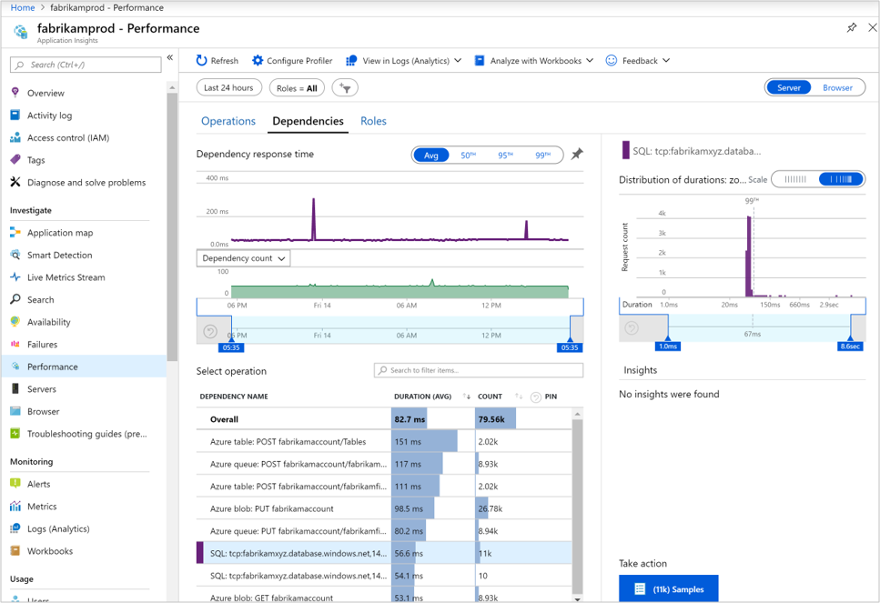
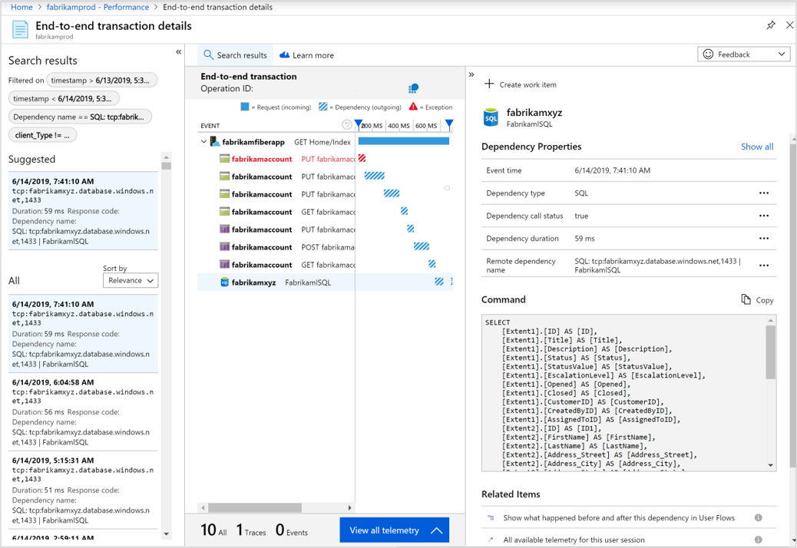
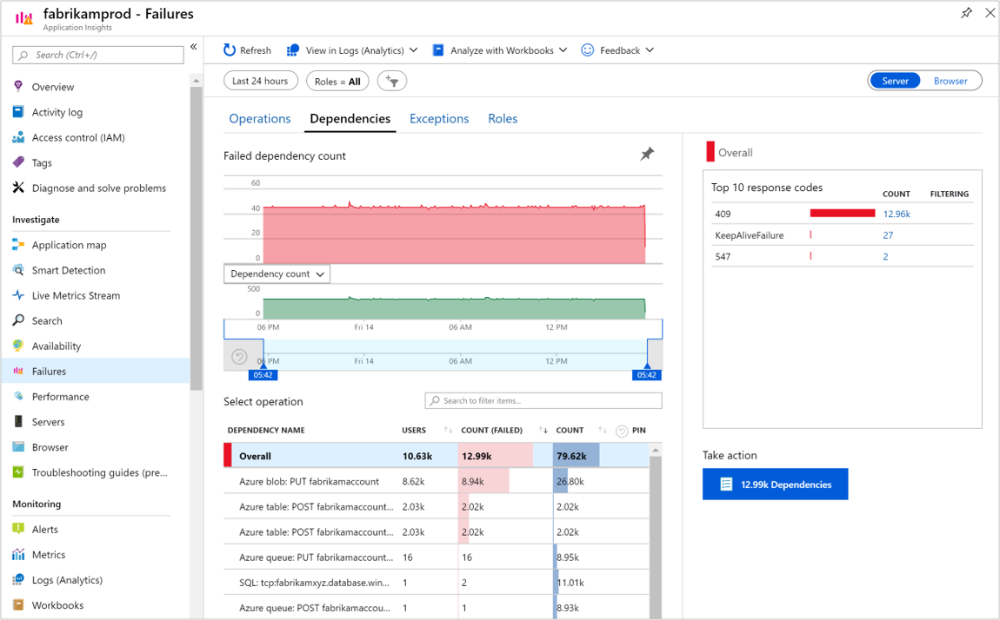

# Dependency Tracking in Azure Application Insights 

A *dependency* is a component that is called by your application. It's typically a service called using HTTP, or a database, or a file system. [Application Insights](./app-insights-overview.md) measures the duration of dependency calls, whether its failing or not, along with additional information like name of dependency and so on. You can investigate specific dependency calls, and correlate them to requests and exceptions.

## Automatically tracked dependencies

Application Insights SDKs for .NET and .NET Core ships with `DependencyTrackingTelemetryModule`, which is a Telemetry Module that automatically collects dependencies. This dependency collection is enabled automatically for [ASP.NET](./asp-net.md) and [ASP.NET Core](./asp-net-core.md) applications, when configured as per the linked official docs. `DependencyTrackingTelemetryModule` is shipped as [this](https://www.nuget.org/packages/Microsoft.ApplicationInsights.DependencyCollector/) NuGet package, and is brought automatically when using either of the NuGet packages `Microsoft.ApplicationInsights.Web` or `Microsoft.ApplicationInsights.AspNetCore`.

 `DependencyTrackingTelemetryModule` currently tracks the following dependencies automatically:

|Dependencies |Details|
|---------------|-------|
|Http/Https | Local or Remote http/https calls |
|WCF calls| Only tracked automatically if Http-based bindings are used.|
|SQL | Calls made with `SqlClient`. See [this](#advanced-sql-tracking-to-get-full-sql-query) for capturing SQL query.  |
|[Azure storage (Blob, Table, Queue )](https://www.nuget.org/packages/WindowsAzure.Storage/) | Calls made with Azure Storage Client. |
|[EventHub Client SDK](https://nuget.org/packages/Azure.Messaging.EventHubs) | Use the latest package. https://nuget.org/packages/Azure.Messaging.EventHubs |
|[ServiceBus Client SDK](https://nuget.org/packages/Azure.Messaging.ServiceBus)| Use the latest package. https://nuget.org/packages/Azure.Messaging.ServiceBus |
|Azure Cosmos DB | Only tracked automatically if HTTP/HTTPS is used. TCP mode won't be captured by Application Insights. |

If you're missing a dependency, or using a different SDK make sure it's in the list of [auto-collected dependencies](./auto-collect-dependencies.md). If the dependency isn't auto-collected, you can still track it manually with a [track dependency call](./api-custom-events-metrics.md#trackdependency).

## Setup automatic dependency tracking in Console Apps

To automatically track dependencies from .NET console apps, install the NuGet package `Microsoft.ApplicationInsights.DependencyCollector`, and initialize `DependencyTrackingTelemetryModule` as follows:

```csharp
    DependencyTrackingTelemetryModule depModule = new DependencyTrackingTelemetryModule();
    depModule.Initialize(TelemetryConfiguration.Active);
```

For .NET Core console apps TelemetryConfiguration.Active is obsolete. Refer to the guidance in the [worker service documentation](./worker-service.md) and the [ASP.NET Core monitoring documentation](./asp-net-core.md)

### How automatic dependency monitoring works?

Dependencies are automatically collected by using one of the following techniques:

* Using byte code instrumentation around select methods. (InstrumentationEngine either from StatusMonitor or Azure Web App Extension)
* EventSource callbacks
* DiagnosticSource callbacks (in the latest .NET/.NET Core SDKs)

## Manually tracking dependencies

The following are some examples of dependencies, which aren't automatically collected, and hence require manual tracking.

* Azure Cosmos DB is tracked automatically only if [HTTP/HTTPS](../../cosmos-db/performance-tips.md#networking) is used. TCP mode won't be captured by Application Insights.
* Redis

For those dependencies not automatically collected by SDK, you can track them manually using the [TrackDependency API](api-custom-events-metrics.md#trackdependency) that is used by the standard auto collection modules.

For example, if you build your code with an assembly that you didn't write yourself, you could time all the calls to it, to find out what contribution it makes to your response times. To have this data displayed in the dependency charts in Application Insights, send it using `TrackDependency`.

```csharp

    var startTime = DateTime.UtcNow;
    var timer = System.Diagnostics.Stopwatch.StartNew();
    try
    {
        // making dependency call
        success = dependency.Call();
    }
    finally
    {
        timer.Stop();
        telemetryClient.TrackDependency("myDependencyType", "myDependencyCall", "myDependencyData",  startTime, timer.Elapsed, success);
    }
```

Alternatively, `TelemetryClient` provides extension methods `StartOperation` and `StopOperation` which can be used to manually track dependencies, as shown [here](custom-operations-tracking.md#outgoing-dependencies-tracking)

If you want to switch off the standard dependency tracking module, remove the reference to DependencyTrackingTelemetryModule in [ApplicationInsights.config](../../azure-monitor/app/configuration-with-applicationinsights-config.md) for ASP.NET applications. For ASP.NET Core applications, follow instructions [here](asp-net-core.md#configuring-or-removing-default-telemetrymodules).

## Tracking AJAX calls from Web Pages

For web pages, Application Insights JavaScript SDK automatically collects AJAX calls as dependencies.

## Advanced SQL tracking to get full SQL Query

> [!NOTE]
> Azure Functions requires separate settings to enable SQL text collection: within  [host.json](../../azure-functions/functions-host-json.md#applicationinsights) set `"EnableDependencyTracking": true,` and `"DependencyTrackingOptions": { "enableSqlCommandTextInstrumentation": true }` in `applicationInsights`.

For SQL calls, the name of the server and database is always collected and stored as name of the collected `DependencyTelemetry`. There's an additional field called 'data', which can contain the full SQL query text.

For ASP.NET Core applications, It is now required to opt-in to SQL Text collection by using
```csharp
services.ConfigureTelemetryModule<DependencyTrackingTelemetryModule>((module, o) => { module. EnableSqlCommandTextInstrumentation = true; });
```

For ASP.NET applications, full SQL query text is collected with the help of byte code instrumentation, which requires using the instrumentation engine or by using the [Microsoft.Data.SqlClient](https://www.nuget.org/packages/Microsoft.Data.SqlClient) NuGet package instead of the System.Data.SqlClient library. Platform specific steps to enable full SQL Query collection are described below:

| Platform | Step(s) Needed to get full SQL Query |
| --- | --- |
| Azure Web App |In your web app control panel, [open the Application Insights blade](../../azure-monitor/app/azure-web-apps.md) and enable SQL Commands under .NET |
| IIS Server (Azure VM, on-prem, and so on.) | Either use the [Microsoft.Data.SqlClient](https://www.nuget.org/packages/Microsoft.Data.SqlClient) NuGet package or use the Status Monitor PowerShell Module to [install the Instrumentation Engine](../../azure-monitor/app/status-monitor-v2-api-reference.md#enable-instrumentationengine) and restart IIS. |
| Azure Cloud Service | Add [startup task to install StatusMonitor](../../azure-monitor/app/cloudservices.md#set-up-status-monitor-to-collect-full-sql-queries-optional) <br> Your app should be onboarded to ApplicationInsights SDK at build time by installing NuGet packages for [ASP.NET](./asp-net.md) or [ASP.NET Core applications](./asp-net-core.md) |
| IIS Express | Use the [Microsoft.Data.SqlClient](https://www.nuget.org/packages/Microsoft.Data.SqlClient) NuGet package.
| Azure Web Jobs | Use the [Microsoft.Data.SqlClient](https://www.nuget.org/packages/Microsoft.Data.SqlClient) NuGet package.

In addition to the platform specific steps above, you **must also explicitly opt-in to enable SQL command collection** by modifying the applicationInsights.config file with the following:

```xml
<TelemetryModules>
  <Add Type="Microsoft.ApplicationInsights.DependencyCollector.DependencyTrackingTelemetryModule, Microsoft.AI.DependencyCollector">
    <EnableSqlCommandTextInstrumentation>true</EnableSqlCommandTextInstrumentation>
  </Add>
```

In the above cases, the correct way of validating that instrumentation engine is correctly installed is by validating that the SDK version of collected `DependencyTelemetry` is 'rddp'. 'rdddsd' or 'rddf' indicates dependencies are collected via DiagnosticSource or EventSource callbacks, and hence full SQL query won't be captured.

## Where to find dependency data

* [Application Map](app-map.md) visualizes dependencies between your app and neighboring components.
* [Transaction Diagnostics](transaction-diagnostics.md) shows unified, correlated server data.
* [Browsers tab](javascript.md) shows AJAX calls from your users' browsers.
* Click through from slow or failed requests to check their dependency calls.
* [Analytics](#logs-analytics) can be used to query dependency data.

## <a name="diagnosis"></a> Diagnose slow requests

Each request event is associated with the dependency calls, exceptions, and other events that are tracked while your app is processing the request. So if some requests are doing badly, you can find out whether it's because of slow responses from a dependency.

### Tracing from requests to dependencies

Open the **Performance** tab and navigate to the **Dependencies** tab at the top next to operations.

Click on a **Dependency Name** under overall. After you select a dependency a graph of that dependency's distribution of durations will show up on the right.



Click on the blue **Samples** button on the bottom right and then on a sample to see the end-to-end transaction details.



### Profile your live site

No idea where the time goes? The [Application Insights profiler](../../azure-monitor/app/profiler.md) traces HTTP calls to your live site and shows you the functions in your code that took the longest time.

## Failed requests

Failed requests might also be associated with failed calls to dependencies.

We can go to the **Failures** tab on the left and then click on the **dependencies** tab at the top.



Here you will be able to see the failed dependency count. To get more details about a failed occurrence trying clicking on a dependency name in the bottom table. You can click on the blue **Dependencies** button at the bottom right to get the end-to-end transaction details.

## Logs (Analytics)

You can track dependencies in the [Kusto query language](/azure/kusto/query/). Here are some examples.

* Find any failed dependency calls:

``` Kusto

    dependencies | where success != "True" | take 10
```

* Find AJAX calls:

``` Kusto

    dependencies | where client_Type == "Browser" | take 10
```

* Find dependency calls associated with requests:

``` Kusto

    dependencies
    | where timestamp > ago(1d) and  client_Type != "Browser"
    | join (requests | where timestamp > ago(1d))
      on operation_Id  
```


* Find AJAX calls associated with page views:

``` Kusto 

    dependencies
    | where timestamp > ago(1d) and  client_Type == "Browser"
    | join (browserTimings | where timestamp > ago(1d))
      on operation_Id
```

## Frequently asked questions

### *How does automatic dependency collector report failed calls to dependencies?*

* Failed dependency calls will have 'success' field set to False. `DependencyTrackingTelemetryModule` does not report `ExceptionTelemetry`. The full data model for dependency is described [here](data-model-dependency-telemetry.md).

### *How do I calculate ingestion latency for my dependency telemetry?*

```kusto
dependencies
| extend E2EIngestionLatency = ingestion_time() - timestamp 
| extend TimeIngested = ingestion_time()
```

### *How do I determine the time the dependency call was initiated?*

In the Log Analytics query view `timestamp` represents the moment the TrackDependency() call was initiated which occurs immediately after the dependency call response is received. To calculate the time when the dependency call began, you would take `timestamp` and subtract the recorded `duration` of the dependency call.

## Open-source SDK
Like every Application Insights SDK, dependency collection module is also open-source. Read and contribute to the code, or report issues at [the official GitHub repo](https://github.com/Microsoft/ApplicationInsights-dotnet).

## Next steps

* [Exceptions](./asp-net-exceptions.md)
* [User & page data](./javascript.md)
* [Availability](./monitor-web-app-availability.md)

