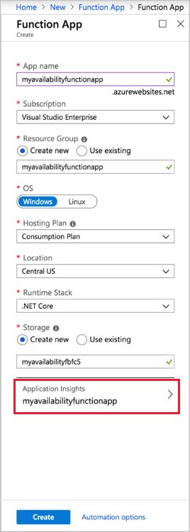
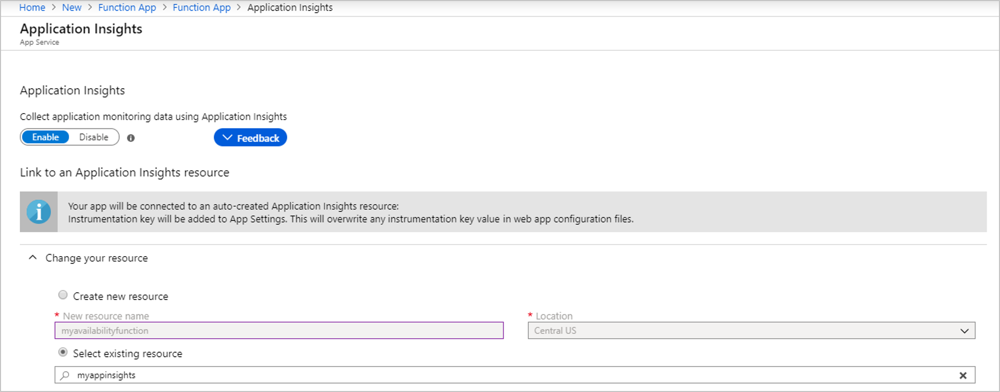
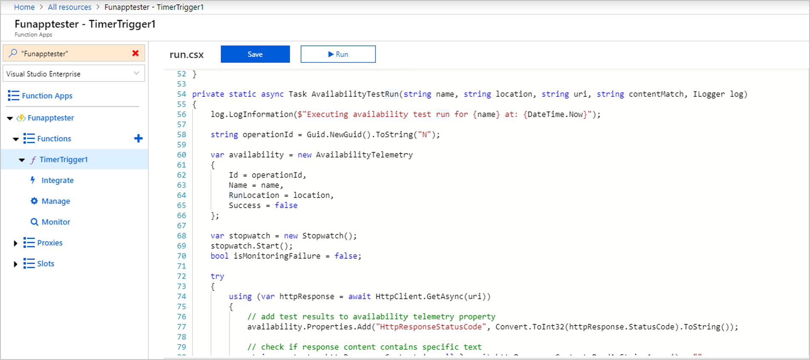

# Availability with Azure Functions

This doc will cover how to create an Azure Function that will run periodically according to the configuration given in TimerTrigger. The results of this test will be sent to your Application Insight resource, where you will be able to query for the alert on the availability results data.

## Create Timer triggered function

- If you do not have an Application Insights Resource created yet for your timer triggered function:
    - By default when you are creating your Azure Functions application it will create an Application Insights resource for you.
    - Follow the instructions on how to [create an Azure Functions resource and Timer triggered function](https://docs.microsoft.com/azure/azure-functions/functions-create-scheduled-function) (stop before clean-up).

- If you have an Application Insights Resource:
    - By default Azure Functions creates an Application Insights resource but if you would like to use one of your already created resources you will need to specify that during creation.
    - Follow the instructions on how to [create an Azure Functions resource and Timer triggered function](https://docs.microsoft.com/azure/azure-functions/functions-create-scheduled-function) with the following chances.
        -  Click the Application Insights section before selecting **Create**.

            

        - Click **Select existing resource** and type the name of your resource. Select **Apply**

            

        - Select **Create**

## Sample Code

Copy the code below into the run.csx. To do this, go into your Azure functions application and select your timer trigger function on the left.



> [!NOTE]
> For the Endpoint Address you can use: [Endpoint Address for Azure Government](https://docs.microsoft.com/en-us/azure/azure-government/documentation-government-services-monitoringandmanagement#application-insights),the default Application Insights ```EndpointAddress= https://dc.services.visualstudio.com/v2/track```, or your own custom endpoint.

```C#
using System;
using System.Diagnostics;
using System.Net.Http;
using System.Threading.Tasks;
using Microsoft.ApplicationInsights;
using Microsoft.ApplicationInsights.DataContracts;
using Microsoft.ApplicationInsights.Extensibility;
using Microsoft.ApplicationInsights.WindowsServer.TelemetryChannel;
using Microsoft.Azure.WebJobs;
using Microsoft.Azure.WebJobs.Host;
using Microsoft.Extensions.Logging;

// [CONFIGURATION_REQUIRED] configure test timeout accordingly for which your request should run
private static readonly HttpClient HttpClient = new HttpClient { Timeout = TimeSpan.FromSeconds(30) };

// The Application Insights Instrumentation Key can be change by going the overview page of your Function App, selecting configuration, and changing the value of APPINSIGHTS_INSTRUMENTATIONKEY
private static readonly string InstrumentationKey = Environment.GetEnvironmentVariable("APPINSIGHTS_INSTRUMENTATIONKEY");

// [CONFIGURATION_REQUIRED] Configure EndpointAddress
private static readonly TelemetryConfiguration TelemetryConfiguration = new TelemetryConfiguration(InstrumentationKey, new ServerTelemetryChannel() { EndpointAddress = "<EndpointAddress>" });
private static readonly TelemetryClient TelemetryClient = new TelemetryClient(TelemetryConfiguration);

[FunctionName("Function")]
public static async void Run([TimerTrigger("0 */5 * * * *")]TimerInfo myTimer, ILogger log)
{
    log.LogInformation($"Entering Run at: {DateTime.Now}");

    if (myTimer.IsPastDue)
    {
        log.LogWarning($"[Warning]: Timer is running late! Last ran at: {myTimer.ScheduleStatus.Last}");
    }

    // [CONFIGURATION_REQUIRED] provide {testName} accordingly for your test function
    string testName = "AvailabilityTestFunction";

    // REGION_NAME is a default environment variable that comes with App Service
    string location = Environment.GetEnvironmentVariable("REGION_NAME");

    // [CONFIGURATION_REQUIRED] configure {uri} and {contentMatch} accordingly for your web app. {uri} is the website that you are testing the availability of. If {contentMatch} is present on the page, the test will succeed, otherwise it will fail.  
    await AvailabilityTestRun(
        name: testName,
        location: location,
        uri: "<http://example.com>",
        contentMatch: "Application Insights",
        log: log
    );
}

private static async Task AvailabilityTestRun(string name, string location, string uri, string contentMatch, ILogger log)
{
    log.LogInformation($"Executing availability test run for {name} at: {DateTime.Now}");

    string operationId = Guid.NewGuid().ToString("N");

    var availability = new AvailabilityTelemetry
    {
        Id = operationId,
        Name = name,
        RunLocation = location,
        Success = false
    };

    var stopwatch = new Stopwatch();
    stopwatch.Start();
    bool isMonitoringFailure = false;

    try
    {
        using (var httpResponse = await HttpClient.GetAsync(uri))
        {
            // add test results to availability telemetry property
            availability.Properties.Add("HttpResponseStatusCode", Convert.ToInt32(httpResponse.StatusCode).ToString());

            // check if response content contains specific text
            string content = httpResponse.Content != null ? await httpResponse.Content.ReadAsStringAsync() : "";
            if (httpResponse.IsSuccessStatusCode && content.Contains(contentMatch))
            {
                availability.Success = true;
                availability.Message = $"Test succeeded with response: {httpResponse.StatusCode}";
                log.LogTrace($"[Verbose]: {availability.Message}");
            }
            else if (!httpResponse.IsSuccessStatusCode)
            {
                availability.Message = $"Test failed with response: {httpResponse.StatusCode}";
                log.LogWarning($"[Warning]: {availability.Message}");
            }
            else
            {
                availability.Message = $"Test content does not contain: {contentMatch}";
                log.LogWarning($"[Warning]: {availability.Message}");
            }
        }
    }
    catch (TaskCanceledException e)
    {
        availability.Message = $"Test timed out: {e.Message}";
        log.LogWarning($"[Warning]: {availability.Message}");
    }
    catch (Exception ex)
    {
        // track exception when unable to determine the state of web app
        isMonitoringFailure = true;
        var exceptionTelemetry = new ExceptionTelemetry(ex);
        exceptionTelemetry.Context.Operation.Id = operationId;
        exceptionTelemetry.Properties.Add("TestName", name);
        exceptionTelemetry.Properties.Add("TestLocation", location);
        exceptionTelemetry.Properties.Add("TestUri", uri);
        TelemetryClient.TrackException(exceptionTelemetry);
        log.LogError($"[Error]: {ex.Message}");

        // optional - throw to fail the function
        throw;
    }
    finally
    {
        stopwatch.Stop();
        availability.Duration = stopwatch.Elapsed;
        availability.Timestamp = DateTimeOffset.UtcNow;

        // do not make assumption for the state of web app when is monitoring failure
        if (!isMonitoringFailure)
        {
            TelemetryClient.TrackAvailability(availability);
            log.LogInformation($"Availability telemetry for {name} is sent.");
        }

        // call flush to ensure telemetries are sent
        TelemetryClient.Flush();
    }
}
```

On the right under view files, select **Add**. Call the new file **function.proj** with the following configuration.

```C#
<Project Sdk="Microsoft.NET.Sdk">
    <PropertyGroup>
        <TargetFramework>netstandard2.0</TargetFramework>
    </PropertyGroup>
    <ItemGroup>
        <PackageReference Include="Microsoft.ApplicationInsights.AspNetCore" Version="2.6.1" />
    </ItemGroup>
</Project>

```


## Next Steps