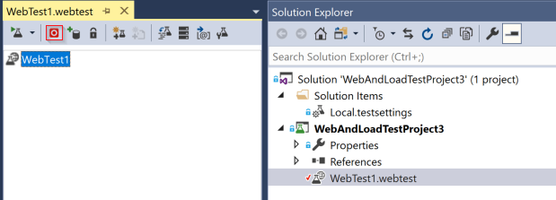
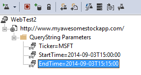
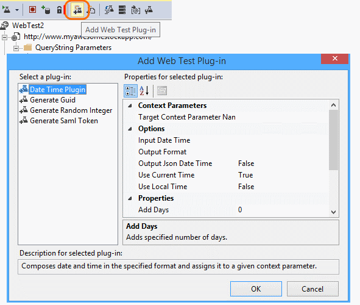

# Multi-step web tests

You can monitor a recorded sequence of URLs and interactions with a website via multi-step web tests. This article will walk you through the process of creating a multi-step web test with Visual Studio Enterprise.

> [!NOTE]
> Multi-step web tests have additional costs associated with them. To learn more consult the [official pricing guide](https://azure.microsoft.com/pricing/details/application-insights/).

## Pre-requisites

    * Visual Studio 2017 Enterprise or greater.
    * Visual Studio web performance and load testing tools.

To locate the testing tools pre-requisite. Launch the **Visual Studio Installer** > **Individual components** > **Debugging and testing** > **Web performance and load testing tools**.

## Record a multi-step web test

To create a multi-step test, you record the scenario by using Visual Studio Enterprise, and then upload the recording to Application Insights. Application Insights replays the scenario at set intervals and verifies the response.

> [!IMPORTANT]
> * You can't use coded functions or loops in your tests. The test must be contained completely in the .webtest script. However, you can use standard plugins.
> * Only English characters are supported in the multi-step web tests. If you use Visual Studio in other languages, please update the web test definition file to translate/exclude non-English characters.

Use Visual Studio Enterprise to record a web session.

1. Create a Web performance and Load Test Project. **File** > **New** > **Project** > **Visual C#** > **Test**

    

2. Open the `.webtest` file and start recording.

    

3. Click through the steps you want your test to simulate as part of the recording.

    

4. Edit the test to:

    * Add validations to check the received text and response codes.
    * Remove any uneccesary interactions. You could also remove dependent requests for pictures or add tracking sites which aren't relevant to you considering your test a success.
    
    Keep in mind that you can only edit the test script - you can add custom code or call other web tests. Don't insert loops in the test. You can use standard web test plug-ins.

5. Run the test in Visual Studio to validate and make sure it works.

    The web test runner opens a web browser and repeats the actions you recorded. Make sure everything behaves as expected.

## Upload the web test

1. In the Application Insights portal on the Availability pane select **Create Test** > **Test type** > **Multi-step web test**.

2. Set the test locations, frequency, and alert parameters.

### Frequency & location

|Setting| Explanation
|----|----|----|
|**Test frequency**| Sets how often the test is run from each test location. With a default frequency of five minutes and five test locations, your site is tested on average every minute.|
|**Test locations**| Are the places from where our servers send web requests to your URL. **Our minimum number of recommended test locations is five** in order to insure that you can distinguish problems in your website from network issues. You can select up to 16 locations.

### Success criteria

|Setting| Explanation
|----|----|----|
| **Test timeout** |Decrease this value to be alerted about slow responses. The test is counted as a failure if the responses from your site have not been received within this period. If you selected **Parse dependent requests**, then all the images, style files, scripts, and other dependent resources must have been received within this period.|
| **HTTP response** | The returned status code that is counted as a success. 200 is the code that indicates that a normal web page has been returned.|
| **Content match** | A string, like "Welcome!" We test that an exact case-sensitive match occurs in every response. It must be a plain string, without wildcards. Don't forget that if your page content changes you might have to update it. **Only English characters are supported with content match** |

### Alerts

|Setting| Explanation
|----|----|----|
|**Near-realtime (Preview)** | We recommend using Near-realtime alerts. Configuring this type of alert is done after your availability test is created.  |
|**Classic** | We no longer recommended using classic alerts for new availability tests.|
|**Alert location threshold**|We recommend a minimum of 3/5 locations. The optimal relationship between alert location threshold and the number of test locations is **alert location threshold** = **number of test locations - 2, with a minimum of five test locations.**|

## Advanced Configuration

### Plugging time and random numbers into your test

Suppose you're testing a tool that gets time-dependent data such as stocks from an external feed. When you record your web test, you have to use specific times, but you set them as parameters of the test, StartTime and EndTime.

When you run the test, you'd like EndTime always to be the present time, and StartTime should be 15 minutes ago.

The Web Test Date Time Plugin provides the way to handle parameterize times.

1. Add a web test plug-in for each variable parameter value you want. In the web test toolbar, choose **Add Web Test Plugin**.
    
    
    
    In this example, we use two instances of the Date Time Plug-in. One instance is for "15 minutes ago" and another for "now."

2. Open the properties of each plug-in. Give it a name and set it to use the current time. For one of them, set Add Minutes = -15.

    

3. In the web test parameters, use {{plug-in name}} to reference a plug-in name.

    

Now, upload your test to the portal. It will use the dynamic values on every run of the test.

### Dealing with sign-in

If your users sign in to your app, you have various options for simulating sign-in so that you can test pages behind the sign-in. The approach you use depends on the type of security provided by the app.

In all cases, you should create an account in your application just for the purpose of testing. If possible, restrict the permissions of this test account so that there's no possibility of the web tests affecting real users.

**Simple username and password**
Record a web test in the usual way. Delete cookies first.

**SAML authentication**
Use the SAML plugin that is available for web tests. Access the plugin by...

**Client secret**
If your app has a sign-in route that involves a client secret, use that route. Azure Active Directory (AAD) is an example of a service that provides a client secret sign-in. In AAD, the client secret is the App Key.

Here's a sample web test of an Azure web app using an app key:

Get token from AAD using client secret (AppKey).
Extract bearer token from response.
Call API using bearer token in the authorization header.
Make sure that the web test is an actual client - that is, it has its own app in AAD - and use its clientId + app key. Your service under test also has its own app in AAD: the appID URI of this app is reflected in the web test in the resource field.

### Open Authentication
An example of open authentication is signing in with your Microsoft or Google account. Many apps that use OAuth provide the client secret alternative, so your first tactic should be to investigate that possibility.

If your test must sign in using OAuth, the general approach is:

Use a tool such as Fiddler to examine the traffic between your web browser, the authentication site, and your app.
Perform two or more sign-ins using different machines or browsers, or at long intervals (to allow tokens to expire).
By comparing different sessions, identify the token passed back from the authenticating site, that is then passed to your app server after sign-in.
Record a web test using Visual Studio.
Parameterize the tokens, setting the parameter when the token is returned from the authenticator, and using it in the query to the site. (Visual Studio attempts to parameterize the test, but does not correctly parameterize the tokens.)

## Troubleshooting

Dedicated [troubleshooting article](availability-troubleshooting.md).

## Next steps

* [Availability Alerts](availability-alerts.md)
* [Url ping web tests](monitor-web-app-availability.md)
