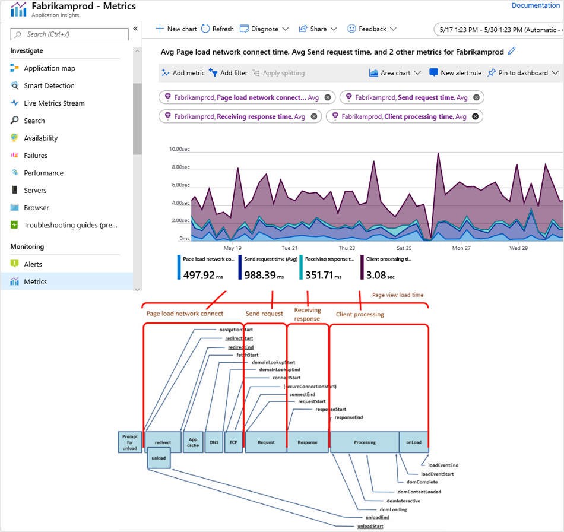

# PageView telemetry: Application Insights data model

PageView telemetry (in [Application Insights](./app-insights-overview.md))...

## Lifecycle of Processing a Request between a client browser and DNS/Web servers

1. Client <--> DNS : Client reaches out to DNS to resolve website hostname, DNS responds with IP address.
1. Client <--> Web Server : Client creates TCP then TLS handshakes with web server.
1. Client <--> Web Server : Client sends request payload, waits for server to execute request, and receives first response packet.
1. Client <-- Web Server : Client receives the rest of the response payload bytes from the web server.
1. Client : Client now has full response payload and has to render contents into browser and load the DOM.
 
[`browserTiming`](../essentials/metrics-supported.md#microsoftinsightscomponents) metrics can be understood per the above processing time definitions:

* `browserTimings/networkDuration` = #1 + #2
* `browserTimings/sendDuration` = #3
* `browserTimings/receiveDuration` = #4
* `browserTimings/processingDuration` = #5
* `browsertimings/totalDuration` = #1 + #2 + #3 + #4 + #5
* `pageViews/duration`
   * The PageView duration is from the browser’s performance timing interface, [PerformanceNavigationTiming.duration](https://developer.mozilla.org/en-US/docs/Web/API/PerformanceEntry/duration).
    * If PerformanceNavigationTiming is available use its duration.
    * If it’s not (when an older browser is encountered), then use (the now deprecated) [PerformanceTiming](https://developer.mozilla.org/en-US/docs/Web/API/PerformanceTiming) interface and find the delta between [NavigationStart](https://developer.mozilla.org/en-US/docs/Web/API/PerformanceTiming/navigationStart) and [LoadEventEnd](https://developer.mozilla.org/en-US/docs/Web/API/PerformanceTiming/loadEventEnd).
    * There are also cases when the users can send their own duration which will override any of the calculated values.

## PageView and Browser Timing 

Browser timing is considered physical and is defined by the browser [Performance API](https://developer.mozilla.org/en-US/docs/Web/API/Performance_API).

PageView timing is considered logical and can be defined by the customer. 
