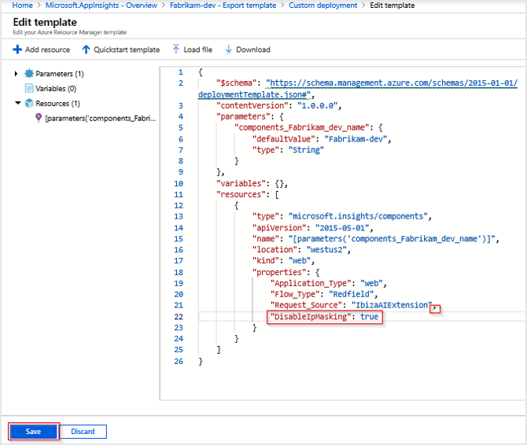

# Geolocation and IP address handling

This article explains how geolocation lookup and IP address handling occurs in Application Insights along with how to modify the default behavior.

## Default behavior

By default IP addresses are temporarily collected, but not stored in Application Insights. The basic process is as follows:

IP addresses are sent to Application Insights as part of telemetry data. Upon reaching the ingestion endpoint in Azure the IP address is used to perform a geolocation lookup using [GeoLite2 from MaxMind](https://dev.maxmind.com/geoip/geoip2/geolite2/). The results of this lookup populate the following fields `client_City`, `client_StateOrProvince`, `client_CountryOrRegion`. At this point the IP address is discarded and `0.0.0.0` is written to the client_IP field.

* Browser telemetry: We collect the sender's IP address.
* Server telemetry: The Application Insights module collects the client IP address. It is not collected if `X-Forwarded-For` is set.

This behavior is by design to help avoid unecessary collection of personal data. Whenever possible, we strongly recommend avoiding the collection of personal data. 

## Overriding default behavior

While the default behavior is to minimize the collection of personal data, we still offer the flexibility to collect and store IP address data. Before choosing to store any personal data like IP addresses, we strongly recommend verifying that this does not break any compliance requirements or local regulations that you may be subject to. To learn more about personal data handling  in Application Insights consult the [guidance for personal data](https://docs.microsoft.com/azure/azure-monitor/platform/personal-data-mgmt).

## Storing partial IP address data

In order to enable partial IP collection and storage the  `DisableIpMasking` property of the Application Insights component must be set to `true`. This can be done either through Azure Resource Manager templates or by calling the REST API. IP addresses will be recorded with the last octet zeroed out.


### Azure Resource Manager Template

```json
{
       "id": "/subscriptions/<subscription-id>/resourceGroups/<resource-group-name>/providers/microsoft.insights/components/<resource-name>",
       "name": "<resource-name>",
       "type": "microsoft.insights/components",
       "location": "westcentralus",
       "tags": {
              
       },
       "kind": "web",
       "properties": {
              "Application_Type": "web",
              "Flow_Type": "Redfield",
              "Request_Source": "IbizaAIExtension",
              // ...
              "DisableIpMasking": true
       }
}
```

### Portal 

If you only need to modify the behavior for a single Application Insights resource the easiest way to do this is via the Azure Portal. 

1. Go your Application Insights resource > **Settings** > **Export Template** 


2. Select **Deploy**


3. Select **Edit Template**


4. Make the following changes to the json for your resource and then click **Save**:



   > [!NOTE]
   > If you experience an error that says: _The resource group is in a location that is not supported by one or more resources in the template. Please choose a different resource group._ Temporarily select a different resource group from the dropdown and then re-select your original resource group to resolve the error.

5. Select **I agree** > **Purchase**. 


In this case nothing new is being purchased, we are just updating the config of the existing Application Insights resource.

6. Once the deployment is complete new telemetry data will recorded with the first three octets populated with the IP and the last octet zeroed out.

If you aren't seeing IP address data and want to confirm that `"DisableIpMasking": true`. run the following PowerShell: (Replace `Fabrikam-dev with the appropriate resource and resource group name.)

```powershell
# If you aren't using the cloud shell you will need to connect to your Azure account
# Connect-AzAccount 
$AppInsights = Get-AzResource -Name Fabrikam-dev -ResourceType microsoft.insights/components -ResourceGroupName Fabrikam-dev
$AppInsights.Properties
```

### Rest API

The Rest API payload to make the same modifications is as follows:

```
PATCH https://management.azure.com/subscriptions/<sub-id>/resourceGroups/<rg-name>/providers/microsoft.insights/components/<resource-name>?api-version=2018-05-01-preview HTTP/1.1
Host: management.azure.com
Authorization: AUTH_TOKEN
Content-Type: application/json
Content-Length: 54

{
       "properties": {
              "DisableIpMasking": true
       }
}
```

### Telemetry initializer

If you need to record the entire IP address rather than just the the first 3 octets you can use a telemetry initializer to copy the IP address to a custom field that will not be masked.

### ASP.NET

```csharp
using Microsoft.ApplicationInsights.Channel;
using Microsoft.ApplicationInsights.Extensibility;

namespace MyWebApp
{
    public class CloneIPAddress : ITelemetryInitializer
    {
        public void Initialize(ITelemetry telemetry)
        {
            if(!string.IsNullOrEmpty(telemetry.Context.Location.Ip))
            {
                telemetry.Context.Properties["client-ip"] = telemetry.Context.Location.Ip;
            }
        }
    }

}
```

```csharp
using Microsoft.ApplicationInsights.Extensibility;


namespace MyWebApp
{
    public class MvcApplication : System.Web.HttpApplication
    {
        protected void Application_Start()
        {
              //Enable your telemetry initializer:
              TelemetryConfiguration.Active.TelemetryInitializers.Add(new CloneIPAddress());
        }
    }
}

```

### ASP.NET Core

You can create your telemetry initializer the same way for ASP.NET Core as ASP.NET but to enable use the following example for reference:

```csharp
 using Microsoft.ApplicationInsights.Extensibility;
 using CustomInitializer.Telemetry;
 public void ConfigureServices(IServiceCollection services)
{
    services.AddSingleton<ITelemetryInitializer, CloneIPAddress>();
}
```

## Next Step

* Learn more about [personal data collection](https://docs.microsoft.com/azure/azure-monitor/platform/personal-data-mgmt) in Application Insights.
