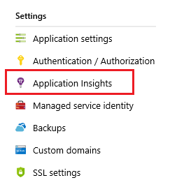

# Enable Snapshot Debugger for .NET apps in Azure App Service

Snapshot Debugger currently works for ASP.NET and ASP.NET Core apps that are running on Azure App Service on Windows service plans.

##  Enable Snapshot Debugger
To enable Snapshot Debugger for an app, follow the instructions below. If you are running a different type of Azure service, here are instructions for enabling Snapshot Debugger on other supported platforms:
* [Azure Cloud Services](snapshot-debugger-cloudservice.md?toc=/azure/azure-monitor/toc.json)
* [Azure Service Fabric services](snapshot-debugger-servicefabric.md?toc=/azure/azure-monitor/toc.json)
* [Azure Virtual Machines and virtual machine scale sets](snapshot-debugger-vm.md?toc=/azure/azure-monitor/toc.json)
* [On-premises virtual or physical machines](snapshot-debugger-vm.md?toc=/azure/azure-monitor/toc.json)

Application Insights Snapshot Debugger is pre-installed as part of the App Services runtime, but you need to turn it on to get snapshots for your App Service app. Once you have deployed an app, even if you have included the Application Insights SDK in the source code, follow the steps below to enable the snapshot debugger.

1. Go to the **App Services** pane in the Azure portal.
2. Navigate to **Settings > Application Insights** pane.

   

3. Either follow the instructions on the pane to create a new resource or select an existing App Insights resource to monitor your app. Also make sure both switches for Snapshot Debugger are **On**.

   ![Add App Insights site extension][Enablement UI]

4. Snapshot Debugger is now enabled using an App Services App Setting.

    ![App Setting for Snapshot Debugger][snapshot-debugger-app-setting]

## Disable Snapshot Debugger

Follow the same steps as for **Enable Snapshot Debugger**, but switch both switches for Snapshot Debugger to **Off**.
We recommend that you have Snapshot Debugger enabled on all your apps to ease diagnostics of application exceptions.

## Next steps

* [Working with Application Insights in Visual Studio](https://docs.microsoft.com/azure/application-insights/app-insights-visual-studio)

[Enablement UI]: ./media/snapshot-debugger/Enablement_UI.png
[snapshot-debugger-app-setting]:./media/snapshot-debugger/snapshot-debugger-app-setting.png

