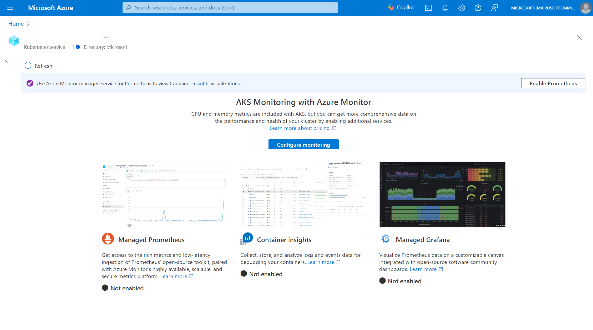
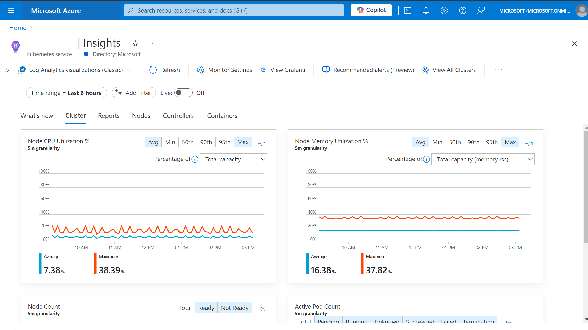
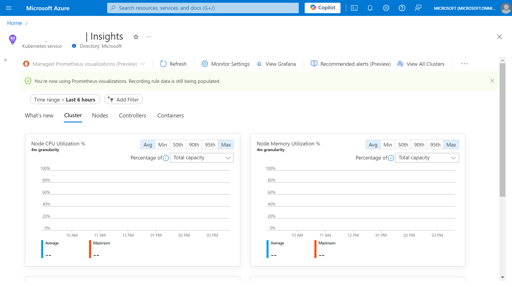

# Switch to using managed Prometheus visualizations for Container Insights (preview)

Container Insights currently uses data from Log Analytics to power the visualizations in the Azure portal. However, with the release of managed Prometheus, this new format of metrics collection is cheaper and more efficient. Container Insights now offers the ability to visualize using only managed Prometheus data. This article helps you with the setup to start using managed Prometheus as your primary Container Insights visualization tool.

> [!Note]
> This feature is currently in public preview. For additional information, please read the [Supplemental Terms of Use for Microsoft Azure Previews](https://azure.microsoft.com/support/legal/preview-supplemental-terms).

## Prerequisites

To view your Container Insights data using Prometheus, ensure the following steps are complete.

* Azure Kubernetes Service (AKS) [configured with managed Prometheus](./kubernetes-monitoring-enable.md#existing-cluster-prometheus-only)
* User has `Reader` permission or higher on the associated [Azure Monitor workspace](../essentials/azure-monitor-workspace-overview.md)
* Ad block is disabled or set to allow `monitor.azure.com` traffic
* For Windows clusters, [enable Windows metric collection](./kubernetes-monitoring-enable.md#enable-windows-metrics-collection-preview)

## Accessing Prometheus based Container Insights

Because Azure Monitor supports various levels of customization, your cluster may currently have logs based Container Insights, managed Prometheus, or some other combination.

> [!Note]
> Managed Prometheus visualizations for Container Insights use recording rules to improve chart performance, learn more about [what rules are configured](./prometheus-metrics-scrape-default.md#prometheus-visualization-recording-rules).

### [No Prometheus or logs based Container Insights enabled](#tab/unmonitored)

1.) Open the Azure portal and navigate to your desired AKS cluster.

2.) Choose the `Insights` menu item from the menu, displaying a splash screen indicating no monitoring enabled.



3.) Select the `Configure monitoring` button to open up the monitoring configuration blade.

4.) Underneath the advanced settings blade, choose `Logs and events` from the Cost presets dropdown.

5.) To finish the setup, click the `Configure` button.

6.) Once the onboarding deployment completes, you should be able to see the Insights experience using Prometheus as the data source, indicated by the toolbar dropdown showing `Managed Prometheus visualizations (Preview)`.


### [Logs based Container Insights enabled](#tab/LA)

1.) Open the Azure portal and navigate to your desired AKS cluster.

2.) Choose the `Insights` menu item from the menu, which displays a banner at the top to configure managed Prometheus.

3.) Using the banner, select the `Configure` button to complete onboarding to managed Prometheus or deploy the requisite recording rules.


If the banner was previously dismissed, you can instead use the dropdown in the toolbar that says `Log Analytics visualizations (Classic)`, and select the `Managed Prometheus visualizations (Preview)` option, which opens up a pop-up to complete onboarding.



4.) Once the monitoring deployment is complete, the Insights blade should switch to using Prometheus as the data source, indicated by the toolbar dropdown showing `Managed Prometheus visualizations (Preview)`.


### [Prometheus enabled and logs based Container Insights not enabled or with custom settings applied](#tab/Prom)

1.) Open the Azure portal and navigate to your desired AKS cluster.

2.) Choose the `Insights` menu item from the menu, which displays a banner for enabling Prometheus recording rules.


3.) Click `Enable` to deploy the recording rules.

4.) Once the monitoring deployment is complete, the Insights blade should switch to using Prometheus as the data source, indicated by the toolbar dropdown showing `Managed Prometheus visualizations (Preview)`.

> [!Note]
> Some charts will only have partial data for the default time range until sufficient time has elapsed for the recording rules to collect data.



---

## Optional steps

While the above steps are sufficient, for the full visualization experience, a few optional steps can be completed.

### Node and Pod labels collection 

By default the labels for nodes and pods aren't available, but can be collected through re-enabling the addon. Node labels are required for filtering data by node pools.

1.) If the managed Prometheus addon is currently deployed, we must first disable it

```azurecli
az aks update --disable-azure-monitor-metrics -n <clusterName> -g <resourceGroup>
```

2.) Then, re-enable the addon with the flag `--ksm-metric-labels-allow-list`
    
```azurecli
az aks update -n <clusterName> -g <resourceGroup> --enable-azure-monitor-metrics --ksm-metric-labels-allow-list "nodes=[*], pods=[*]" --azure-monitor-workspace-resource-id <amw-id
```

### Disable Log Analytics data collection

If you're currently using the logs based Container Insights experience, then you can choose to stop ingesting metrics to Log Analytics to save on billing. Once you confirm the Prometheus backed Container Insights experience is sufficient for your purposes, complete the steps to stop metrics ingestion to Log Analytics.

1.) Navigate to the monitoring settings for your clusters by following the instructions on how to configure your [Container Insights data collection rule](./container-insights-data-collection-dcr.md#configure-data-collection)

2.) From the Cost presets dropdown, select "Logs and Events" and save to configure.

## Known limitations and issues

As this feature is currently in preview, there are several, known limitations, the following features aren't supported

* Environment variable details
* Filtering data by individual services
* Live data viewing on the Cluster tab
* Workbooks reports data
* Node memory working set and RSS metrics
* Partial or no data available in the multi-cluster view based on Container Insights DCR settings

## Troubleshooting

When using the Prometheus based Container Insights experience, you may encounter the following errors.

### The charts are stuck in a loading state

This issue occurs if the network traffic for the Azure Monitor workspace is blocked. The root cause of this is typically related to network policies, such as ad blocking software. To resolve this issue, disable the ad block or allow-list `monitor.azure.com` traffic and reload the page.

### Unable to access Data Collection Rule

This error occurs when the user doesn't have permissions to view the associated Prometheus data collection rule for the cluster or the data collection rule may have been deleted. To resolve this error, grant access to the Prometheus data collection rule or reconfigure managed Prometheus using the `Monitoring Settings` button in the toolbar.

### Unable to access Azure Monitor workspace

This error occurs when the user doesn't have permissions to view the associated Azure Monitor workspace for the cluster or the Azure Monitor workspace may have been deleted. To resolve this error, grant access to the Azure Monitor workspace or reconfigure managed Prometheus by deleting and [redeploying the addon](./kubernetes-monitoring-enable.md#enable-prometheus-and-grafana).

### The data could not be retrieved

This error typically occurs when querying large volumes of data and may be resolved by reducing the time range to a shorter window or filtering for fewer objects.

### Data configuration error

This error occurs when the recording rules may have been modified or deleted. Use the `Reconfigure` button to patch the recording rules and try again.

### Access denied

This occurs when the user's portal token expires or doesn't have permissions to view the associated Azure Monitor workspace for the cluster. This can typically be resolved by refreshing the browser session or logging in again.

### An unknown error occurred

If this error message persists, then contact support to open up a ticket.
