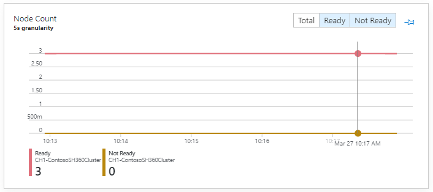
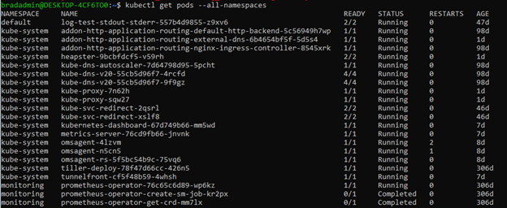

# View metrics in real time

With Container insights Live Data, you can visualize metrics about node and pod state in a cluster in real time. The feature emulates direct access to the `kubectl top nodes`, `kubectl get pods --all-namespaces`, and `kubectl get nodes` commands to call, parse, and visualize the data in performance charts that are included with this insight.

This article provides a detailed overview and helps you understand how to use this feature.

>[!NOTE]
>Azure Kubernetes Service (AKS) clusters enabled as [private clusters](https://azure.microsoft.com/updates/aks-private-cluster/) aren't supported with this feature. This feature relies on directly accessing the Kubernetes API through a proxy server from your browser. Enabling networking security to block the Kubernetes API from this proxy will block this traffic.

For help with setting up or troubleshooting the Live Data feature, review the [setup guide](container-insights-livedata-setup.md).

## How it works

The Live Data feature directly accesses the Kubernetes API. For more information about the authentication model, see [The Kubernetes API](https://kubernetes.io/docs/concepts/overview/kubernetes-api/).

This feature performs a polling operation against the metrics endpoints including `/api/v1/nodes`, `/apis/metrics.k8s.io/v1beta1/nodes`, and `/api/v1/pods`. The interval is every five seconds by default. This data is cached in your browser and charted in four performance charts included in Container insights. Each subsequent poll is charted into a rolling five-minute visualization window. To see the charts, select **Go Live (preview)** and then select the **Cluster** tab.

The polling interval is configured from the **Set interval** dropdown list. Use this dropdown list to set polling for new data every 1, 5, 15, and 30 seconds.

>[!IMPORTANT]
>We recommend that you set the polling interval to one second while you troubleshoot an issue for a short period of time. These requests might affect the availability and throttling of the Kubernetes API on your cluster. Afterward, reconfigure to a longer polling interval.

These charts can't be pinned to the last Azure dashboard you viewed in live mode.

>[!IMPORTANT]
>No data is stored permanently during operation of this feature. All information captured during this session is immediately deleted when you close your browser or navigate away from the feature. Data only remains present for visualization inside the five-minute window. Any metrics older than five minutes are also permanently deleted.

## Metrics captured

The following metrics are captured and displayed in four performance charts.

### Node CPU utilization % and Node memory utilization %

These two performance charts map to an equivalent of invoking `kubectl top nodes` and capturing the results of the **CPU%** and **MEMORY%** columns to the respective chart.

The percentile calculations will function in larger clusters to help identify outlier nodes in your cluster. For example, you can understand if nodes are underutilized for scale-down purposes. By using the **Min** aggregation, you can see which nodes have low utilization in the cluster. To further investigate, select the **Nodes** tab and sort the grid by CPU or memory utilization.

This information also helps you understand which nodes are being pushed to their limits and if scale-out might be required. By using both the **Max** and **P95** aggregations, you can see if there are nodes in the cluster with high resource utilization. For further investigation, you would again switch to the **Nodes** tab.

### Node count

This performance chart maps to an equivalent of invoking `kubectl get nodes` and mapping the **STATUS** column to a chart grouped by status types.

Nodes are reported either in a **Ready** or **Not Ready** state and they're counted to create a total count. The results of these two aggregations are charted so that, for example, you can understand if your nodes are falling into failed states. By using the **Not Ready** aggregation, you can quickly see the number of nodes in your cluster currently in the **Not Ready** state.

### Active pod count

This performance chart maps to an equivalent of invoking `kubectl get pods --all-namespaces` and maps the **STATUS** column the chart grouped by status types.

>[!NOTE]
>Names of status as interpreted by `kubectl` might not exactly match in the chart.

## Next steps

View [log query examples](container-insights-log-query.md) to see predefined queries and examples to create alerts and visualizations or perform further analysis of your clusters.
