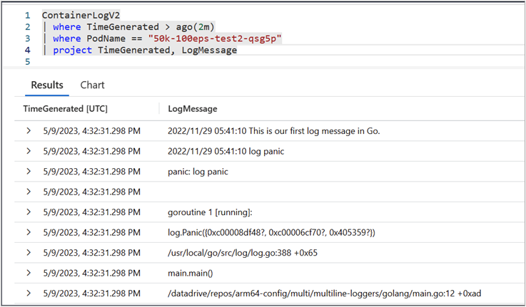

# Enable the ContainerLogV2 schema 
Azure Monitor Container insights offers a schema for container logs, called ContainerLogV2. As part of this schema, there are fields to make common queries to view Azure Kubernetes Service (AKS) and Azure Arc-enabled Kubernetes data. In addition, this schema is compatible with [Basic Logs](../logs/basic-logs-configure.md), which offers a low-cost alternative to standard analytics logs.

>[!NOTE]
> ContainerLogV2 will be default schema for customers who will be onboarding container insights with Managed Identity Auth using ARM, Bicep, Terraform, Policy and Portal onboarding. ContainerLogV2 can be explicitly enabled through CLI version 2.51.0 or higher using Data collection settings.

The new fields are:
* `ContainerName`
* `PodName`
* `PodNamespace`

## ContainerLogV2 schema
```kusto
 Computer: string,
 ContainerId: string,
 ContainerName: string,
 PodName: string,
 PodNamespace: string,
 LogMessage: dynamic,
 LogSource: string,
 TimeGenerated: datetime
```

>[!NOTE]
> [Export](../logs/logs-data-export.md) to Event Hub and Storage Account is not supported if the incoming LogMessage is not a valid JSON. For best performance, we recommend emitting container logs in JSON format.

## Enable the ContainerLogV2 schema
Customers can enable the ContainerLogV2 schema at the cluster level through either the cluster's Data Collection Rule (DCR) or ConfigMap. To enable the ContainerLogV2 schema, configure the cluster's ConfigMap. Learn more about ConfigMap in [Kubernetes documentation](https://kubernetes.io/docs/tasks/configure-pod-container/configure-pod-configmap/)  and in [Azure Monitor documentation](./container-insights-agent-config.md#configmap-file-settings-overview).
Follow the instructions to configure an existing ConfigMap or to use a new one.

>[!NOTE]
> Because ContainerLogV2 can be enabled through either the DCR and ConfigMap, when both are enabled the ContainerLogV2 setting of the ConfigMap will take precedence. Stdout and stderr logs will only be ingested to the ContainerLog table when both the DCR and ConfigMap are explicitly set to off.

### Configure via an existing Data Collection Rule (DCR)

## [Azure portal](#tab/configure-portal)

1. In the Insights section of your Kubernetes cluster, select the **Monitoring Settings** button from the top toolbar


2. Select **Edit collection settings** to open the advanced settings


3. Select the checkbox with **Enable ContainerLogV2** and choose the **Save** button below


4. The summary section should display the message "ContainerLogV2 enabled", click the **Configure** button to complete your configuration change


## [CLI](#tab/configure-CLI)

1. For configuring via CLI, use the corresponding [config file](./container-insights-cost-config.md#configuring-aks-data-collection-settings-using-azure-cli), update the `enableContainerLogV2` field in the config file to be true.


---
 
### Configure an existing ConfigMap
This applies to the scenario where you have already enabled container insights for your AKS cluster and have [configured agent data collection settings](./container-insights-agent-config.md#configure-and-deploy-configmaps) using ConfigMap "_container-azm-ms-agentconfig.yaml_". If this ConfigMap doesn't yet have the `log_collection_settings.schema` field, you'll need to append the following section in this existing ConfigMap .yaml file:

```yaml
[log_collection_settings.schema]
          # In the absence of this ConfigMap, the default value for containerlog_schema_version is "v1"
          # Supported values for this setting are "v1","v2"
          # See documentation at https://aka.ms/ContainerLogv2 for benefits of v2 schema over v1 schema before opting for "v2" schema
          containerlog_schema_version = "v2"
```

### Configure a new ConfigMap
1. [Download the new ConfigMap](https://aka.ms/container-azm-ms-agentconfig). For the newly downloaded ConfigMap, the default value for `containerlog_schema_version` is `"v1"`.
1. Update `containerlog_schema_version` to `"v2"`:

    ```yaml
    [log_collection_settings.schema]
        # In the absence of this ConfigMap, the default value for containerlog_schema_version is "v1"
        # Supported values for this setting are "v1","v2"
        # See documentation at https://aka.ms/ContainerLogv2 for benefits of v2 schema over v1 schema before opting for "v2" schema
        containerlog_schema_version = "v2"
    ```

3. After you finish configuring the ConfigMap, run the following kubectl command: `kubectl apply -f <configname>`.

   Example: `kubectl apply -f container-azm-ms-agentconfig.yaml`

>[!NOTE]
>* The configuration change can take a few minutes to complete before it takes effect. All ama-logs pods in the cluster will restart. 
>* The restart is a rolling restart for all ama-logs pods. It won't restart all of them at the same time.

## Multi-line logging in Container Insights
Azure Monitor container insights now supports multiline logging. With this feature enabled, previously split container logs are stitched together and sent as single entries to the ContainerLogV2 table. Customers are able see container log lines upto to 64 KB (up from the existing 16 KB limit). If the stitched log line is larger than 64 KB, it gets truncated due to Log Analytics limits. 
Additionally, the feature also adds support for .NET, Go, Python and Java stack traces, which appear as single entries instead of being split into multiple entries in ContainerLogV2 table.

Below are two screenshots which demonstrate Multi-line logging at work for Go exception stack trace:

Multi-line logging disabled scenario:



Multi-line logging enabled scenario:


Similarly, below screenshots depict Multi-line logging enabled scenarios for Java and Python stack traces:

For Java:


For Python:


### Pre-requisites 

Customers must [enable ContainerLogV2](./container-insights-logging-v2.md#enable-the-containerlogv2-schema) for multi-line logging to work.

### How to enable 
Multi-line logging is a preview feature and can be enabled by setting **enabled** flag to "true" under the `[log_collection_settings.enable_multiline_logs]` section in the the [config map](https://github.com/microsoft/Docker-Provider/blob/ci_prod/kubernetes/container-azm-ms-agentconfig.yaml)

```yaml
[log_collection_settings.enable_multiline_logs]
# fluent-bit based multiline log collection for go (stacktrace), dotnet (stacktrace)
# if enabled will also stitch together container logs split by docker/cri due to size limits(16KB per log line)
  enabled = "true"
```

## Next steps
* Configure [Basic Logs](../logs/basic-logs-configure.md) for ContainerLogv2.
* Learn how [query data](./container-insights-log-query.md#container-logs) from ContainerLogV2

