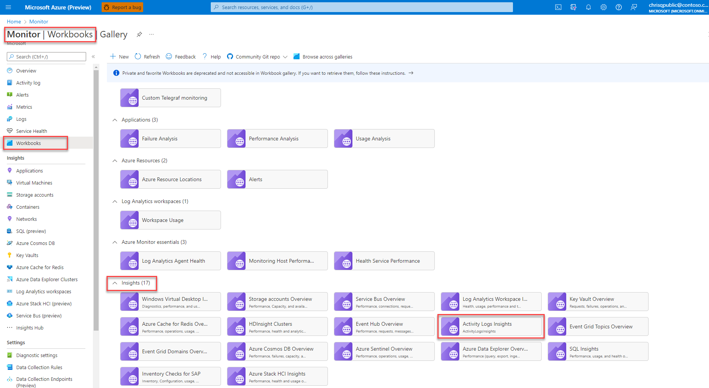
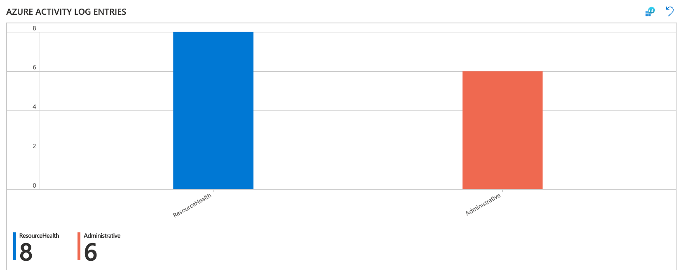

# Activity log insights (Preview)

Activity log insights lets you view information about changes to resources and resource groups in a subscription. The dashboards also present data about which users or services performed activities in the subscription and the activities' status. This article explains how to view Activity log insights in the Azure portal.

Before using Activity log insights, you'll have to [enable sending logs to your Log Analytics workspace](./diagnostic-settings.md).

## How does Activity log insights work?

Activity logs you send to a [Log Analytics workspace](/articles/azure-monitor/logs/log-analytics-workspace-overview.md) are stored in a table called AzureActivity. 

Activity log insights is a curated [Log Analytics workbook](/articles/azure-monitor/visualize/workbooks-overview.md) with dashboards that visualize the data in the AzureActivity table. For example, which administrators deleted, updated or created resources, and whether the activities failed or succeeded.

## View Activity log insights

To view Activity log insights:

1. In the Azure portal, select **Monitor** > **Workbooks**.
1. Select **Activity Logs Insights** in the **Insights** section. 

    

1. At the top of the **Activity Logs Insights** page, select:
    1. One or more subscriptions from the **Subscriptions** drowpdown.
    1. Resources and resource groups from the **CurrentResource** dropdown.
    1. A time range for which to view data from the **TimeRange** dropdown.

    * Use the Azure activities by Category Value to view a count of Activity log records for each category.
     
        
    
    * Use the Azure activities by Category status to view a count of Activity log records by each status.
    
        
    
    * If you are on a scale level - a subscription or a resource group, use the Azure activities by Resource and by resource provider to view a count of Activity log records for each selected resource and provider.
    
        
    
## Next steps
Learn more about:
* [Platform logs](./platform-logs-overview.md)
* [Activity log event schema](activity-log-schema.md)
* [Creating a diagnostic setting to send Activity logs to other destinations](./diagnostic-settings.md)