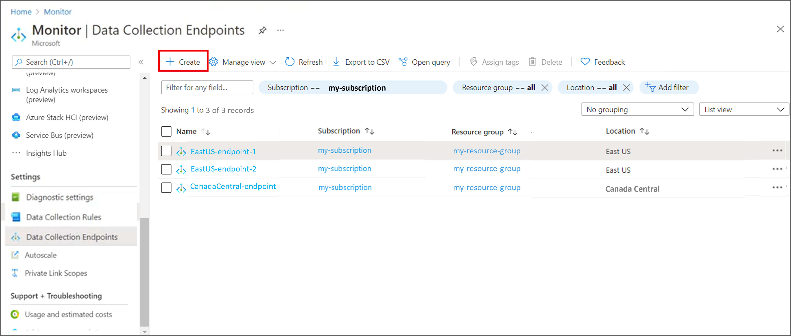

# Data collection endpoints in Azure Monitor 
Data Collection Endpoints (DCEs) allow you to uniquely configure ingestion settings for Azure Monitor. This article provides an overview of data collection endpoints including their contents and structure and how you can create and work with them.

## Workflows that use DCEs
The following workflows currently use DCEs:

- [Azure Monitor agent](../agents/data-collection-rule-azure-monitor-agent.md)
- [Custom logs](../logs/custom-logs-overview.md)

## Components of a data collection endpoint
A data collection endpoint includes the following components.

| Component | Description |
|:---|:---|
| Configuration access endpoint | The endpoint used to access the configuration service to fetch associated data collection rules (DCR). Example: `<unique-dce-identifier>.<regionname>.handler.control` |
| Logs ingestion endpoint | The endpoint used to ingest logs to Log Analytics workspace(s). Example: `<unique-dce-identifier>.<regionname>.ingest` |
| Network Access Control Lists (ACLs) | Network access control rules for the endpoints

## Regionality
Data collection endpoints are ARM resources created within specific regions. An endpoint in a given region can only be **associated with machines in the same region**, although you can have more than one endpoint within the same region as per your needs.

## Limitations
Data collection endpoints only support Log Analytics workspaces as a destination for collected data. [Custom Metrics (preview)](../essentials/metrics-custom-overview.md) collected and uploaded via the Azure Monitor Agent are not currently controlled by DCEs nor can they be configured over private links.

## Create data collection endpoint 

> [!IMPORTANT]
> If agents will connect to your DCE, it must be created in the same region. If you have agents in different regions, then you'll need multiple DCEs.

# [Azure portal](#tab/portal)

1. In the **Azure Monitor** menu in the Azure portal, select **Data Collection Endpoint** from the **Settings** section. Click **Create** to create a new Data Collection Rule and assignment.

  

2. Click **Create** to create a new endpoint. Provide a **Rule name** and specify a **Subscription**, **Resource Group** and **Region**. This specifies where the DCE will be created.

  

3. Click **Review + create** to review the details of the data collection endpoint. Click **Create** to create it.

# [REST API](#tab/restapi)

1. Create data collection endpoint(s) using these [DCE REST APIs](/cli/azure/monitor/data-collection/endpoint).
2. Create association(s) to link the endpoint(s) to your target machines or resources, using these [DCRA REST APIs](/rest/api/monitor/datacollectionruleassociations/create#examples).

---

## Sample data collection endpoint
See [Sample data collection endpoint](data-collection-endpoint-sample.md) for a sample data collection endpoint.

## Next steps
- [Associate endpoint to machines](../agents/data-collection-rule-azure-monitor-agent.md#create-rule-and-association-in-azure-portal)
- [Add endpoint to AMPLS resource](../logs/private-link-configure.md#connect-azure-monitor-resources) 
