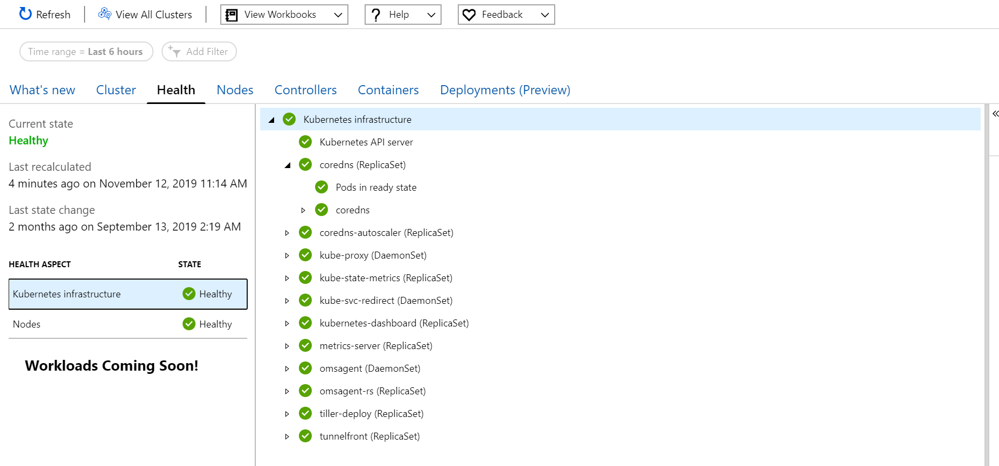

# Understand AKS cluster health with Azure Monitor for containers

With Azure Monitor for containers, it monitors and reports health status of the managed infrastructure components, all nodes, and workloads running in an Azure Kubernetes Service (AKS) cluster. This experience extends beyond the cluster health status calculated and reported on the [multi-cluster view](container-insights-analyze.md#multi-cluster-view-from-azure-monitor), where now you can understand if one or more nodes in the cluster are resource constrained, or a node or pod are unavailable that could impact a running application in the cluster based on curated metrics. 

For information about how to enable Azure Monitor for containers, see [Onboard Azure Monitor for containers](container-insights-onboard.md).

## Sign in to the Azure portal

Sign in to the [Azure portal](https://portal.azure.com). 

## View health from an AKS cluster

Access to the Azure Monitor for containers health feature is available directly from an AKS cluster by selecting **Insights** from the left pane in the Azure portal. From the **Cluster** performance tab, select **Health**.  

Immediately you can see the overall health of the cluster without having to view from each tab - **Node**, **Controllers**, and **Pods**. Under the **Cluster health summary**, an overall health perspective is provided for:

- Kubernetes infrastructure - provides a rollup of the Kubernetes API server, ReplicaSets, and DaemonSets running on nodes deployed in your cluster.

- Nodes - provides a rollup of the node pools and state of individual nodes in each pool, by evaluating CPU and memory utilization, and a nodes availability.

- Workloads - provides a rollup of overall utilization of the cluster and for each containerized application or other workload running across all namespaces in the cluster.

applications running on the nodes in the cluster.  

## Next steps