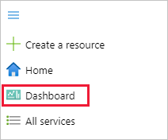
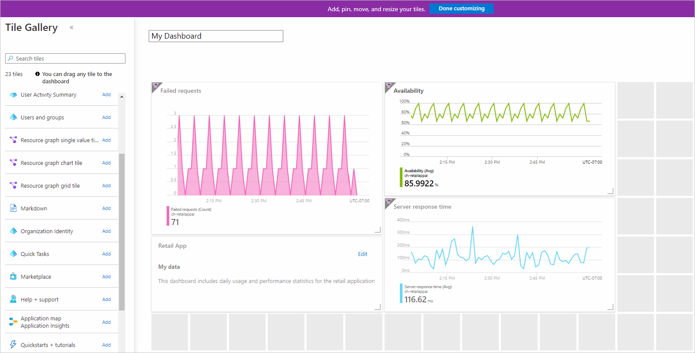
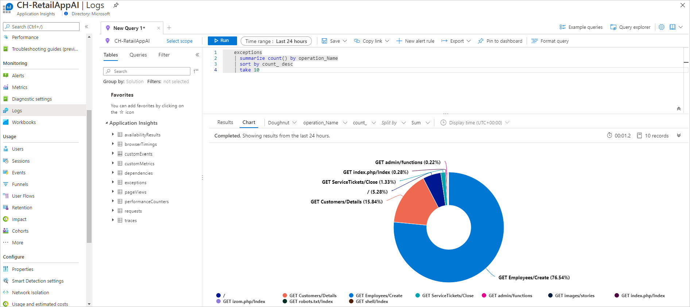

# Create custom KPI dashboards using Azure Application Insights

You can create multiple dashboards in the Azure portal that each include tiles visualizing data from multiple Azure resources across different resource groups and subscriptions.  You can pin different charts and views from Azure Application Insights to create custom dashboards that provide you with complete picture of the health and performance of your application. This tutorial walks you through the creation of a custom dashboard that includes multiple types of data and visualizations from Azure Application Insights.

 You learn how to:

> [!div class="checklist"]
> * Create a custom dashboard in Azure
> * Add a tile from the Tile Gallery
> * Add standard metrics in Application Insights to the dashboard
> * Add a custom metric chart Application Insights to the dashboard
> * Add the results of a Logs (Analytics) query to the dashboard

## Prerequisites

To complete this tutorial:

- Deploy a .NET application to Azure and [enable the Application Insights SDK](../app/asp-net.md).

> [!NOTE]
> Required permissions for working with dashboards are discussed in the article on [understanding access control for dashboards](../../azure-portal/azure-portal-dashboard-share-access.md#understanding-access-control-for-dashboards).

## Sign in to Azure

Sign in to the Azure portal at [https://portal.azure.com](https://portal.azure.com).

## Create a new dashboard

> [!WARNING]
> If you move your Application Insights resource over to a different resource group or subscription, you will need to manually update the dashboard by removing the old tiles and pinning new tiles from the same Application Insights resource at new location.

A single dashboard can contain resources from multiple applications, resource groups, and subscriptions.  Start the tutorial by creating a new dashboard for your application.  

1. In the menu dropdown on the left in Azure Portal, select **Dashboard**.

    

2. On the dashboard pane, select **New dashboard** then **Blank dashboard**.

   

3. Type a name for the dashboard.
4. Have a look at the **Tile Gallery** for a variety of tiles that you can add to your dashboard.  In addition to adding tiles from the gallery, you can pin charts and other views directly from Application Insights to the dashboard.
5. Locate the **Markdown** tile and drag it on to your dashboard.  This tile allows you to add text formatted in markdown, which is ideal for adding descriptive text to your dashboard.
6. Add text to the tile's properties and resize it on the dashboard canvas.

    [](media/tutorial-app-dashboards/dashboard-edit-mode.png#lightbox)

7. Select **Done customizing** at the top of the screen to exit tile customization mode.

## Add health overview

A dashboard with static text isn't very interesting, so now add a tile from Application Insights to show information about your application. You can add Application Insights tiles from the Tile Gallery, or you can pin them directly from Application Insights screens. This allows you to configure charts and views that you're already familiar with before pinning them to your dashboard.  Start by adding the standard health overview for your application.  This requires no configuration and allows minimal customization in the dashboard.


1. Select your **Application Insights** resource on the home screen.
2. In the **Overview** pane, select the pin icon  to add the tile to a dashboard.
3. In the "Pin to dashboard" tab, select which dashboard to add the tile to or create a new one.
 
3. In the top right, a notification will appear that your tile was pinned to your dashboard.  Select **Pinned to dashboard** in the notification to return to your dashboard or use the dashboard pane.
4. That tile is now added to your dashboard. Select **Edit** to change the positioning of the tile. Select and drag it into position and then click **Done customizing**. Your dashboard now has a tile with some useful information.

    [](media/tutorial-app-dashboards/dashboard-edit-mode.png#lightbox)

## Add custom metric chart

The **Metrics** panel allows you to graph a metric collected by Application Insights over time with optional filters and grouping.  Like everything else in Application Insights, you can add this chart to the dashboard.  This does require you to do a little customization first.

1. Select your **Application Insights** resource in the home screen.
1. Select **Metrics**.  
2. An empty chart has already been created, and you're prompted to add a metric.  Add a metric to the chart and optionally add a filter and a grouping.  The example below shows the number of server requests grouped by success.  This gives a running view of successful and unsuccessful requests.

	[](media/tutorial-app-dashboards/metrics.png#lightbox)

4. Select **Pin to dashboard** on the right.

3.  In the top right, a notification will appear that your tile was pinned to your dashboard. Select **Pinned to dashboard** in the notification to return to your dashboard or use the dashboard tab.

4. That tile is now added to your dashboard. Select **Edit** to change the positioning of the tile. Select and drag the tile into position and then select **Done customizing**.

## Add Logs query

Azure Application Insights Logs provides a rich query language that allows you to analyze all of the data collected Application Insights. Just like charts and other views, you can add the output of a logs query to your dashboard.

1. Select your **Application Insights** resource in the home screen.
2. Select **Logs** on the left under "monitoring" to open the Logs tab.
3. Type the following query, which returns the top 10 most requested pages and their request count:

    ``` Kusto
	requests
	| summarize count() by name
	| sort by count_ desc
	| take 10
    ```

4. Select **Run** to validate the results of the query.
5. Select the pin icon  and select the name of your dashboard.

5. Before you go back to the dashboard, add another query, but this time render it as a chart so you see the different ways to visualize a logs query in a dashboard. Start with the following query that summarizes the top 10 operations with the most exceptions.

    ``` Kusto
	exceptions
	| summarize count() by operation_Name
	| sort by count_ desc
	| take 10
    ```

6. Select **Chart** and then change to a **Doughnut** to visualize the output.

	[](media/tutorial-app-dashboards/logs-doughnut.png#lightbox)

6. Select the pin icon  on the top right to pin the chart to your dashboard and then  return to your dashboard.
7. The results of the queries are now added to your dashboard in the format that you selected. Select and drag each into position and then select **Done customizing**.
8. Select the pencil icon  on each title to give them a descriptive title.

## Share dashboard

1. At the top of the dashboard, select **Share** to publish your changes.
2. You can optionally define specific users who should have access to the dashboard. For more information, see [Share Azure dashboards by using Role-Based Access Control](../../azure-portal/azure-portal-dashboard-share-access.md).
3. Select **Publish**.

## Next steps

Now that you've learned how to create custom dashboards, have a look at the rest of the Application Insights documentation including a case study.

> [!div class="nextstepaction"]
> [Deep diagnostics](../app/devops.md)
