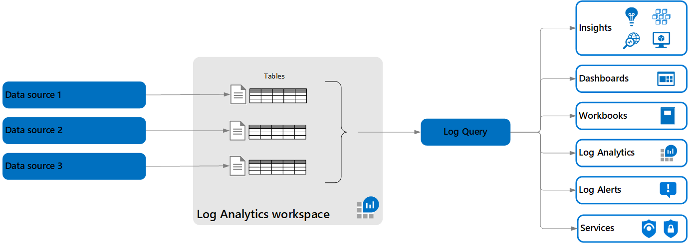

# Log queries in Azure Monitor
Azure Monitor Logs is based on Azure Data Explorer, and log queries are written using the same Kusto query language (KQL). This is a rich language designed to be easy to read and author, so you should be able to start writing queries with some basic guidance.

Areas in Azure Monitor where you will use queries include the following:

- [Log Analytics](../log-query/log-analytics-overview.md) is the primary tool in the Azure portal for editing log queries and interactively analyzing their results. Even if you intend to use a log query elsewhere in Azure Monitor, you'll typically write and test it in Log Analytics before copying it to its final location.
- [Log alert rules](../platform/alerts-overview.md) proactively identify issues from data in your workspace.  Each alert rule is based on a log query that is automatically run at regular intervals.  The results are inspected to determine if an alert should be created.
- [Azure Dashboards](../learn/tutorial-logs-dashboards.md).** Pin the results of any query into an Azure dashboard which allow you to visualize log and metric data together and optionally share with other Azure users.
- [Export to Azure storage]()  When you import log data from Azure Monitor into Excel or [Power BI](../platform/powerbi.md), you create a log query to define the data to export.
- **PowerShell.** You can run a PowerShell script from a command line or an Azure Automation runbook that uses [Get-AzOperationalInsightsSearchResults](/powershell/module/az.operationalinsights/get-azoperationalinsightssearchresult) to retrieve log data from Azure Monitor.  This cmdlet requires a query to determine the data to retrieve.
- [Azure Monitor Logs API](https://dev.loganalytics.io) allows any REST API client to retrieve log data from the workspace.  The API request includes a query that is run against Azure Monitor to determine the data to retrieve.

## Getting started
The best way to get started learning to write log queries using KQL is leveraging available tutorials and samples.

- [Log Analytics tutorial](log-analytics-tutorial.md) - Tutorial on using the features of Log Analytics which is the tool that you'll use in the Azure portal to edit and run queries. It also allows you to write simple queries without directly working with the query language. If you haven't used Log Analytics before, start here so you understand the tool that you'll use with the other tutorials and samples.
- [KQL tutorial](/azure/data-explorer/kusto/query/tutorial?pivots=azuremonitor) - Guided walk through basic KQL concepts and common operators. This is the best place to start to come up to speed with the language itself and the structure of log queries. 
- [Example queries](example-queries.md) - Description of the example queries available in Log Analytics. You can use the queries without modification or use them as samples to learn KQL.
- [Query samples](/azure/data-explorer/kusto/query/samples?pivots=azuremonitor) - Sample queries illustrating a variety of different concepts.

## Data structure
Log queries retrieve their data from a Log Analytics workspace. Each workspace contains multiple tables are that are organized into separate columns with multiple rows of data. Each table is defined by a unique set of columns that are shared by the rows of data provided by the data source. 

Log data from Application Insights is also stored in Azure Monitor Logs, but it's stored different depending on how your application is configured. For a workspace-based application, data is stored in a Log Analytics workspace in a standard set of tables to hold data such as application requests, exceptions, and page views. Multiple applications can use the same workspace. For a classic application, the data is not stored in a Log Analytics workspace. It uses the same query language, and you create and run queries using the same Log Analytics tool in the Azure portal. Data for classic applications though is stored separately from each other. Its general structure is the same as workspace-based applications although the table and column names are different. See [Workspace-based resource changes](../app/apm-tables.md) for a detailed comparison of the schema for workspace-based and classic applications.

> [!NOTE]
> We still provide full backwards compatibility for your Application Insights classic resource queries, workbooks, and log-based alerts within the Application Insights experience. To query/view against the [new workspace-based table structure/schema](../app/apm-tables.md) you must first navigate to your Log Analytics workspace. During the preview, selecting **Logs** from within the Application Insights panes will give you access to the classic Application Insights query experience. See [Query scope](../log-query/scope.md) for more details.

## Reference documentation
[Documentation for KQL](/azure/data-explorer/kusto/query/) including the reference for all commands and operators is available in the Azure Data Explorer documentation. Even as you get proficient using KQL, you'll still regularly use the reference to investigate new commands and scenarios that you haven't used before.

## Language differences
While Azure Monitor uses the same KQL as azure Data Explorer, there are some differences. The KQL documentation will specify those operators that aren't supported by Azure Monitor or that have different functionality. Operators specific to Azure Monitor are documented in the Azure Monitor content. 

The following sections provide a list the differences between versions of the language for quick reference.

### Statements not supported in Azure Monitor

* [Alias](/azure/kusto/query/aliasstatement)
* [Query parameters](/azure/kusto/query/queryparametersstatement)

### Functions not supported in Azure Monitor

* [cluster()](/azure/kusto/query/clusterfunction)
* [cursor_after()](/azure/kusto/query/cursorafterfunction)
* [cursor_before_or_at()](/azure/kusto/query/cursorbeforeoratfunction)
* [cursor_current(), current_cursor()](/azure/kusto/query/cursorcurrent)
* [database()](/azure/kusto/query/databasefunction)
* [current_principal()](/azure/kusto/query/current-principalfunction)
* [extent_id()](/azure/kusto/query/extentidfunction)
* [extent_tags()](/azure/kusto/query/extenttagsfunction)

### Operators not supported in Azure Monitor

* [Cross-Cluster Join](/azure/kusto/query/joincrosscluster)

### Plugins not supported in Azure Monitor

* [Python plugin](/azure/kusto/query/pythonplugin)
* [sql_request plugin](/azure/kusto/query/sqlrequestplugin)

### Additional operators in Azure Monitor
The following operators support specific Azure Monitor features and are not available outside of Azure Monitor.

* [app()](app-expression.md)
* [resource()](resource-expression.md)
* [workspace()](workspace-expression.md)

## Next steps
- Walk through a [tutorial on writing queries](/azure/data-explorer/kusto/query/tutorial?pivots=azuremonitor).
- Access the complete [reference documentation for Kusto query language](/azure/kusto/query/).

