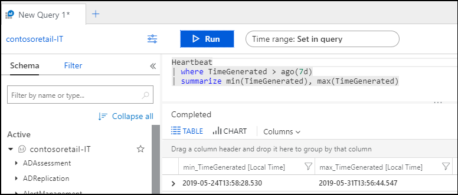
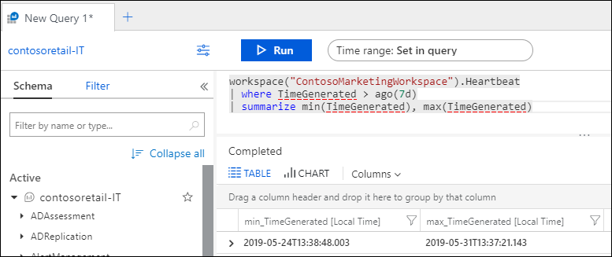
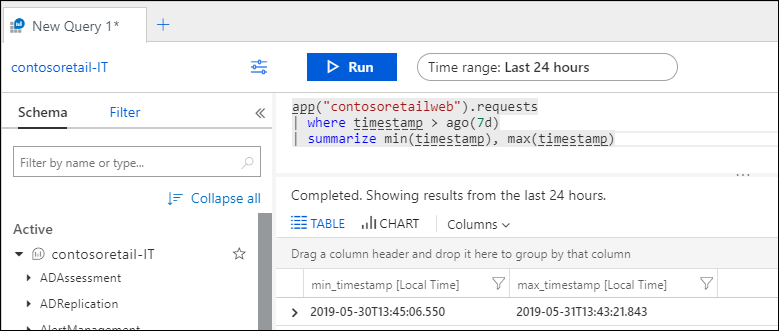

# Log query scope and time range in Azure Monitor Log Analytics
This article describes the scope and time range that define the records that are included in a log query that you run in Log Analytics in the Azure portal.

## Query scope
The scope defines the records that are evaluated by the query. This may include all records in a single Log Analytics workspace or it may include records created by particular Azure resources across multiple workspaces. The scope is displayed at the top left of the Log Analytics window. An icon indicates whether the scope is a Log Analytics workspace or an Application Insights application. No icon indicates another Azure resource.

The scope is defined by a single Azure resource and functions differently depending on the resource type. It's initially determined depending on how you start Log Analytics, and in some cases you can change the scope by clicking on it.

The following table lists the different resource types, how they define the query scope, and how the scope is determined.

| Resource | Records in scope | How to select | Changing Scope |
|:---|:---|:---|:---|
| Log Analytics workspace | All records in the Log Analytics workspace. | Select **Logs** from the **Azure Monitor** menu or the **Log Analytics workspaces** menu.  | Can change scope to any other resource type. |
| Application Insights application | All records in the Application Insights application. | Select **Analytics** from **Overview** page of Application Insights. | Can only change scope to another Application Insights application. |
| Resource group | Records created by all resources in the resource group. May include data from multiple Log Analytics workspaces. | Select **Logs** from the resource group menu. | Cannot change scope.|
| Subscription | Records created by all resources in the subsciption. May include data from multiple Log Analytics workspaces. | Select **Logs** from the **Azure Monitor** menu. Click on scope. Select **Multiple resources**. Select subscription. | Can change scope to any other resource type. |
| Other Azure resources | Records created by the resource. May include data from multiple Log Analytics workspaces.  | Select **Logs** from the resource menu. OR Select **Logs** from the **Azure Monitor** menu and then select a new scope. | Can only change scope to same resource type. |

## Scope limitations
When the scope is set to any resource other than a Log Analytics workspace or an Application Insights application, the following limitations apply:

- The following options in the portal not available:
    - Save
    - New alert rule
    - Query explorer
- You cannot use the following commands in the query:
    - [app](app-expression.md)
    - [workspace](workspace-expression.md)
 

## Query limits
When the query scope includes multiple Log Analytics workspaces, it can significantly affect performance if those workspaces are spread across multiple Azure regions. In this case, your query may receive a warning or be blocked from running.

Your query will receive a warning if the scope includes workspaces in 7 or more regions, it will still run but may take excessive time to complete.

Your query will be blocked from running if the scope includes workspaces in 20 or more regions. In this case you will be prompted to reduce the number of workspace regions and attempt to run the query again.

## Time range
The time range species the records that are evaluated for the query based on when the record was created. This is defined by a standard property on every record in the workspace or application as specified in the following table.

| Location | Property |
|:---|:---|
| Log Analytics workspace          | TimeGenerated |
| Application Insights application | timestamp     |

Select the time range from the time picker at the top of the Log Analytics window.  You can select a predefined period or select **Custom** to specify a specific time range.

If you set a filter in the query that uses the standard time property as shown in the table above, the time picker changes to **Set in query**, and the time picker is disabled. In this case, it's most efficient to put the filter at the top of the query so that any subsequent processing only needs to work with the filtered records.

If you use the [workspace](workspace-expression.md) or [app](app-expression.md) command to retrieve data from another workspace or application, the time picker may behave differently. If the scope is a Log Analytics workspace, and you use **app** or if the scope is an Application Insights application, and you use **workspace**, then Log Analytics may not understand that the property used in the filter should determine the time filter.

In the following example, the scope is set to a Log Analytics workspace.  The query uses **workspace** to retrieve data from another Log Analytics workspace. The time picker changes to **Set in query** because it sees a filter that uses the expected **TimeGenerated** property.

If the query uses **app** to retrieve data from an Application Insights application though, Log Analytics doesn't recognize the **timestamp** property in the filter, and the time picker remains unchanged. In this case, both filters are applied. In the example, only records created in the last 24 hours are included in the query even though it specifies 7 days in the **where** clause.

## Next steps

- Learn more about [writing Azure Monitor log queries](get-started-queries.md).
