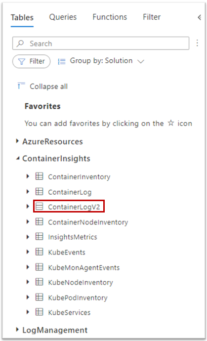

# Query Basic Logs in Azure Monitor (Preview)
Basic Logs reduce the cost of high-volume verbose logs you don’t need for analytics and alerts. Basic Logs have reduced charges for ingestion and limitations on log queries and other Azure Monitor features. This article describes how to query data from tables configured for Basic Logs in the Azure portal and using the Log Analytics REST API. 

Note that other tools that use the Azure API for querying - for example, Grafana and PowerBI - cannot access Basic Logs. 

## Limits
Queries with Basic Logs are subject to the following limitations:
### KQL language limits
Log queries against Basic Logs are intended for simple data retrieval and use a subset of the KQL language, including the following operators: 

- [where](/azure/data-explorer/kusto/query/whereoperator)
- [extend](/azure/data-explorer/kusto/query/extendoperator)
- [project](/azure/data-explorer/kusto/query/projectoperator)
- [project-away](/azure/data-explorer/kusto/query/projectawayoperator)
- [project-keep](/azure/data-explorer/kusto/query/projectkeepoperator)
- [project-rename](/azure/data-explorer/kusto/query/projectrenameoperator)
- [project-reorder](/azure/data-explorer/kusto/query/projectreorderoperator)
- [parse](/azure/data-explorer/kusto/query/parseoperator)
- [parse-where](/azure/data-explorer/kusto/query/parsewhereoperator)

You can use all functions and binary operators within these operators.

### Time range
Specify the time range in the query header in Log Analytics or in the API call. You can't specify the time range in the query body using a **where** statement.

### Query context
Queries with Basic Logs must use a workspace for the scope. You can't run queries using another resource for the scope. For more details, see [Log query scope and time range in Azure Monitor Log Analytics](scope.md).

### Concurrent queries
You can run two concurrent queries per user. 

### Purge
You cannot [purge personal data](personal-data-mgmt.md#how-to-export-and-delete-private-data) from Basic Logs tables. 


## Run a query from the Azure portal
Creating a query using Basic Logs is the same as any other query in Log Analytics. See [Get started with Azure Monitor Log Analytics](./log-analytics-tutorial.md) if you aren't familiar with this process.

Open Log Analytics in the Azure portal and open the **Tables** tab. When browsing the list of tables, Basic Logs tables are identified with a unique icon: 



You can also hover over a table name for the table information view. This will specify that the table is configured as Basic Logs:


When you add a table to the query, Log Analytics will identify a Basic Logs table and align the authoring experience accordingly. The following example shows when you attempt to use an operator that isn't supported by Basic Logs.


## Run a query from REST API
Use **/search** from the [Log Analytics API](api/overview.md) to run a query with Basic Logs using a REST API. This is similar to the [/query](api/request-format.md) API with the following differences:

- The query is subject to the language limitations described above.
- The time span must be specified in the header of the request and not in the query statement.

### Sample Request
```http
https://api.loganalytics.io/v1/workspaces/testWS/search?timespan=P1D
```

**Request body**

```json
{
    "query": "ContainerLog | where LogEntry has \"some value\"\n",
}
```

## Costs
The charge for a query on Basic Logs is based on the amount of data the query scans, not just the amount of data the query returns. For example, a query that scans three days of data in a table that ingests 100 GB each day, would be charged for 300 GB. Calculation is based on chunks of up to one day of data. 

For more information, see [Azure Monitor pricing](https://azure.microsoft.com/pricing/details/monitor/).

> [!NOTE]
> During the preview period, there is no cost for log queries on Basic Logs.

## Next steps

- [Learn more about Basic Logs and the different log plans.](log-analytics-workspace-overview.md#log-data-plans-preview)
- [Configure a table for Basic Logs.](basic-logs-configure.md)
- [Use a search job to retrieve data from Basic Logs into Analytics Logs where it can be queries multiple times.](search-jobs.md)