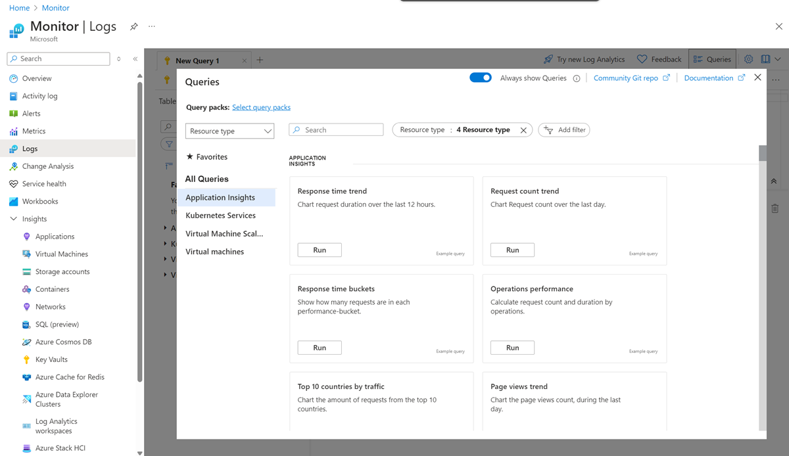
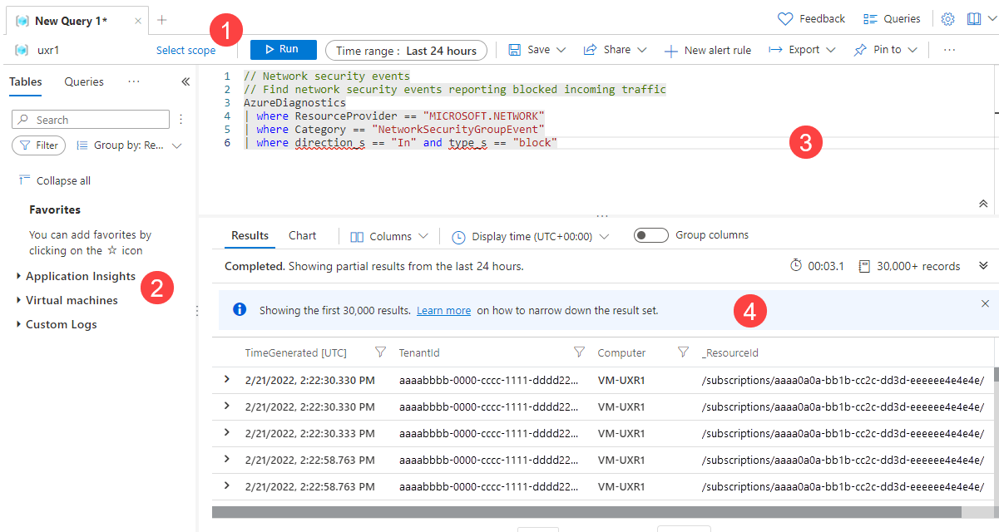

# Overview of Log Analytics in Azure Monitor

Log Analytics is a tool in the Azure portal that's used to edit and run log queries against data in the Azure Monitor Logs store.  

You might write a simple query that returns a set of records and then use features of Log Analytics to sort, filter, and analyze them. Or you might write a more advanced query to perform statistical analysis and visualize the results in a chart to identify a particular trend.

Whether you work with the results of your queries interactively or use them with other Azure Monitor features, such as log query alerts or workbooks, Log Analytics is the tool that you'll use to write and test them.

## Start Log Analytics

To start Log Analytics in the Azure portal, on the **Azure Monitor** menu select **Logs**. You'll also see this option on the menu for most Azure resources. No matter where you start Log Analytics, the tool is the same. But the menu you use to start Log Analytics determines the data that's available.

If you start Log Analytics from the **Azure Monitor** menu or the **Log Analytics workspaces** menu, you'll have access to all the records in a workspace. If you select **Logs** from another type of resource, your data will be limited to log data for that resource. For more information, see [Log query scope and time range in Azure Monitor Log Analytics](./scope.md).

When you start Log Analytics, a dialog appears that contains [example queries](../logs/queries.md). The queries are categorized by solution. Browse or search for queries that match your requirements. You might find one that does exactly what you need. You can also load one to the editor and modify it as required. Browsing through example queries is a good way to learn how to write your own queries.

If you want to start with an empty script and write it yourself, close the example queries. Select **Queries** at the top of the screen to get them back.

> [!TIP]
> The new Log Analytics, which offers [simple and advanced modes for exploring data](../logs/log-analytics-simple-mode.md), is currently in preview and available to a limited number of customers. To try it, select **Try the new Log Analytics** at the top right corner of the Log Analytics query editor.
> :::image type="content" source="media/log-analytics-explorer/try-new-log-analytics.png" alt-text="A GIF showing the Try new Log Analytics button.":::

## Log Analytics interface

The following image identifies four Log Analytics components.

### Top action bar

The top bar has controls for working with a query in the query window.

| Option | Description |
|:---|:---|
| Scope | Specifies the scope of data used for the query. This could be all the data in a Log Analytics workspace or data for a particular resource across multiple workspaces. See [Query scope](./scope.md). |
| Run button | Run the selected query in the query window. You can also select **Shift+Enter** to run a query. |
| Time picker | Select the time range for the data available to the query. This action is overridden if you include a time filter in the query. See [Log query scope and time range in Azure Monitor Log Analytics](./scope.md). |
| Save button | Save the query to **Query Explorer** for the workspace. |
 Copy button | Copy a link to the query, the query text, or the query results to the clipboard. |
| New alert rule button | Create a new tab with an empty query. |
| Export button | Export the results of the query to a CSV file or the query to Power Query Formula Language format for use with Power BI. |
| Pin to button | Pin the results of the query to an Azure dashboard or add them to an Azure workbook. |
| Format query button | Arrange the selected text for readability. |
| Example queries button | Open the example queries dialog that appears when you first open Log Analytics. |
| Query Explorer button | Open **Query Explorer**, which provides access to saved queries in the workspace. |

### Left sidebar

The sidebar on the left lists tables in the workspace, sample queries, and filter options for the current query.

| Tab | Description |
|:---|:---|
| Tables | Lists the tables that are part of the selected scope. Select **Group by** to change the grouping of the tables. Hover over a table name to display a dialog with a description of the table and options to view its documentation and preview its data. Expand a table to view its columns. Double-click a table or column name to add it to the query. |
| Queries | List of example queries that you can open in the query window. This list is the same one that appears when you open Log Analytics. Select **Group by** to change the grouping of the queries. Double-click a query to add it to the query window or hover over it for other options. |
| Filter | Creates filter options based on the results of a query. After you run a query, columns appear with different values from the results. Select one or more values, and then select **Apply & Run** to add a **where** command to the query and run it again. |

### Query window

The query window is where you edit your query. IntelliSense is used for KQL commands and color coding enhances readability. Select **+** at the top of the window to open another tab.

A single window can include multiple queries. A query can't include any blank lines, so you can separate multiple queries in a window with one or more blank lines. The current query is the one with the cursor positioned anywhere in it.

To run the current query, select the **Run** button or select **Shift+Enter**.

### Results window

The results of a query appear in the results window. By default, the results are displayed as a table. To display the results as a chart, select **Chart** in the results window. You can also add a **render** command to your query.

#### Results view

The results view displays query results in a table organized by columns and rows. Click to the left of a row to expand its values. Select the **Columns** dropdown to change the list of columns. Sort the results by selecting a column name. Filter the results by selecting the funnel next to a column name. Clear the filters and reset the sorting by running the query again.

Select **Group columns** to display the grouping bar above the query results. Group the results by any column by dragging it to the bar. Create nested groups in the results by adding more columns.

#### Chart view

The chart view displays the results as one of multiple available chart types. You can specify the chart type in a **render** command in your query. You can also select it from the **Visualization Type** dropdown.

| Option | Description |
|:---|:---|
| Visualization type | Type of chart to display. |
| X-axis | Column in the results to use for the x-axis.
| Y-axis | Column in the results to use for the y-axis. Typically, this is a numeric column. |
| Split by | Column in the results that defines the series in the chart. A series is created for each value in the column. |
| Aggregation | Type of aggregation to perform on the numeric values in the y-axis. |

## Relationship to Azure Data Explorer

If you've worked with the Azure Data Explorer web UI, Log Analytics should look familiar. That's because it's built on top of Azure Data Explorer and uses the same Kusto Query Language.

Log Analytics adds features specific to Azure Monitor, such as filtering by time range and the ability to create an alert rule from a query. Both tools include an explorer that lets you scan through the structure of available tables. The Azure Data Explorer web UI primarily works with tables in Azure Data Explorer databases. Log Analytics works with tables in a Log Analytics workspace.

## Next steps

- Walk through a [tutorial on using Log Analytics in the Azure portal](./log-analytics-tutorial.md).
- Walk through a [tutorial on writing queries](./get-started-queries.md).
