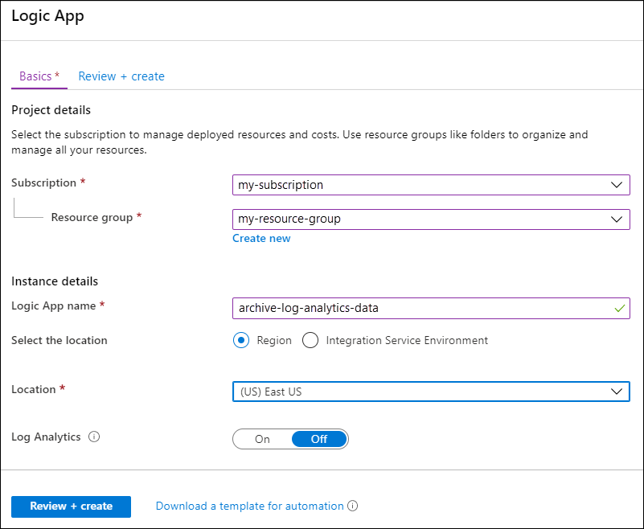
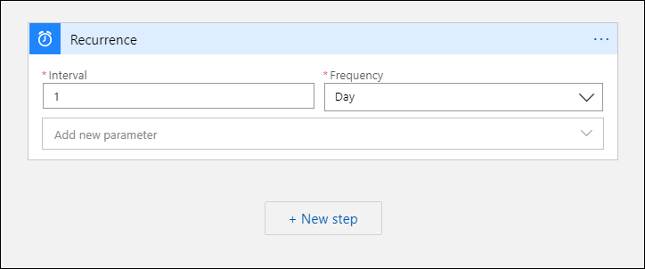
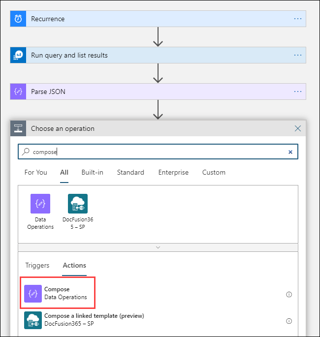
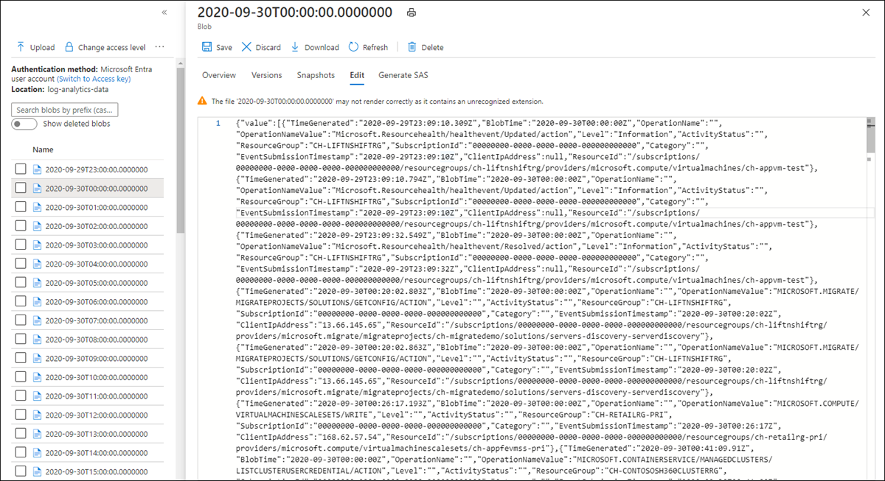

# Export data from a Log Analytics workspace to a Storage account using Logic Apps
This article describes a method to use [Azure Logic Apps](../../logic-apps/index.yml) to query data from a Log Analytics workspace in Azure Monitor and send it to Azure Storage. Use this process when you need to export your Azure Monitor Log data for auditing and compliance scenarios or to allow another service to retrieve this data.

## Other export methods
The method discussed in this article describes a scheduled export from a log query by using a logic app. Other options to export data for particular scenarios include:

- To export data from your Log Analytics workspace to a Storage account or Azure Event Hubs, use the Log Analytics workspace data export feature of Azure Monitor Logs. See [Log Analytics workspace data export in Azure Monitor](logs-data-export.md)
- One-time export by using a logic app. See [Azure Monitor Logs connector for Logic Apps and Power Automate](logicapp-flow-connector.md).
- One-time export to a local machine by using a PowerShell script. See [Invoke-AzOperationalInsightsQueryExport](https://www.powershellgallery.com/packages/Invoke-AzOperationalInsightsQueryExport).

## Overview
This procedure uses the [Azure Monitor Logs connector](/connectors/azuremonitorlogs), which lets you run a log query from a logic app and use its output in other actions in the workflow. The [Azure Blob Storage connector](/connectors/azureblob) is used in this procedure to send the query output to storage.

[](media/logs-export-logic-app/logic-app-overview.png#lightbox)

When you export data from a Log Analytics workspace, limit the amount of data processed by your Logic Apps workflow. Filter and aggregate your log data in the query to reduce the required data. For example, if you need to export sign-in events, filter for required events and project only the required fields. For example:

```Kusto
SecurityEvent
| where EventID == 4624 or EventID == 4625
| project TimeGenerated , Account , AccountType , Computer
```

When you export the data on a schedule, use the `ingestion_time()` function in your query to ensure that you don't miss late-arriving data. If data is delayed because of network or platform issues, using the ingestion time ensures that data is included in the next Logic Apps execution. For an example, see the step "Add Azure Monitor Logs action" in the [Logic Apps procedure](#logic-app-procedure) section.

## Prerequisites
The following prerequisites must be completed before you start this procedure:

- **Log Analytics workspace**: The user who creates the logic app must have at least read permission to the workspace.
- **Storage account**: The Storage account doesn't have to be in the same subscription as your Log Analytics workspace. The user who creates the logic app must have write permission to the Storage account.

## Connector limits
Log Analytics workspace and log queries in Azure Monitor are multitenancy services that include limits to protect and isolate customers and maintain quality of service. When you query for a large amount of data, consider the following limits, which can affect how you configure the Logic Apps recurrence and your log query:

- Log queries can't return more than 500,000 rows.
- Log queries can't return more than 64,000,000 bytes.
- Log queries can't run longer than 10 minutes by default.
- Log Analytics connector is limited to 100 calls per minute.

## Logic Apps procedure

### Create a container in the Storage account

Use the procedure in [Create a container](../../storage/blobs/storage-quickstart-blobs-portal.md#create-a-container) to add a container to your Storage account to hold the exported data. The name used for the container in this article is **loganalytics-data**, but you can use any name.

### Create a logic app

1. Go to **Logic Apps** in the Azure portal and select **Add**. Select a **Subscription**, **Resource group**, and **Region** to store the new Logic App. Then give it a unique name. You can turn on the **Log Analytics** setting to collect information about runtime data and events as described in [Set up Azure Monitor logs and collect diagnostics data for Azure Logic Apps](../../logic-apps/monitor-logic-apps-log-analytics.md). This setting isn't required for using the Azure Monitor Logs connector.

   [](media/logs-export-logic-app/create-logic-app.png#lightbox)

1. Select **Review + create** and then select **Create**. When the deployment is complete, select **Go to resource** to open the **Logic Apps Designer**.

### Create a trigger for the logic app

Under **Start with a common trigger**, select **Recurrence**. This setting creates a logic app that automatically runs at a regular interval. In the **Frequency** box of the action, select **Day**. In the **Interval** box, enter **1** to run the workflow once per day.

[](media/logs-export-logic-app/recurrence-action.png#lightbox)

### Add an Azure Monitor Logs action

The Azure Monitor Logs action lets you specify the query to run. The log query used in this example is optimized for hourly recurrence. It collects the data ingested for the particular execution time. For example, if the workflow runs at 4:35, the time range would be 3:00 to 4:00. If you change the logic app to run at a different frequency, you need to change the query too. For example, if you set the recurrence to run daily, you set startTime in the query to startofday(make_datetime(year,month,day,0,0)).

You're prompted to select a tenant to grant access to the Log Analytics workspace with the account that the workflow will use to run the query.

1. Select **+ New step** to add an action that runs after the recurrence action. Under **Choose an action**, enter **azure monitor**. Then select **Azure Monitor Logs**.

   [](media/logs-export-logic-app/select-azure-monitor-connector.png#lightbox)

1. Select **Azure Log Analytics – Run query and list results**.

   [](media/logs-export-logic-app/select-query-action-list.png#lightbox)

1. Select the **Subscription** and **Resource Group** for your Log Analytics workspace. Select **Log Analytics Workspace** for the **Resource Type**. Then select the workspace name under **Resource Name**.

1. Add the following log query to the **Query** window:

     ```Kusto
     let dt = now();
     let year = datetime_part('year', dt);
     let month = datetime_part('month', dt);
     let day = datetime_part('day', dt);
      let hour = datetime_part('hour', dt);
     let startTime = make_datetime(year,month,day,hour,0)-1h;
     let endTime = startTime + 1h - 1tick;
     AzureActivity
     | where ingestion_time() between(startTime .. endTime)
     | project 
         TimeGenerated,
         BlobTime = startTime, 
         OperationName ,
         OperationNameValue ,
         Level ,
         ActivityStatus ,
         ResourceGroup ,
         SubscriptionId ,
         Category ,
         EventSubmissionTimestamp ,
         ClientIpAddress = parse_json(HTTPRequest).clientIpAddress ,
         ResourceId = _ResourceId 
     ```

1. The **Time Range** specifies the records that will be included in the query based on the **TimeGenerated** column. This should be set to a value greater than the time range selected in the query. Because this query isn't using the **TimeGenerated** column, the **Set in query** option isn't available. For more information about the time range, see [Query scope](./scope.md). Select **Last 4 hours** for the **Time Range**. This setting ensures that any records with an ingestion time larger than **TimeGenerated** will be included in the results.

   [](media/logs-export-logic-app/run-query-list-action.png#lightbox)

### Add a Parse JSON action (optional)

The output from the **Run query and list results** action is formatted in JSON. You can parse this data and manipulate it as part of the preparation for the **Compose** action.

You can provide a JSON schema that describes the payload you expect to receive. The designer parses JSON content by using this schema and generates user-friendly tokens that represent the properties in your JSON content. You can then easily reference and use those properties throughout your Logic App's workflow.

You can use a sample output from the **Run query and list results** step.

1. Select **Run Trigger** in the Logic Apps ribbon. Then select **Run** and download and save an output record. For the sample query in the previous stem, you can use the following sample output:

    ```json
    {
        "TimeGenerated": "2020-09-29T23:11:02.578Z",
        "BlobTime": "2020-09-29T23:00:00Z",
        "OperationName": "Returns Storage Account SAS Token",
        "OperationNameValue": "MICROSOFT.RESOURCES/DEPLOYMENTS/WRITE",
        "Level": "Informational",
        "ActivityStatus": "Started",
        "ResourceGroup": "monitoring",
        "SubscriptionId": "00000000-0000-0000-0000-000000000000",
        "Category": "Administrative",
        "EventSubmissionTimestamp": "2020-09-29T23:11:02Z",
        "ClientIpAddress": "192.168.1.100",
        "ResourceId": "/subscriptions/00000000-0000-0000-0000-000000000000/resourcegroups/monitoring/providers/microsoft.storage/storageaccounts/my-storage-account"
    }
    ```

1. Select **+ New step** and then select **+ Add an action**. Under **Choose an action**, enter **json** and then select **Parse JSON**.

   [](media/logs-export-logic-app/select-parse-json.png#lightbox)

1. Select the **Content** box to display a list of values from previous activities. Select **Body** from the **Run query and list results** action. This output is from the log query.

   [](media/logs-export-logic-app/select-body.png#lightbox)

1. Copy the sample record saved earlier. Select **Use sample payload to generate schema** and paste.

   [](media/logs-export-logic-app/parse-json-payload.png#lightbox)

### Add the Compose action

The **Compose** action takes the parsed JSON output and creates the object that you need to store in the blob.

1. Select **+ New step**, and then select **+ Add an action**. Under **Choose an action**, enter **compose**. Then select the **Compose** action.

   [](media/logs-export-logic-app/select-compose.png#lightbox)

1. Select the **Inputs** box to display a list of values from previous activities. Select **Body** from the **Parse JSON** action. This parsed output is from the log query.

   [](media/logs-export-logic-app/select-body-compose.png#lightbox)

### Add the Create blob action

The Create blob action writes the composed JSON to storage.

1. Select **+ New step**, and then select **+ Add an action**. Under **Choose an action**, enter **blob**. Then select the **Create blob** action.

   [](media/logs-export-logic-app/select-create-blob.png#lightbox)

1. Enter a name for the connection to your Storage account in **Connection Name**. Then select the folder icon in the **Folder path** box to select the container in your Storage account. Select the **Blob name** to see a list of values from previous activities. Select **Expression** and enter an expression that matches your time interval. For this query, which is run hourly, the following expression sets the blob name per previous hour:

     ```json
     subtractFromTime(formatDateTime(utcNow(),'yyyy-MM-ddTHH:00:00'), 1,'Hour')
     ```

   [](media/logs-export-logic-app/blob-expression.png#lightbox)

1. Select the **Blob content** box to display a list of values from previous activities. Then select **Outputs** in the **Compose** section.

   [](media/logs-export-logic-app/create-blob.png#lightbox)

### Test the logic app

Test the workflow by selecting **Run**. If the workflow has errors, it will be indicated on the step with the problem. You can view the executions and drill in to each step to view the input and output to investigate failures. See [Troubleshoot and diagnose workflow failures in Azure Logic Apps](../../logic-apps/logic-apps-diagnosing-failures.md) if necessary.

[](media/logs-export-logic-app/runs-history.png#lightbox)

### View logs in storage

Go to the **Storage accounts** menu in the Azure portal and select your Storage account. Select the **Blobs** tile. Then select the container you specified in the Create blob action. Select one of the blobs and then select **Edit blob**.

[](media/logs-export-logic-app/blob-data.png#lightbox)

## Next steps

- Learn more about [log queries in Azure Monitor](./log-query-overview.md).
- Learn more about [Logic Apps](../../logic-apps/index.yml).
- Learn more about [Power Automate](https://flow.microsoft.com).
