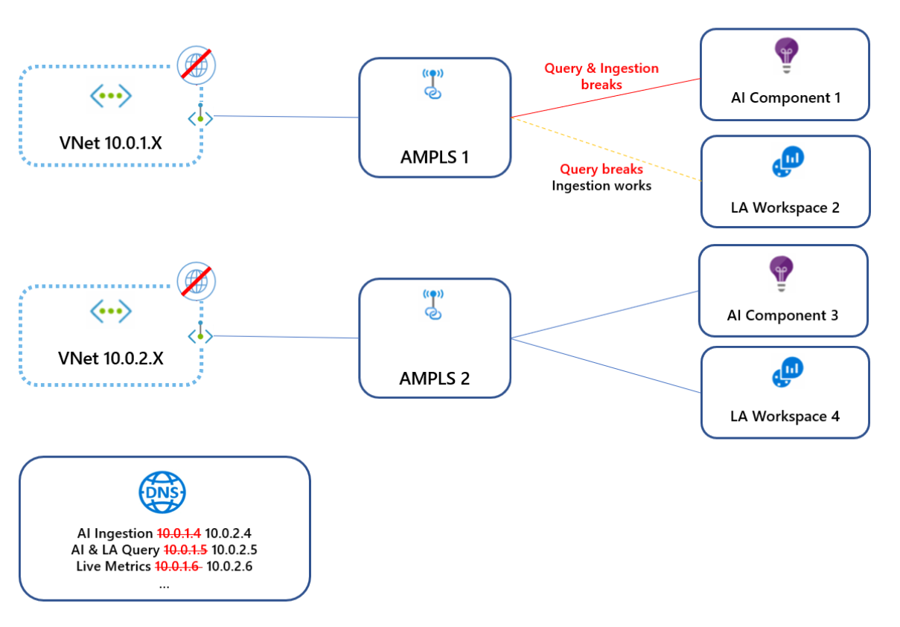
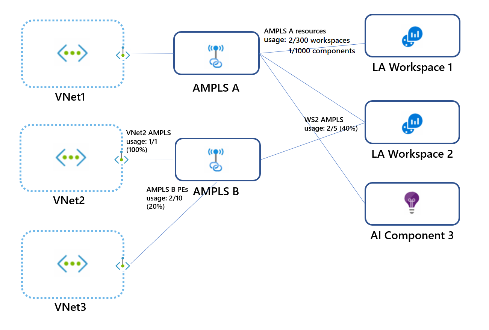
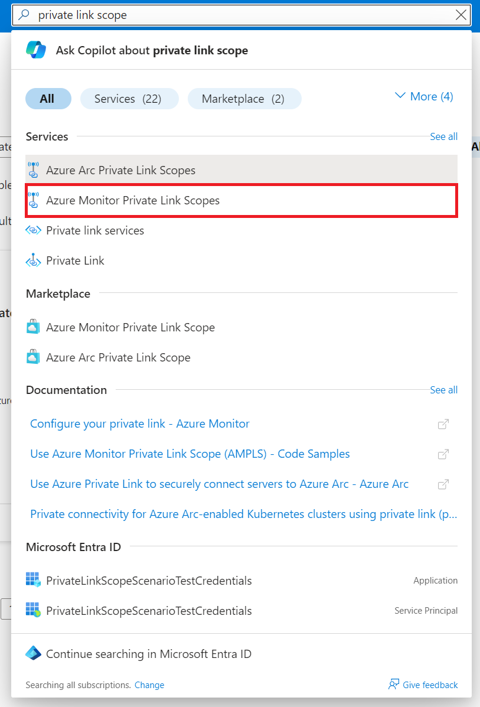
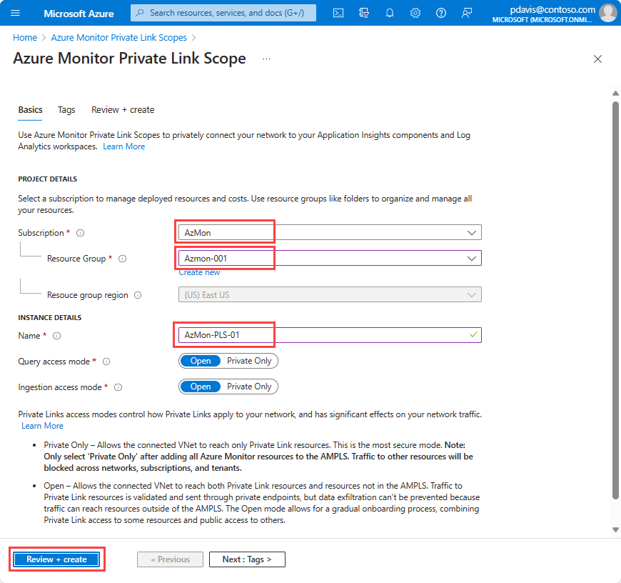
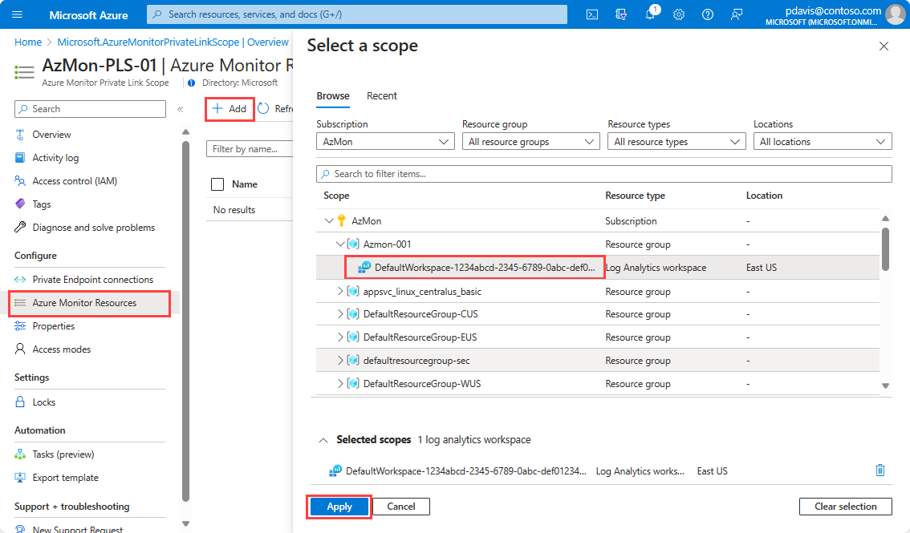
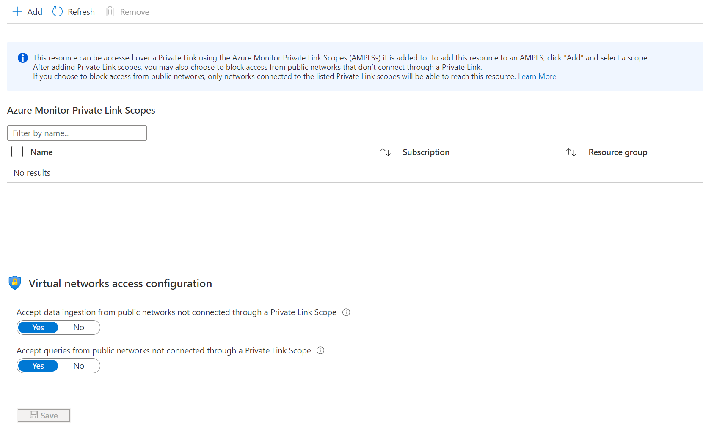

# Use Azure Private Link to securely connect networks to Azure Monitor

[Azure Private Link](../../private-link/private-link-overview.md) allows you to securely link Azure PaaS services to your virtual network using private endpoints. For many services, you just set up an endpoint per resource. However, Azure Monitor is a constellation of different interconnected services that work together to monitor your workloads. As a result, we have built a resource called an Azure Monitor Private Link Scope (AMPLS). AMPLS allows you to define the boundaries of your monitoring network and connect to your virtual network. This article covers when to use and how to set up an Azure Monitor Private Link Scope.

## Advantages

With Private Link you can:

- Connect privately to Azure Monitor without opening up any public network access
- Ensure your monitoring data is only accessed through authorized private networks
- Prevent data exfiltration from your private networks by defining specific Azure Monitor resources that connect through your private endpoint
- Securely connect your private on-premises network to Azure Monitor using ExpressRoute and Private Link
- Keep all traffic inside the Microsoft Azure backbone network

For more information, see  [Key Benefits of Private Link](../../private-link/private-link-overview.md#key-benefits).

## How it works

Azure Monitor Private Link Scope (AMPLS) connects private endpoints (and the VNets they're contained in) to one or more Azure Monitor resources - Log Analytics workspaces, Application Insights components and [Data Collection Endpoints (preview)](../agents/data-collection-endpoint-overview.md).


* The Private Endpoint on your VNet allows it to reach Azure Monitor endpoints through private IPs from your network's pool, instead of using to the public IPs of these endpoints. That allows you to keep using your Azure Monitor resources without opening your VNet to unrequired outbound traffic. 
* Traffic from the Private Endpoint to your Azure Monitor resources will go over the Microsoft Azure backbone, and not routed to public networks. 
* You can configure each of your workspaces or components to allow or deny ingestion and queries from public networks. That provides a resource-level protection, so that you can control traffic to specific resources.

> [!NOTE]
> A single Azure Monitor resource can belong to multiple AMPLSs, but you cannot connect a single VNet to more than one AMPLS. 

### Azure Monitor Private Links and your DNS: It's All or Nothing
Some Azure Monitor services use global endpoints, meaning they serve requests targeting any workspace/component. When you set up a Private Link connection your DNS is updated to map Azure Monitor endpoints to private IPs, in order to send traffic through the Private Link. When it comes to global endpoints, setting up a Private Link (even to a single resource) affects traffic to all resources. In other words, it's impossible to create a Private Link connection only for a specific component or workspace.

#### Global endpoints
Most importantly, traffic to the below global endpoints will be sent through the Private Link:
* All Application Insights endpoints - endpoints handling ingestion, live metrics, profiler, debugger etc. to Application Insights endpoints are global.
* The Query endpoint - the endpoint handling queries to both Application Insights and Log Analytics resources is global.

That effectively means that all Application Insights traffic will be sent to the Private Link, and that all queries - to both Application Insights and Log Analytics resources - will be sent to the Private Link.

Traffic to Application Insights resource not added to your AMPLS will not pass the Private Link validation, and will fail.


#### Resource-specific endpoints
All Log Analytics endpoints except the Query endpoint, are workspace-specific. So, creating a Private Link to a specific Log Analytics workspace won't affect ingestion (or other) traffic to other workspaces, which will continue to use the public Log Analytics endpoints. All queries, however, will be sent through the Private Link.

[Data Collection Endpoints (preview)](../agents/data-collection-endpoint-overview.md) are also resource-specific, and allow you to uniquely configure ingestion settings for your machines when using the new [Azure Monitor agent](../agents/azure-monitor-agent-overview.md) and [Data Collection Rules](../agents/data-collection-rule-overview.md)


### Azure Monitor Private Link applies to all networks that share the same DNS
Some networks are composed of multiple VNets or other connected networks. If these networks share the same DNS, setting up a Private Link on any of them would update the DNS and affect traffic across all networks. That's especially important to note due to the "All or Nothing" behavior described above.



In the above diagram, VNet 10.0.1.x first connects to AMPLS1 and maps the Azure Monitor global endpoints to IPs from its range. Later, VNet 10.0.2.x connects to AMPLS2, and overrides the DNS mapping of the *same global endpoints* with IPs from its range. Since these VNets aren't peered, the first VNet now fails to reach these endpoints.


## Planning your Private Link setup

Before setting up your Azure Monitor Private Link setup, consider your network topology, and specifically your DNS routing topology.

As discussed above, setting up a Private Link affects - in many ways - traffic to all Azure Monitor resources. That's especially true for Application Insights resources. Additionally, it affects not only the network connected to the Private Endpoint (and through it to the AMPLS resources) but also all other networks the share the same DNS.

> [!NOTE]
> Given all that, the simplest and most secure approach would be:
> 1. Create a single Private Link connection, with a single Private Endpoint and a single AMPLS. If your networks are peered, create the Private Link connection on the shared (or hub) VNet.
> 2. Add *all* Azure Monitor resources (Application Insights components and Log Analytics workspaces) to that AMPLS.
> 3. Block network egress traffic as much as possible.

If for some reason you can't use a single Private Link and a single AMPLS, the next best thing would be to create isolated Private Link connections for isolation networks. If you are (or can align with) using spoke vnets, follow the guidance in [Hub-spoke network topology in Azure](/azure/architecture/reference-architectures/hybrid-networking/hub-spoke). Then, setup separate private link settings in the relevant spoke VNets. **Make sure to separate DNS zones as well**, since sharing DNS zones with other spoke networks will cause DNS overrides.


### Hub-spoke networks
Hub-spoke topologies can avoid the issue of DNS overrides by setting the Private Link on the hub (main) VNet, and not on each spoke VNet. This setup makes sense especially if the Azure Monitor resources used by the spoke VNets are shared. 


> [!NOTE]
> You may intentionally prefer to create separate Private Links for your spoke VNets, for example to allow each VNet to access a limited set of monitoring resources. In such cases, you can create a dedicated Private Endpoint and AMPLS for each VNet, but **must also verify they don't share the same DNS zones in order to avoid DNS overrides**.


### Peered networks
Network peering is used in various topologies, other than hub-spoke. Such networks can share reach each others' IP addresses, and most likely share the same DNS. In such cases, our recommendation is similar to Hub-spoke - select a single network that is reached by all other (relevant) networks and set the Private Link connection on that network. Avoid creating multiple Private Endpoints and AMPLS objects, since ultimately only the last one set in the DNS will apply.


### Isolated networks
If your networks aren't peered, **you must also separate their DNS in order to use Private Links**. Once that's done, you can create a Private Link for one (or many) network, without affecting traffic of other networks. That means creating a separate Private Endpoint for each network, and a separate AMPLS object. Your AMPLS objects can link to the same workspaces/components, or to different ones.


### Test with a local bypass: Edit your machine's hosts file instead of the DNS 
As a local bypass to the All or Nothing behavior, you can select not to update your DNS with the Private Link records, and instead edit the hosts files on select machines so only these machines would send requests to the Private Link endpoints.
* Set up a Private Link as show below, but when [connecting to a Private Endpoint](#connect-to-a-private-endpoint) choose **not** to auto-integrate with the DNS (step 5b).
* Configure the relevant endpoints on your machines' hosts files. To review the Azure Monitor endpoints that need mapping, see [Reviewing your Endpoint's DNS settings](#reviewing-your-endpoints-dns-settings).

That approach isn't recommended for production environments.

## Limits and additional considerations

### AMPLS limits

The AMPLS object has the following limits:
* A VNet can only connect to **one** AMPLS object. That means the AMPLS object must provide access to all the Azure Monitor resources the VNet should have access to.
* An AMPLS object can connect to 50 Azure Monitor resources at most.
* An Azure Monitor resource (Workspace or Application Insights component) can connect to 5 AMPLSs at most.
* An AMPLS object can connect to 10 Private Endpoints at most.

In the below diagram:
* Each VNet connects to only **one** AMPLS object.
* AMPLS A connects to two workspaces and one Application Insight component, using 3 of the 50 possible Azure Monitor resources connections.
* Workspace2 connects to AMPLS A and AMPLS B, using  of the 5 possible AMPLS connections.
* AMPLS B is connected to Private Endpoints of two VNets (VNet2 and VNet3), using 2 of the 10 possible Private Endpoint connections.




### Application Insights considerations
* You’ll need to add resources hosting the monitored workloads to a private link. For example, see [Using Private Endpoints for Azure Web App](../../app-service/networking/private-endpoint.md).
* Non-portal consumption experiences must also run on the private-linked VNET that includes the monitored workloads.
* In order to support Private Links for Profiler and Debugger, you'll need to [provide your own storage account](../app/profiler-bring-your-own-storage.md) 

> [!NOTE]
> To fully secure workspace-based Application Insights, you need to lock down both access to Application Insights resource as well as the underlying Log Analytics workspace.

### Log Analytics considerations
#### Automation
If you use Log Analytics solutions that require an Automation account, such as Update Management, Change Tracking, or Inventory, you should also set up a separate Private Link for your Automation account. For more information, see [Use Azure Private Link to securely connect networks to Azure Automation](../../automation/how-to/private-link-security.md).

#### Log Analytics solution packs download
Log Analytics agents need to access a global storage account to download solution packs. Private Link setups created at or after April 19, 2021 (or starting June 2021 on Azure Sovereign clouds) can reach the agents' solution packs storage over the private link. This capability is made possible through the new DNS zone created for [blob.core.windows.net](#privatelink-blob-core-windows-net).

If your Private Link setup was created before April 19, 2021, it won't reach the solution packs storage over a private link. To handle that you can either:
* Re-create your AMPLS and the Private Endpoint connected to it
* Allow your agents to reach the storage account through its public endpoint, by adding the following rules to your firewall allowlist:

    | Cloud environment | Agent Resource | Ports | Direction |
    |:--|:--|:--|:--|
    |Azure Public     | scadvisorcontent.blob.core.windows.net         | 443 | Outbound
    |Azure Government | usbn1oicore.blob.core.usgovcloudapi.net | 443 |  Outbound
    |Azure China 21Vianet      | mceast2oicore.blob.core.chinacloudapi.cn| 443 | Outbound


## Private Link connection setup

Start by creating an Azure Monitor Private Link Scope resource.

1. Go to **Create a resource** in the Azure portal and search for **Azure Monitor Private Link Scope**.

   

2. Select **create**.
3. Pick a Subscription and Resource Group.
4. Give the AMPLS a name. It's best to use a meaningful and clear name, such as "AppServerProdTelem".
5. Select **Review + Create**. 

   

6. Let the validation pass, and then select **Create**.

### Connect Azure Monitor resources

Connect Azure Monitor resources (Log Analytics workspaces and Application Insights components) to your AMPLS.

1. In your Azure Monitor Private Link scope, select **Azure Monitor Resources** in the left-hand menu. Select the **Add** button.
2. Add the workspace or component. Selecting the **Add** button brings up a dialog where you can select Azure Monitor resources. You can browse through your subscriptions and resource groups, or you can type in their name to filter down to them. Select the workspace or component and select **Apply** to add them to your scope.

    

> [!NOTE]
> Deleting Azure Monitor resources requires that you first disconnect them from any AMPLS objects they are connected to. It's not possible to delete resources connected to an AMPLS.

### Connect to a private endpoint

Now that you have resources connected to your AMPLS, create a private endpoint to connect our network. You can do this task in the [Azure portal Private Link center](https://portal.azure.com/#blade/Microsoft_Azure_Network/PrivateLinkCenterBlade/privateendpoints), or inside your Azure Monitor Private Link Scope, as done in this example.

1. In your scope resource, select **Private Endpoint connections** in the left-hand resource menu. Select **Private Endpoint** to start the endpoint create process. You can also approve connections that were started in the Private Link center here by selecting them and selecting **Approve**.

    

2. Pick the subscription, resource group, and name of the endpoint, and the region it should live in. The region needs to be the same region as the VNet you connect it to.

3. Select **Next: Resource**. 

4. In the Resource screen,

   a. Pick the **Subscription** that contains your Azure Monitor Private Scope resource. 

   b. For **resource type**, choose **Microsoft.insights/privateLinkScopes**. 

   c. From the **resource** drop-down, choose your Private Link scope you created earlier. 

   d. Select **Next: Configuration >**.
      

5. On the configuration pane,

   a.    Choose the **virtual network** and **subnet** that you want to connect to your Azure Monitor resources. 
 
   b.    Choose **Yes** for **Integrate with private DNS zone**, and let it automatically create a new Private DNS Zone. The actual DNS zones may be different from what is shown in the screenshot below. 
   > [!NOTE]
   > If you choose **No** and prefer to manage DNS records manually, first complete setting up your Private Link - including this Private Endpoint and the AMPLS configuration. Then, configure your DNS according to the instructions in [Azure Private Endpoint DNS configuration](../../private-link/private-endpoint-dns.md). Make sure not to create empty records as preparation for your Private Link setup. The DNS records you create can override existing settings and impact your connectivity with Azure Monitor.
 
   c.    Select **Review + create**.
 
   d.    Let validation pass. 
 
   e.    Select **Create**. 

    

You've now created a new private endpoint that is connected to this AMPLS.


## Configure access to your resources
So far we covered the configuration of your network, but you should also consider how you want to configure network access to your monitored resources:
- Log Analytics workspaces
- Application Insights components
- [Data Collection Endpoints (preview)](../agents/data-collection-endpoint-overview.md)

Go to the Azure portal. In your resource's menu, there's a menu item called **Network Isolation** on the left-hand side. This page controls both which networks can reach the resource through a Private Link, and whether other networks can reach it or not.

> [!NOTE]
> Starting August 16, 2021, Network Isolation will be strictly enforced. Resources set to block queries from public networks, and that aren't associated with an AMPLS, will stop accepting queries from any network.



### Connected Azure Monitor Private Link scopes
Here you can review and configure the resource's connections to Azure Monitor Private Links scopes. Connecting to scopes (AMPLSs) allows traffic from the virtual network connected to each AMPLS to reach this resource, and has the same effect as connecting it from the scope as we did in [Connecting Azure Monitor resources](#connect-azure-monitor-resources). To add a new connection, select **Add** and select the Azure Monitor Private Link Scope. Select **Apply** to connect it. Your resource can connect to 5 AMPLS objects, as mentioned in [Restrictions and limitations](#restrictions-and-limitations).

### Virtual networks access configuration - Managing access from outside of private links scopes
The settings on the bottom part of this page control access from public networks, meaning networks not connected to the listed scopes (AMPLSs).

If you set **Allow public network access for ingestion** to **No**, then clients (machines, SDKs, etc.) outside of the connected scopes can't upload data or send logs to this resource.

If you set **Allow public network access for queries** to **No**, then clients (machines, SDKs etc.) outside of the connected scopes can't query data in this resource. That data includes access to logs, metrics, and the live metrics stream, as well as experiences built on top such as workbooks, dashboards, query API-based client experiences, insights in the Azure portal, and more. Experiences running outside the Azure portal and that query Log Analytics data also have to be running within the private-linked VNET.


### Exceptions

#### Diagnostic logs
Logs and metrics uploaded to a workspace via [Diagnostic Settings](../essentials/diagnostic-settings.md) go over a secure private Microsoft channel, and are not controlled by these settings.

#### Azure Resource Manager
Restricting access as explained above applies to data in the resource. However, configuration changes, including turning these access settings on or off, are managed by Azure Resource Manager. To control these settings, you should restrict access to this resources using the appropriate roles, permissions, network controls, and auditing. For more information, see [Azure Monitor Roles, Permissions, and Security](../roles-permissions-security.md)

Additionally, specific experiences (such as the LogicApp connector) query data through Azure Resource Manager and therefore won't be able to query data unless Private Link settings are applied to the Resource Manager as well.


## Review and validate your Private Link setup

### Reviewing your Endpoint's DNS settings
The Private Endpoint you created should now have an five DNS zones configured:

* privatelink-monitor-azure-com
* privatelink-oms-opinsights-azure-com
* privatelink-ods-opinsights-azure-com
* privatelink-agentsvc-azure-automation-net
* privatelink-blob-core-windows-net

> [!NOTE]
> Each of these zones maps specific Azure Monitor endpoints to private IPs from the VNet's pool of IPs. The IP addresses showns in the below images are only examples. Your configuration should instead show private IPs from your own network.

#### Privatelink-monitor-azure-com
This zone covers the global endpoints used by Azure Monitor, meaning these endpoints serve requests considering all resources, not a specific one. This zone should have endpoints mapped for:
* `in.ai` - Application Insights ingestion endpoint (both a global and a regional entry)
* `api` - Application Insights and Log Analytics API endpoint
* `live` - Application Insights live metrics endpoint
* `profiler` - Application Insights profiler endpoint
* `snapshot` - Application Insights snapshots endpoint
[](./media/private-link-security/dns-zone-privatelink-monitor-azure-com-expanded.png#lightbox)

#### privatelink-oms-opinsights-azure-com
This zone covers workspace-specific mapping to OMS endpoints. You should see an entry for each workspace linked to the AMPLS connected with this Private Endpoint.
[](./media/private-link-security/dns-zone-privatelink-oms-opinsights-azure-com-expanded.png#lightbox)

#### privatelink-ods-opinsights-azure-com
This zone covers workspace-specific mapping to ODS endpoints - the ingestion endpoint of Log Analytics. You should see an entry for each workspace linked to the AMPLS connected with this Private Endpoint.
[](./media/private-link-security/dns-zone-privatelink-ods-opinsights-azure-com-expanded.png#lightbox)

#### privatelink-agentsvc-azure-automation-net
This zone covers workspace-specific mapping to the agent service automation endpoints. You should see an entry for each workspace linked to the AMPLS connected with this Private Endpoint.
[](./media/private-link-security/dns-zone-privatelink-agentsvc-azure-automation-net-expanded.png#lightbox)

#### privatelink-blob-core-windows-net
This zone configures connectivity to the global agents' solution packs storage account. Through it, agents can download new or updated solution packs (also known as management packs). Only one entry is required to handle to Log Analytics agents, no matter how many workspaces are used.
[](./media/private-link-security/dns-zone-privatelink-blob-core-windows-net-expanded.png#lightbox)
> [!NOTE]
> This entry is only added to Private Links setups created at or after April 19, 2021 (or starting June, 2021 on Azure Sovereign clouds).


### Validating you are communicating over a Private Link
* To validate your requests are now sent through the Private Endpoint, you can review them with a network tracking tool or even your browser. For example, when attempting to query your workspace or application, make sure the request is sent to the private IP mapped to the API endpoint, in this example it's *172.17.0.9*.

    Note: Some browsers may use other DNS settings (see [Browser DNS settings](#browser-dns-settings)). Make sure your DNS settings apply.

* To make sure your workspace or component aren't receiving requests from public networks (not connected through AMPLS), set the resource's public ingestion and query flags to *No* as explained in [Configure access to your resources](#configure-access-to-your-resources).

* From a client on your protected network, use `nslookup` to any of the endpoints listed in your DNS zones. It should be resolved by your DNS server to the mapped private IPs instead of the public IPs used by default.


## Use APIs and command line

You can automate the process described earlier using Azure Resource Manager templates, REST, and command-line interfaces.

To create and manage private link scopes, use the [REST API](/rest/api/monitor/privatelinkscopes(preview)/private%20link%20scoped%20resources%20(preview)) or [Azure CLI (az monitor private-link-scope)](/cli/azure/monitor/private-link-scope).

To manage the network access flag on your workspace or component, use the flags `[--ingestion-access {Disabled, Enabled}]` and `[--query-access {Disabled, Enabled}]`on [Log Analytics workspaces](/cli/azure/monitor/log-analytics/workspace) or [Application Insights components](/cli/azure/ext/application-insights/monitor/app-insights/component).

### Example Azure Resource Manager (ARM) template
The below Azure Resource Manager template creates:
* A private link scope (AMPLS) named "my-scope"
* A Log Analytics workspace named "my-workspace"
* Add a scoped resource to the "my-scope" AMPLS, named "my-workspace-connection"

```
{
    "$schema": https://schema.management.azure.com/schemas/2019-04-01/deploymentTemplate.json#,
    "contentVersion": "1.0.0.0",
    "parameters": {
        "private_link_scope_name": {
            "defaultValue": "my-scope",
            "type": "String"
        },
        "workspace_name": {
            "defaultValue": "my-workspace",
            "type": "String"
        }
    },
    "variables": {},
    "resources": [
        {
            "type": "microsoft.insights/privatelinkscopes",
            "apiVersion": "2019-10-17-preview",
            "name": "[parameters('private_link_scope_name')]",
            "location": "global",
            "properties": {}
        },
        {
            "type": "microsoft.operationalinsights/workspaces",
            "apiVersion": "2020-10-01",
            "name": "[parameters('workspace_name')]",
            "location": "westeurope",
            "properties": {
                "sku": {
                    "name": "pergb2018"
                },
                "publicNetworkAccessForIngestion": "Enabled",
                "publicNetworkAccessForQuery": "Enabled"
            }
        },
        {
            "type": "microsoft.insights/privatelinkscopes/scopedresources",
            "apiVersion": "2019-10-17-preview",
            "name": "[concat(parameters('private_link_scope_name'), '/', concat(parameters('workspace_name'), '-connection'))]",
            "dependsOn": [
                "[resourceId('microsoft.insights/privatelinkscopes', parameters('private_link_scope_name'))]",
                "[resourceId('microsoft.operationalinsights/workspaces', parameters('workspace_name'))]"
            ],
            "properties": {
                "linkedResourceId": "[resourceId('microsoft.operationalinsights/workspaces', parameters('workspace_name'))]"
            }
        }
    ]
}
```

## Collect custom logs and IIS log over Private Link

Storage accounts are used in the ingestion process of custom logs. By default, service-managed storage accounts are used. However to ingest custom logs on private links, you must use your own storage accounts and associate them with Log Analytics workspace(s). See more details on how to set up such accounts using the [command line](/cli/azure/monitor/log-analytics/workspace/linked-storage).

For more information on bringing your own storage account, see [Customer-owned storage accounts for log ingestion](private-storage.md)

## Restrictions and limitations

### AMPLS

The AMPLS object has a number of limits you should consider when planning your Private Link setup. See [AMPLS limits](#ampls-limits) for a deeper review of these limits.

### Agents

The latest versions of the Windows and Linux agents must be used to support secure ingestion to Log Analytics workspaces. Older versions can't upload monitoring data over a private network.

**Log Analytics Windows agent**

Use the Log Analytics agent version 10.20.18038.0 or later.

**Log Analytics Linux agent**

Use agent version 1.12.25 or later. If you can't, run the following commands on your VM.

```cmd
$ sudo /opt/microsoft/omsagent/bin/omsadmin.sh -X
$ sudo /opt/microsoft/omsagent/bin/omsadmin.sh -w <workspace id> -s <workspace key>
```


### Azure portal

To use Azure Monitor portal experiences such as Application Insights and Log Analytics, you need to allow the Azure portal and Azure Monitor extensions to be accessible on the private networks. Add **AzureActiveDirectory**, **AzureResourceManager**, **AzureFrontDoor.FirstParty**, and **AzureFrontdoor.Frontend** [service tags](../../firewall/service-tags.md) to your Network Security Group.

### Querying data
The [`externaldata` operator](/azure/data-explorer/kusto/query/externaldata-operator?pivots=azuremonitor) isn't supported over a Private Link, as it reads data from storage accounts but doesn't guarantee the storage is accessed privately.

### Programmatic access

To use the REST API, [CLI](/cli/azure/monitor) or PowerShell with Azure Monitor on private networks, add the [service tags](../../virtual-network/service-tags-overview.md)  **AzureActiveDirectory** and **AzureResourceManager** to your firewall.

### Application Insights SDK downloads from a content delivery network

Bundle the JavaScript code in your script so that the browser doesn't attempt to download code from a CDN. An example is provided on [GitHub](https://github.com/microsoft/ApplicationInsights-JS#npm-setup-ignore-if-using-snippet-setup)

### Browser DNS settings

If you're connecting to your Azure Monitor resources over a Private Link, traffic to these resources must go through the private endpoint that is configured on your network. To enable the private endpoint, update your DNS settings as explained in [Connect to a private endpoint](#connect-to-a-private-endpoint). Some browsers use their own DNS settings instead of the ones you set. The browser might attempt to connect to Azure Monitor public endpoints and bypass the Private Link entirely. Verify that your browsers settings don't override or cache old DNS settings. 

## Next steps

- Learn about [private storage](private-storage.md)