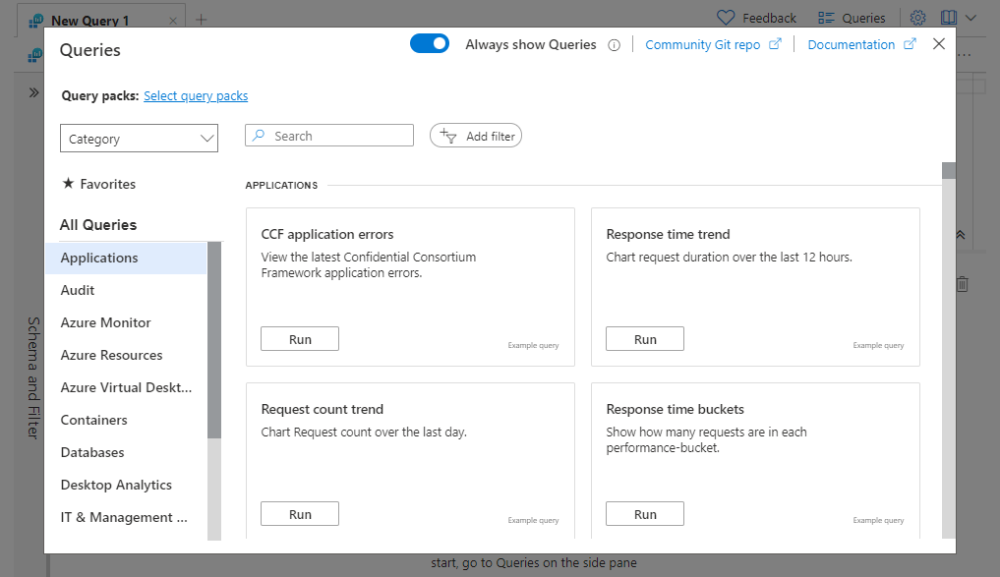
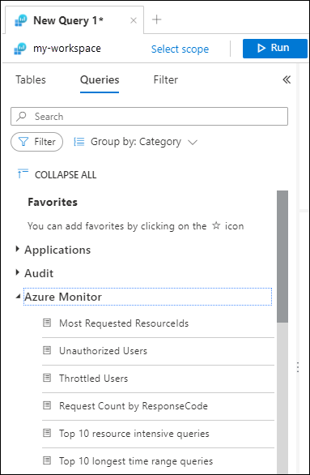
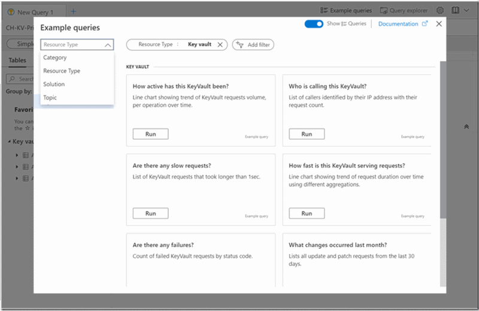

# Using queries in Azure Monitor Log Analytics
Instead of writing new queries in Log Analytics, you can access a library of existing queries that you can run or modify. This includes example queries provided by Azure Monitor, which are a great way to get started with Log Analytics if you aren't familiar with the KQL query language. It may also include log queries written by you or your organization to reuse logic specific to your organization.

## Queries interface
Select queries from the query interface which is available from two different locations in Log Analytics.

### Queries dialog

When you open Log Analytics, the *Queries* dialog automatically displayed. If you don't want this dialog to be automatically displayed, turn off the **Always show Queries** switch.

Each query is represented by a card. You can quickly scan through the queries to find what you need. You can run the query directly from the dialog or choose to load it to the query editor for modification.

It can also be accessed by clicking in the upper right of the screen on **Queries**.

### Query sidebar

The same functionality of the dialog experience can be accessed from the queries pane on the left-hand sidebar of Log Analytics. You can hover over a query name to get the query description and additional functionality.

## Finding and filtering queries

The options in this section are available in both the dialog and sidebar query experience, but with a slightly different user interface.  

### Group by

Change the grouping of the queries by clicking the *group by* drop-down list. The grouping values also act as an active table of contents. Clicking one of the values on the left-hand side of the screen scrolls the queries view right to the item clicked.

### Filter

You can also filter the queries according to the **group by** values mentioned earlier. In the example query dialog, the filters are found at the top.

### Combining group by and filter

The filter and group by functionality are designed to work in tandem. They provide flexibility in how queries are arranged. For example, if you using a resource group with multiple resources, you may want to filter down to a specific resource type and arrange the resulting queries by topic.

## Query properties
Each query has multiple properties that help you group and find them. These properties are available for sorting and filtering, and you can define several of them when [saving your own query](save-query.md). The types of properties are:

- **Resource type** – A resource as defined in Azure, such as a Virtual machine. See the [Azure Monitor Table Reference](/azure/azure-monitor/reference/tables/tables-resourcetype) for a full mapping of Azure Monitor Logs/Log Analytics tables to resource type.  
- **Category** – A type of information such as *Security* or *Audit*. Categories are identical to the categories defined in the Tables side pane. See the [Azure Monitor Table Reference](/azure/azure-monitor/reference/tables/tables-category) for a full list of categories.  
- **Solution** – An Azure Monitor solution associated with the queries
- **Topic** – The topic of the example query such as *Activity Logs* or *App logs*. The topic property is unique to example queries and may differ according to the specific resource type.
- **Labels** - Custom labels that you can define and assign when you [save your own query](save-query.md).
- **Tags** - Custom properties that can be defined when you [create a query pack](query-packs.md). Tags allow your organization to create their own taxonomies for organizing queries.

## Favorites
You can favorite frequently used queries to give you quicker access. Click the star next to the query to add it to **Favorites**. View your favorite queries from the **Favorites** option in the query interface.

## Types of queries
The query interface is populated with the following types of queries:

**Example queries:** Example queries can provide instant insight into a resource and provide a nice way to start learning and using KQL, thus shortening the time it takes to start using Log Analytics. We have collected and curated over 500 example queries designed to provide you instant value and that number of example queries is continually growing.

**Query packs:** A [query pack](query-packs.md) holds a collection of log queries, including queries that you save yourself. This includes the [default query pack](query-packs.md#default-query-pack) and any other query packs that your organization may have created in the subscription.

**Legacy queries:** Log queries previously saved in the query explorer experience and queries Azure solutions that are installed in the workspace. These are listed in the query dialog box under **Legacy queries**.

## Effect of query scope
The queries that are available when you open Log Analytics is determined by the current [query scope ](scope.md).

- For a **workspace** – All example queries and queries from query packs. Legacy queries in the workspace.
- For a **single resource** – Example queries and queries from query packs for the resource type. 
- For a **resource group** - Example queries and queries from query packs for resource types in the resource group. 

> [!TIP]
> The more resources you have in your scope, the longer the time for the portal to filter and show the query dialog.

## Next steps

[Get started with KQL Queries](get-started-queries.md)

