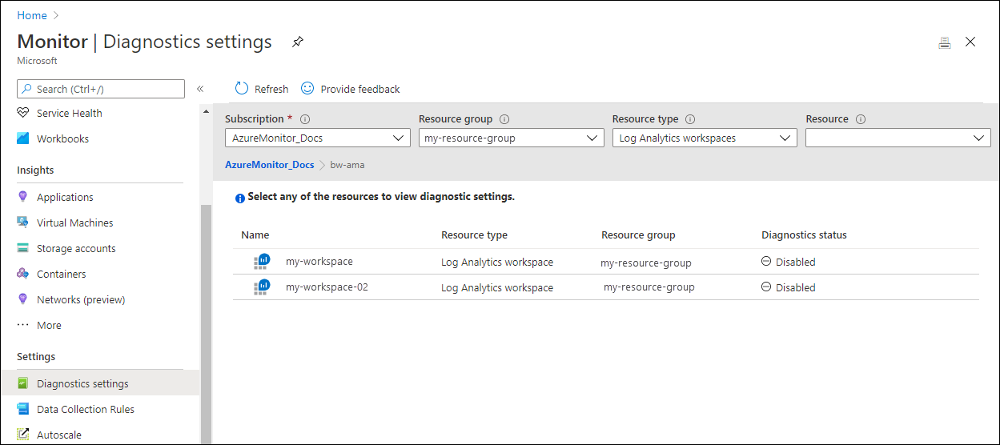
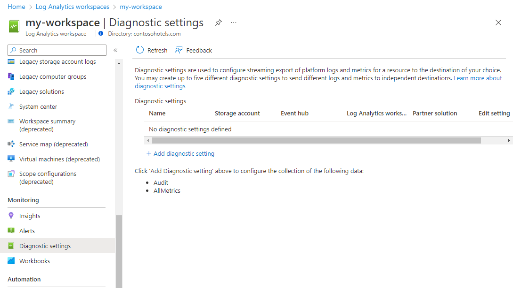

# Audit queries in Azure Monitor Logs
Log query audit logs provide telemetry about log queries run in Azure Monitor. This includes information such as when a query was run, who ran it, what tool was used, the query text, and performance statistics describing the query's execution.

## Configure query auditing
Query auditing is enabled with a [diagnostic setting](../essentials/diagnostic-settings.md) on the Log Analytics workspace. This allows you to send audit data to the current workspace or any other workspace in your subscription, to Azure Event Hubs to send outside of Azure, or to Azure Storage for archiving. 

### Azure portal
Access the diagnostic setting for a Log Analytics workspace in the Azure portal in either of the following locations:

- From the **Azure Monitor** menu, select **Diagnostic settings**, and then locate and select the workspace.

     

- From the **Log Analytics workspaces** menu, select the workspace, and then select **Diagnostic settings**.

     

### Resource Manager template
You can get an example Resource Manager template from [Diagnostic setting for Log Analytics workspace](../essentials/resource-manager-diagnostic-settings.md#diagnostic-setting-for-a-log-analytics-workspace).

## Audit data
An audit record is created each time a query is run. If you send the data to a Log Analytics workspace, it's stored in a table called *LAQueryLogs*. The following table describes the properties in each record of the audit data.

| Field | Description |
|:---|:---|
| TimeGenerated         | UTC time when query was submitted. |
| CorrelationId         | Unique ID to identify the query. Can be used in troubleshooting scenarios when contacting Microsoft for assistance. |
| AADObjectId           | Azure Active Directory ID of the user account that started the query.  |
| AADTenantId           | ID of the tenant of the user account that started the query.  |
| AADEmail              | Email of the tenant of the user account that started the query.  |
| AADClientId           | ID and resolved name of the application used to start the query. |
| RequestClientApp      | Resolved name of the application used to start the query. For more details, see [request client app.](#request-client-app).|
| QueryTimeRangeStart   | Start of the time range selected for the query. This may not be populated in certain scenarios such as when the query is started from Log Analytics, and time range is specified inside the query rather than the time picker. |
| QueryTimeRangeEnd     | End of the time range selected for the query. This may not be populated in certain scenarios such as when the query is started from Log Analytics, and time range is specified inside the query rather than the time picker.  |
| QueryText             | Text of the query that was run. |
| RequestTarget         | API URL was used to submit the query.  |
| RequestContext        | List of resources that the query was requested to run against. Contains up to three string arrays: workspaces, applications, and resources. Subscription or resource group-targeted queries will show as *resources*. Includes the target implied by RequestTarget. The resource ID for each resource will be included if it can be resolved. It may not be able to resolved if an error is returned in accessing the resource. In this case, the specific text from the query will be used. If the query uses an ambiguous name, such as a workspace name existing in multiple subscriptions, this ambiguous name will be used. |
| RequestContextFilters | Set of filters specified as part of the query invocation. Includes up to three possible string arrays: - ResourceTypes - type of resource to limit the scope of the query - Workspaces - list of workspaces to limit the query to - WorkspaceRegions - list of workspace regions to limit the query |
| ResponseCode          | HTTP response code returned when the query was submitted. |
| ResponseDurationMs    | Time for the response to be returned.  |
| ResponseRowCount     | Total number of rows returned by the query. |
| StatsCPUTimeMs       | Total compute time used for computing, parsing and data fetching. Only populated if query returns with status code 200. |
| StatsDataProcessedKB | Amount of data that was accessed to process the query. Influenced by the size of the target table, time span used, filters applied, and the number of columns referenced. Only populated if query returns with status code 200. |
| StatsDataProcessedStart | Time of oldest data that was accessed to process the query. Influenced by the query explicit time span and filters applied. This might be larger than the explicit time span due to data partitioning. Only populated if query returns with status code 200. |
| StatsDataProcessedEnd  |Time of newest data that was accessed to process the query. Influenced by the query explicit time span and filters applied. This might be larger than the explicit time span due to data partitioning. Only populated if query returns with status code 200. |
| StatsWorkspaceCount | Number of workspaces accessed by the query. Only populated if query returns with status code 200. |
| StatsRegionCount | Number of regions accessed by the query. Only populated if query returns with status code 200. |

### Request Client App
| RequestClientApp | Description |
|:---|:---|
|AAPBI|[Log Analytics integration with Power BI](../logs/log-powerbi.md).|
|AppAnalytics|Experiences of Log Analytics in the Azure portal.|
|AppInsightsPortalExtension|[Workbooks](../visualize/workbooks-data-sources.md#logs) or [Application insights](../app/app-insights-overview.md).|
|ASC_Portal|Microsoft Defender for Cloud.|
|ASI_Portal|Sentinel.|
|AzureAutomation|[Azure Automation.](../../automation/overview.md)|
|AzureMonitorLogsConnector|[Azure Monitor Logs Connector](../../connectors/connectors-azure-monitor-logs.md).|
|csharpsdk|[Log Analytics Query API.](../logs/api/overview.md)|
|Draft-Monitor|[Log alert creation in the Azure Portal.](../alerts/alerts-create-new-alert-rule.md?tabs=metric#create-a-new-alert-rule-in-the-azure-portal)|
|Grafana|[Grafana connector.](../visualize/grafana-plugin.md)|
|IbizaExtension|Experiences of Log Analytics in the Azure portal.|
|infraInsights/container|[Container insights.](../containers/container-insights-overview.md)|
|infraInsights/vm|[VM insights.](../vm/vminsights-overview.md)|
|LogAnalyticsExtension|[Azure Dasboard](../../azure-portal/azure-portal-dashboards.md).|
|LogAnalyticsPSClient|[Log Analytics Query API.](../logs/api/overview.md)|
|OmsAnalyticsPBI|Log Analytics integration with [Power BI.](../logs/log-powerbi.md)|
|PowerBIConnector|Log Analytics integration with [Power BI.](../logs/log-powerbi.md)|
|Sentinel-Investigation-Queries|Sentinel.|
|Sentinel-DataCollectionAggregator|Sentinel.|
|Sentinel-analyticsManagement-customerQuery|Sentinel.|
|Unknown|[Log Analytics Query API.](../logs/api/overview.md)|
|UpdateManagement|[Update Management.](../../automation/update-management/overview.md)|

## Considerations

- Queries are only logged when executed in a user context. No Service-to-Service within Azure will be logged. The two primary sets of queries this exclusion encompasses are billing calculations and automated alert executions. In the case of alerts, only the scheduled alert query itself will not be logged; the initial execution of the alert in the alert creation screen is executed in a user context, and will be available for audit purposes. 
- Performance statistics are not available for queries coming from the Azure Data Explorer proxy. All other data for these queries will still be populated.
- The *h* hint on strings that [obfuscates string literals](/azure/data-explorer/kusto/query/scalar-data-types/string#obfuscated-string-literals) will not have an effect on the query audit logs. The queries will be captured exactly as submitted without the string being obfuscated. You should ensure that only users who have compliance rights to see this data are able to do so using the various Kubernetes RBAC or Azure RBAC modes available in Log Analytics workspaces.
- For queries that include data from multiple workspaces, the query will only be captured in those workspaces to which the user has access.

## Costs  
There is no cost for Azure Diagnostic Extension, but you may incur charges for the data ingested. Check [Azure Monitor pricing](https://azure.microsoft.com/pricing/details/monitor/) for the destination where you're collecting data.

## Next steps

- Learn more about [diagnostic settings](../essentials/diagnostic-settings.md).
- Learn more about [optimizing log queries](query-optimization.md).
