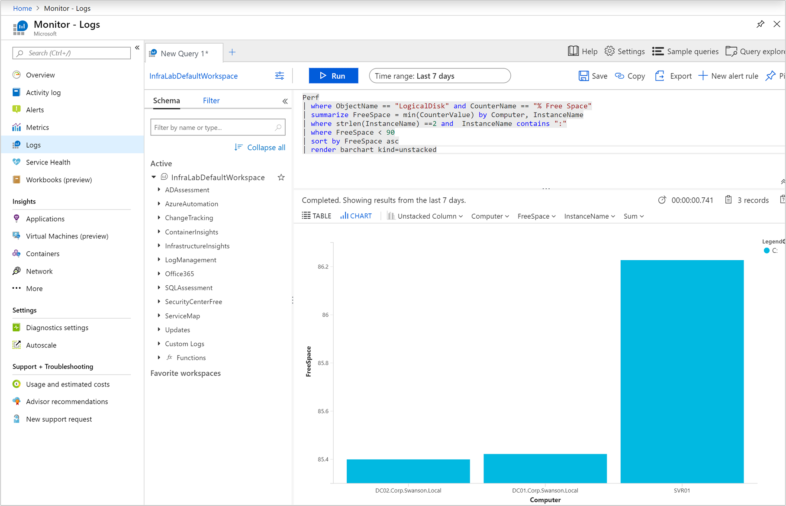
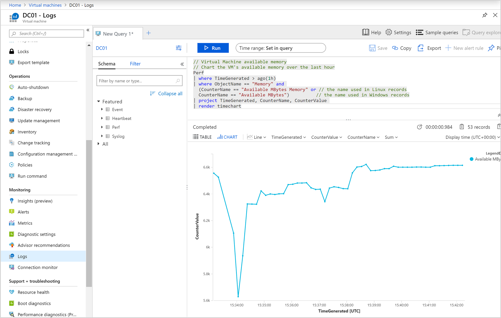

# Designing your Azure Monitor Logs deployment

Azure Monitor stores log data in a Log Analytics workspace, which is an Azure resource and a container where data is collected, aggregated, analyzed, and presented in Azure Monitor. While you can deploy one or more workspaces in your Azure subscription, there are several considerations you should understand in order to ensure that your initial deployment is following our guidelines to provide you with a cost effective, manageable, and scalable deployment meeting your organizations needs.

Data in a workspace is organized into tables, each of which stores different kinds of data and has its own unique set of properties based on the resource generating the data. Most data sources will write to their own tables in a Log Analytics workspace.

A Log Analytics workspace provides:

* A geographic location for data storage.
* Data isolation by granting different users access rights following one of our recommended design strategies.
* Scope for configuration of settings like [pricing tier](https://docs.microsoft.com/azure/azure-monitor/platform/manage-cost-storage#changing-pricing-tier), [retention](https://docs.microsoft.com/azure/azure-monitor/platform/manage-cost-storage#change-the-data-retention-period) and [data capping](https://docs.microsoft.com/azure/azure-monitor/platform/manage-cost-storage#daily-cap).

This article provides a detailed overview of the design factors and considerations, access control overview, and understand the design implementations we recommend for your IT organization.

## Important considerations for an access control strategy

Identifying the number of workspaces you need is influenced by one or more of the following requirements:

* You are a global company and you need log data stored in specific regions for data sovereignty or compliance reasons.
* You are using Azure and you want to avoid outbound data transfer charges by having a workspace in the same region as the Azure resources it manages.
* You manage multiple departments or business groups, and you want each to see their own data, but not data from others. Also, there is no business requirement for a consolidated cross department or business group view.

IT organizations today are modeled following either a centralized, decentralized, or an in-between hybrid of both structures. As a result, the following workspace deployment models have been commonly used:

* Centralized: All logs are stored in a central workspace. In this scenario, it is easy to search across resources and cross-correlate logs. The workspace can grow significantly depending on the amount of data collected from multiple resources in your subscription, with additional administrative overhead to maintain access control to different users.
* Decentralized: Log data is either stored within a resource group or stored centrally, but segregated per resource. In this scenario, the repository can be kept secure, and access control is consistent with resource access, but it's almost impossible to cross-correlate logs. Users who need a broad view of many resources cannot analyze the data in a meaningful way.
* Hybrid: Security audit compliance requirements further complicate this scenario because many organizations implement both deployment models in parallel. This commonly results in a complex, expensive, and hard-to-maintain configuration with gaps in logs coverage.

While the centralized workspace design comes with minor trade-offs compared to the other deployment models, the resource-context access mode alleviates the need to configure scoped permissions to particular tables in the workspace.  

When using the Log Analytics agents to collect data, you need to understand the following in order to plan your agent deployment:

* To collect data from Windows agents, you can [configure each agent to report to one or more workspaces](../../azure-monitor/platform/agent-windows.md), even while it is reporting to a System Center Operations Manager management group. The Windows agent can report up to four workspaces.
* The Linux agent does not support multi-homing and can only report to a single workspace.
* If you are using System Center Operations Manager 2012 R2 or later, each Operations Manager management group can be [connected to only one workspace](../platform/om-agents.md). With Linux computers reporting to a management group, the agent doesn't include a health service component as the Windows agent does, and information is collected and processes by a management server on its behalf. Because Linux computers are monitored differently with Operations Manager, they do not receive configuration or collect data directly and forward through the management group like a Windows agent-managed system. In this scenario, you need to configure the Linux computer to [report to an Operations Manager management group](agent-manage.md#configure-agent-to-report-to-an-operations-manager-management-group). You can install the Log Analytics Windows agent on the Windows computer and have it report to both Operations Manager and a different workspace.

Once you have designed your workspace architecture, you should enforce this on Azure resources with [Azure Policy](../../governance/policy/overview.md). This can provide a built-in definition that would automatically apply to all Azure resources. For example, you could set a policy to ensure that all your Azure resources in a particular region send all their diagnostic logs to a particular workspace.

## Access control overview

With role-based access control (RBAC), you can grant only the amount of access to users, groups, and applications that users need access to and align with your IT organization operating model using a single workspace to store collected data enabled on all your resources. For example, you grant access to your team responsible for infrastructure services hosted on Azure virtual machine (VM), and as a result they'll have access to only the logs generated by the VMs. This is following our new resource-context log model. The basis for this model is that every log record emitted by an Azure resource is automatically associated with this resource. Logs are forwarded to a central workspace that respects scoping and RBAC based on the resources.

The data that a user has access to are determined by a combination of factors that are listed in the following table. Each is described in the sections below.

| Factor | Description |
|:---|:---|
| [Access mode](#access-mode) | Method that the user uses to accesses the workspace.  Defines the scope of the data available and the access control mode that's applied. |
| [Access control mode](#access-control-mode) | Setting on the workspace that defines whether permissions are applied at the workspace or resource level. |
| [Permissions](manage-access.md#manage-accounts-and-users) | Permissions applied to individual or groups of users for the workspace or resource. Defines what data the user will have access to. |
| [Table level RBAC](manage-access.md#table-level-rbac) | Optional granular permissions that applies to all users regardless of their access mode or access control mode. Defines which data types a user can access. |

## Access mode

The *access mode* refers to how a user accesses a Log Analytics workspace and defines the scope of data they can access. 

Users have two options for accessing the data:

**Workspace-context**: You can view all logs in the workspace that you have permission to. Queries in this mode are scoped to all data in all tables in the workspace. This is the access mode used when logs are accessed with the workspace as the scope, such as when you select **Logs** from the **Azure Monitor** menu in the Azure portal.

**Resource-context**: When you access the workspace for a particular resource, resource group, or subscription, such as when you select **Logs** from a resource menu in the Azure portal, you can view logs for only that resource in all tables that you have access to. Queries in this mode are scoped to only data associated with that resource. This mode also enables granular RBAC.

> [!NOTE]
> Logs are available for resource-centric queries only if they were properly associated with the relevant resource. Currently, the following resources have limitations:
> - Computers outside of Azure
> - Service Fabric
> - Application Insights
> - Containers
>
> You can test if logs are properly associated with their resource by running a query and inspecting the records you're interested in. If the correct resource ID is in the [_ResourceId](log-standard-properties.md#_resourceid) property, then data is available to resource-centric queries.

Azure Monitor automatically determines the right mode depending on the context you perform the log search from. The scope is always presented in the top left section of Log Analytics.

### Comparing access modes

The following table summarizes the access modes:

| | Workspace-context | Resource-context |
|:---|:---|:---|
| Who is each model intended for? | Central administration. Administrators who need to configure data collection and users who need access to a wide variety of resources. Also currently required for users who need to access logs for resources outside of Azure. | Application teams. Administrators of Azure resources being monitored. |
| What does a user require to view logs? | Permissions to the workspace. See **Workspace permissions** in [Manage accounts and users](manage-access.md#manage-accounts-and-users). | Read access to the resource. See **Resource permissions** in [Manage accounts and users](manage-access.md#manage-accounts-and-users). Permissions can be inherited (such as from the containing resource group) or directly assigned to the resource. Permission to the logs for the resource will be automatically assigned. |
| What is the scope of permissions? | Workspace. Users with access to the workspace can query all logs in that workspace from tables that they have permissions to. See [Table access control](manage-access.md#table-level-rbac) | Azure resource. User can query logs for resources they have access to from any workspace but can't query logs for other resources. |
| How can user access logs? | Start **Logs** from **Azure Monitor** menu or **Log Analytics workspaces**. | Start **Logs** from the menu for the Azure resource. |

## Access control mode

The *Access control mode* is a setting on each workspaces that defines how permissions are determined for that workspace.

**Require workspace permissions**: This control mode does not allow granular RBAC. For a user to access the workspace, they must be granted permissions to the workspace or to specific tables.

If a user accesses the workspace following the workspace-context mode, they will have access to all data in any tables that they've been granted access to. If a user accesses the workspace following the resource-context mode, they will have access to only data for that resource in any tables that they've been granted access to.

This is the default setting for all workspaces created before March 2019.

**Use resource or workspace permissions**: This control mode allows granular RBAC. Users can be granted access to only data associated with resources they can view through Azure permissions, resources for which they have `read` permission.

When a user accesses the workspace in workspace-context mode, workspace permissions will apply. When a user accesses the workspace in resource-context mode, only resource permissions will be verified, and workspace permissions will be ignored. Enable RBAC for a user by removing them from workspace permissions and allowing their resource permissions to be recognized.

This is the default setting for all workspaces created after March 2019.

> [!NOTE]
> If a user has only resource permissions to the workspace, they will only be able to access the workspace using resource-context mode.

## Recommendations

This scenario covers a single workspace design that is not constrained by data sovereignty or regulatory compliance, or needs to map to the regions your resources are deployed within. It allows you to leverage the improved integration with Azure access management and more secure access control.

While planning your migration to this model, consider the following:

* Make sure that your application teams can work within the existing resource-centric functionality.
* Validate that your application teams have been granted proper access to their resources.
* Configure the workspace to enable resource-only permissions.
* Remove application teams permission to read and query the workspace.

## Next steps

Review how to [manage access to logs](manage-access.md) and to administer your workspaces.