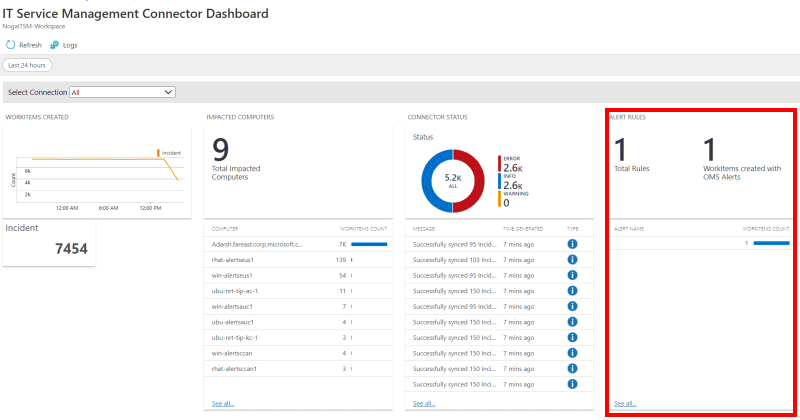

# Investigate errors by using the ITSMC dashboard

This article contains information about the IT Service Management Connector (ITSMC) dashboard. The dashboard helps you investigate the status of ITSMC.

## View the dashboard

Follow these steps to open the dashboard.

1. Select **All resources**, and then find **ServiceDesk(*your workspace name*)**.

   

1. In the left pane, select **Workspace Data Sources**, and then select **ITSM Connections**.

   

1. In the **Summary** section, select **View Summary** to view a summary graph.

    

1. Select the graph in the **Summary** section to open the dashboard.

    

1. Review the dashboard for status and any errors in your connector.
    

## Understand dashboard elements

The dashboard contains information on the alerts that were sent into the ITSM tool by using this connector.

The dashboard is split into four sections:

- **WORK ITEMS CREATED**: The graph and table show the number of the work items by type. Select the graph or the table to learn more about your work items.
      
- **IMPACTED COMPUTERS**: The table contains details about the configuration items that created configuration items.
      Select rows in the tables for more details about the configuration items.
      The table contains a limited number of rows. To see the entire list, select **See all**.
      
- **CONNECTOR STATUS**: The graph and the table show information about the status of the connector. Select the graph or the messages in the table for more details. The table shows a limited number of rows. To see the entire list, select **See all**.
      
- **ALERT RULES**: This section shows information about the number of alert rules that were detected. Select rows in the tables for more details on the rules that were detected. The table has a limited number of rows. To see the entire list, select **See all**.
      

## Next steps

Check out [Common connector status errors](itsmc-dashboard-errors.md).
