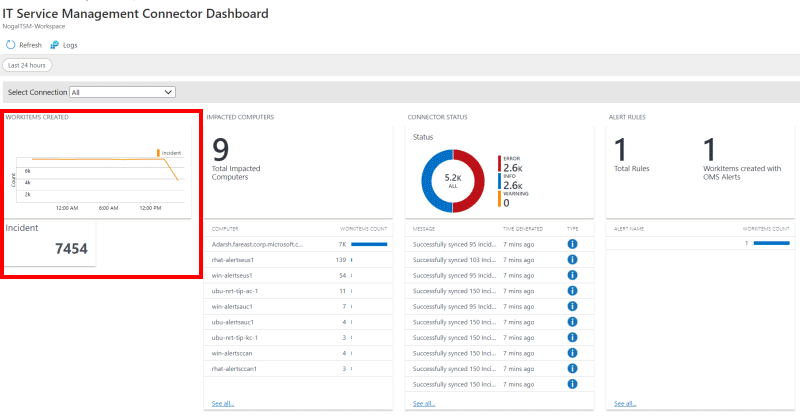
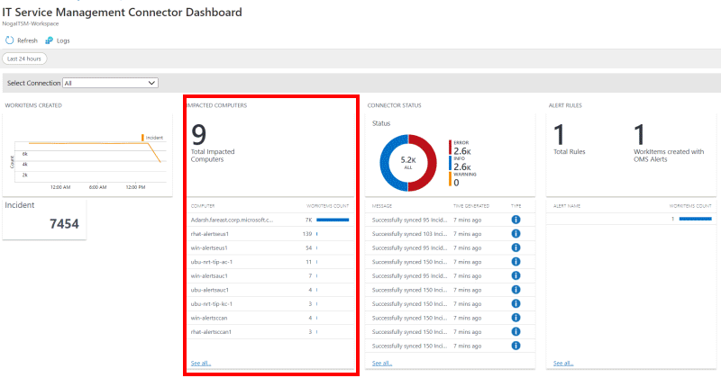
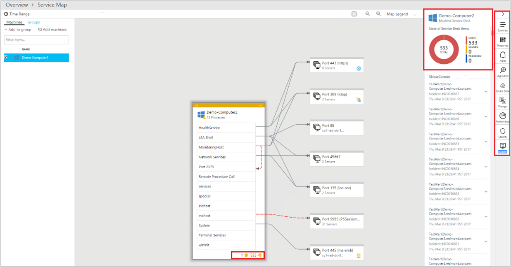

# Troubleshooting problems in ITSM Connector

This article discusses common problems in ITSM Connector and how to troubleshoot them.

Azure Monitor alerts proactively notify you when important conditions are found in your monitoring data. They allow you to identify and address issues before the users of your system notice them. For more information on alerting, see Overview of alerts in Microsoft Azure.
The customer can select how they want to be notified on the alert whether it is by mail, SMS, Webhook or even to automate a solution. Another option to be notified is using ITSM.
ITSM gives you the option to send the alerts to external ticketing system such as ServiceNow.

## Visualize and analyze the incident and change request data

Depending on your configuration when you set up a connection, ITSMC can sync up to 120 days of incident and change request data. The log record schema for this data is provided in the [Additional information Section](./itsmc-synced-data.md) of this article.

You can visualize the incident and change request data by using the ITSMC dashboard:

The dashboard also provides information about connector status, which you can use as a starting point to analyze problems with the connections.

### Error Investigation using the dashboard

In order to view the errors in the dashboard, you should follow the next steps:

1. In **All resources**, look for **ServiceDesk(*your workspace name*)**:

   

2. Under **Workspace Data Sources** in the left pane, select **ITSM Connections**:

   

3. Under **Summary** in the left box **IT Service Management Connector**, select **View Summary**:

    

4. Under **Summary** in the left box **IT Service Management Connector**, click on the graph:

    

5. Using this dashboard you will be able to review the status and the errors in your connector.
    

### Dashboard Elements

The dashboard contains information on teh alerts that were sent into the ITSM tool using this connector.
The dashboard is split into 4 parts:

1. Work Item Created: The graph and the table below contain the count of the work item per type. If you click on the graph or on the table you can see more details about the work items.
    
2. Impacted computers: The tables contain details about the configuration items that created configuration items.
    By clicking on rows in the tables you can get further details on the configuration items.
    The table contain limited number of rows if you would like to see all the list you can click on "See all".
    
3. Connector status: The graph and the table below contain messages about the status of the connector. By clicking on the graph on rows in the table you can get further details on the messages of the connector status.
    The table contain limited number of rows if you would like to see all the list you can click on "See all".
    
4. Alert rules: The tables contain the information on the number of alert rules that were detected.
    By clicking on rows in the tables you can get further details on the rules that were detected.
    The table contain limited number of rows if you would like to see all the list you can click on "See all".
    

### Service map

You can also visualize the incidents synced against the affected computers in Service Map.

Service Map automatically discovers the application components on Windows and Linux systems and maps the communication between services. It allows you to view your servers as you think of them: as interconnected systems that deliver critical services. Service Map shows connections between servers, processes, and ports across any TCP-connected architecture. Other than the installation of an agent, no configuration is required. For more information, see [Using Service Map](../insights/service-map.md).

If you're using Service Map, you can view the service desk items created in ITSM solutions, as shown here:

## Troubleshoot ITSM connections

- If a connection fails to connect to the ITSM system and you get an **Error in saving connection** message, take the following steps:
   - For ServiceNow, Cherwell, and Provance connections:  
     - Ensure that you correctly entered  the user name, password, client ID, and client secret  for each of the connections.  
     - Ensure that you have sufficient privileges in the corresponding ITSM product to make the connection.  
   - For Service Manager connections:  
     - Ensure that the web app is successfully deployed and that the hybrid connection is created. To verify the connection is successfully established with the on-premises Service Manager computer, go to the web app URL as described in the documentation for making the [hybrid connection](./itsmc-connections-scsm.md#configure-the-hybrid-connection).  

- If data from ServiceNow isn't getting synced to Log Analytics, ensure that the ServiceNow instance isn't sleeping. ServiceNow dev instances sometimes go to sleep when they're idle for a long time. If that isn't what's happening, report the problem.
- If Log Analytics alerts fire but work items aren't created in the ITSM product, if configuration items aren't created/linked to work items, or for other information, see these resources:
   -  ITSMC: The solution shows a summary of connections, work items, computers, and more. Select the tile that has the **Connector Status** label. Doing so takes you to **Log Search** with the relevant query. Look at log records with a `LogType_S` of `ERROR` for more information.
   - **Log Search** page: View the errors and related information directly by using the query `*ServiceDeskLog_CL*`.

### Troubleshoot Service Manager web app deployment

-	If you have problems with web app deployment, ensure that you have permissions to create/deploy resources in the subscription.
-	If you get an **Object reference not set to instance of an object** error when you run the [script](itsmc-service-manager-script.md), ensure that you entered valid values in the **User Configuration** section.
-	If you fail to create the service bus relay namespace, ensure that the required resource provider is registered in the subscription. If it's not registered, manually create the service bus relay namespace from the Azure portal. You can also create it when you [create the hybrid connection](./itsmc-connections-scsm.md#configure-the-hybrid-connection) in the Azure portal.

### How to manually fix sync problems

Azure Monitor can connect to third-party IT Service Management (ITSM) providers. ServiceNow is one of those providers.

For security reasons, you may need to refresh the authentication token used for your connection with ServiceNow.
Use the following synchronization process to reactivate the connection and refresh the token:

1. Search for the solution in the top search banner, then select the relevant solutions

    

1. In solution screen, choose "Select All" in the subscription filter and then filter by "ServiceDesk"

    

1. Select the solution of your ITSM connection.
1. Select ITSM connection in the left banner.

    

1. Select each connector from the list. 
    1. Click the Connector name in order to configure it
    1. Delete any connectors no longer in use

    1. Update the fields according to [these definitions](./itsmc-connections.md) based on your partner type

    1. Click on sync

       

    1. Click on save

        

f.    Review the notifications to see if the process started.
