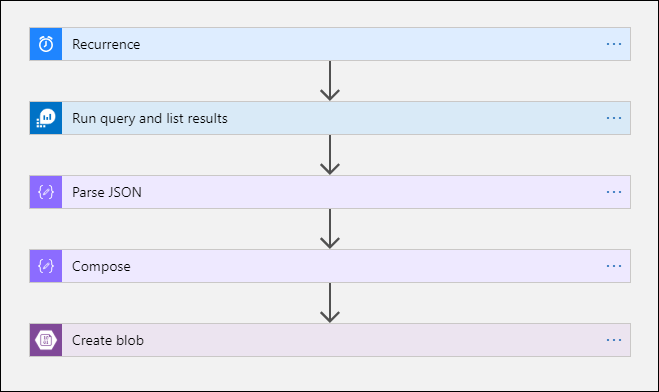
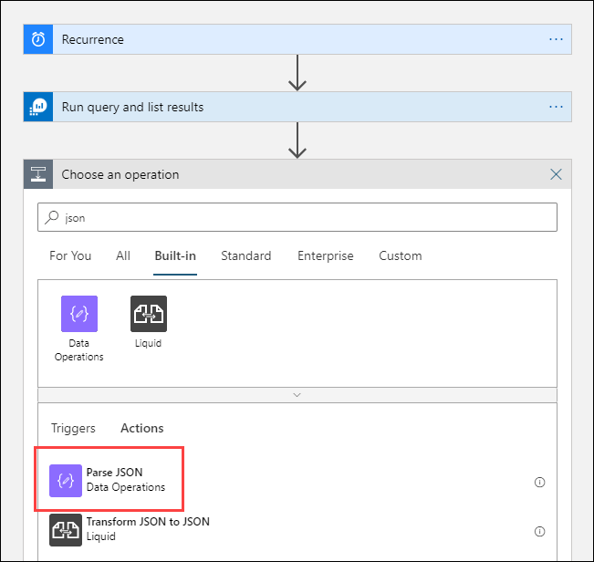
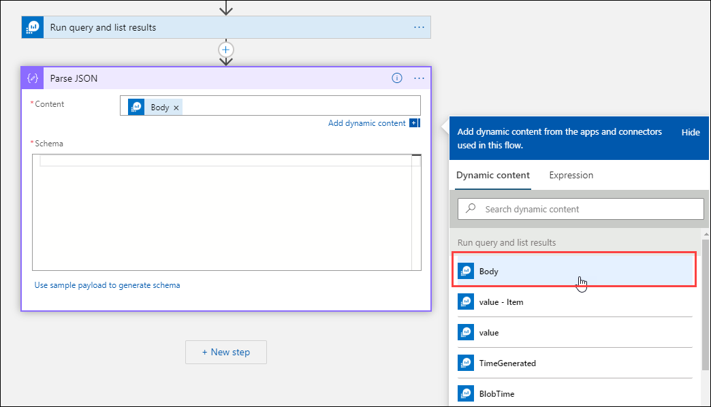
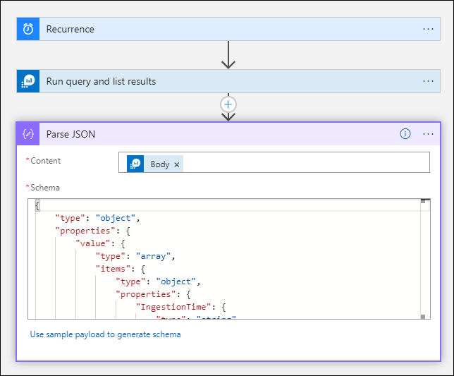
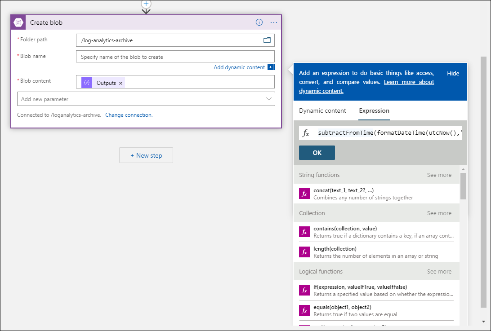

# Archive data from Log Analytics workspace to Azure storage using Logic App
This article describes a method to use [Azure Logic Apps](../../logic-apps/index.yml) to query data from a Log Analytics workspace in Azure Monitor and send to Azure Storage. Use this process when you need to export your Azure Monitor Log data for auditing and compliance scenarios or to allow another service to retrieve this data.  

## Other export methods
The method described in this article describes a scheduled export from a log query using a Logic App. Other options to export data for particular scenarios include the following:

- To export all data from your Log Analytics workspace to an Azure storage account or event hub, use the Log Analytics workspace data export feature of Azure Monitor Logs. See [Log Analytics workspace data export in Azure Monitor (preview)](logs-data-export.md)
- One time export using a Logic App. See [Azure Monitor Logs connector for Logic Apps and Power Automate](logicapp-flow-connector.md).
- One time export to local machine using PowerShell script. See [Invoke-AzOperationalInsightsQueryExport]](https://www.powershellgallery.com/packages/Invoke-AzOperationalInsightsQueryExport).

## Overview
This procedure uses the [Azure Monitor Logs connector](https://docs.microsoft.com/connectors/azuremonitorlogs/) which allows you to run a log query from a logic app and use its output in other actions in the workflow. The [Azure Blob Storage connector](https://docs.microsoft.com/connectors/azureblob/) is used in this procedure to send the query output to Azure storage. The other actions are described in the sections below.



When you export data from a Log Analytics workspace, you should filter and aggregate your log data and optimize your query to limit the amount of data processed by your Logic App workflow to the required data. For example, if you need to archive sign-in events, you could filter for required events and project only the required fields with the following query: 

```json
SecurityEvent
| where EventID == 4624 or EventID == 4625
| project TimeGenerated , Account , AccountType , Computer
```

When you export the data on a schedule, use the ingestion_time() function in your query to ensure that you don’t miss late arriving data. If data is delayed due to network or platform issues, using the ingestion time ensures that it will be included in the next Logic App execution. See [Add Azure Monitor Logs action](#add-azure-monitor-logs-action) for an example.

## Prerequisites
Following are prerequisites that must be completed before completing this procedure.

- Log Analytics workspace. The user who creates the logic app must have at least read permission to the workspace. 
- Azure storage account. The storage account doesn’t have to be in the same subscription as your Log Analytics workspace. The user who creates the logic app must have write permission to the storage account. 


## Connector limits
Log Analytics workspace and log queries in Azure Monitor are multitenancy services that include limits that protect and isolate customers and maintain quality of service. When querying for a large amount of data, you should consider the following limits, which can affect how you configure the Logic App recurrence and your log query:

- Log queries cannot return more than 500,000 rows.
- Log queries cannot return more than 64,000,000 bytes.
- Log queries cannot run longer than 10 minutes by default. 
- Log Analytics connector is limited to 100 call per minute.


## Create container in the storage account
Use the procedure in [Create a container](../../storage/blobs/storage-quickstart-blobs-portal.md#create-a-container) to add a container to your storage account to hold the exported data. The name used for the container in this article is **loganalytics-data**, but you can use any name.


## Create Logic App

Go to **Logic Apps** in the Azure portal and click **Add**. Select a **Subscription**, **Resource group**, and **Region** to store the new logic app and then give it a unique name. You can turn on **Log Analytics** setting to collect information about runtime data and events as described in [Set up Azure Monitor logs and collect diagnostics data for Azure Logic Apps](../../logic-apps/monitor-logic-apps-log-analytics.md). This setting isn't required for using the Azure Monitor Logs connector.


Click **Review + create** and then **Create**. When the deployment is complete, click **Go to resource** to open the **Logic Apps Designer**.

## Create a trigger for the logic app
Under **Start with a common trigger**, select **Recurrence**. This creates a logic app that automatically runs at a regular interval. In the **Frequency** box of the action, select **Hour** and in the **Interval** box, enter **1** to run the workflow once per day.


### Add Azure Monitor Logs action
Click **+ New step** to add an action that runs after the recurrence action. Under **Choose an action**, type **azure monitor** and then select **Azure Monitor Logs**.


Click **Azure Log Analytics – Run query and list results**.


You will be prompted to select a tenant and grant access to the Log Analytics workspace with the account that the workflow will use to run the query.


## Add Azure Monitor Logs action
The Azure Monitor Logs action allows you to specify the query to run. The log query used in this example is optimized for hourly recurrence and collects the data ingested for the particular execution time. For example, if the workflow runs at 4:35, the time range would be 4:00 to 5:00. If you change the Logic App to run at a different frequency, you need the change the query as well. For example, if you set the recurrence to run daily, you would set startTime in the query to startofday(make_datetime(year,month,day,0,0)). 

Select the **Subscription** and **Resource Group** for your Log Analytics workspace. Select *Log Analytics Workspace* for the **Resource Type** and then select the workspace's name under **Resource Name**.

Add the following log query to the **Query** window.  

```Kusto
let dt = now();
let year = datetime_part('year', dt);
let month = datetime_part('month', dt);
let day = datetime_part('day', dt);
let hour = datetime_part('hour', dt);
let startTime = make_datetime(year,month,day,hour,0)-1h;
let endTime = startTime + 1h - 1tick;
AzureActivity
| where ingestion_time() between(startTime .. endTime)
| project 
    TimeGenerated,
    BlobTime = startTime, 
    OperationName ,
    OperationNameValue ,
    Level ,
    ActivityStatus ,
    ResourceGroup ,
    SubscriptionId ,
    Category ,
    EventSubmissionTimestamp ,
    ClientIpAddress = parse_json(HTTPRequest).clientIpAddress ,
    ResourceId = _ResourceId 
```

The **Time Range** specifies the records that will be included in the query based on the **TimeGenerated** column. This should be set to a value equal to or higher than the time range selected in the query. Since this query isn't using the **TimeGenerated** column, then **Set in query** option isn't available. See [Query scope](../log-query/scope.md) for more details about the time range. 

Select **Last 4 hours** for the **Time Range**. This will ensure that any records with a ingestion time larger than **TimeGenerated** will be included in the results.
   


### Add Parse JSON activity (optional)
The output from the **Run query and list results** action is formatted in JSON. You can parse this data and manipulate it as part of the preparation for **Compose** action. 

You can provide a JSON schema that describes the payload you expect to receive. The designer parses JSON content by using this schema and generates user-friendly tokens that represent the properties in your JSON content. You can then easily reference and use those properties throughout your logic app's workflow. 


Click **+ New step**, and then click **+ Add an action**. Under **Choose an action**, type **json** and then select **Parse JSON**.



Click in the **Content** box to display a list of values from previous activities. Select **Body** from the **Run query and list results** action. This is the output from the log query.

[](media/logs-export-logicapp/select-body.png#lightbox)

5.	Click **Use sample payload to generate schema**. Run the log query and copy the output to use for the sample payload.  For the sample query here, you can use the following output:


```json
{
    "TimeGenerated": "2020-09-29T23:11:02.578Z",
    "BlobTime": "2020-09-29T23:00:00Z",
    "OperationName": "Returns Storage Account SAS Token",
    "OperationNameValue": "MICROSOFT.RESOURCES/DEPLOYMENTS/WRITE",
    "Level": "Informational",
    "ActivityStatus": "Started",
    "ResourceGroup": "monitoring",
    "SubscriptionId": "00000000-0000-0000-0000-000000000000",
    "Category": "Administrative",
    "EventSubmissionTimestamp": "2020-09-29T23:11:02Z",
    "ClientIpAddress": "192.168.1.100",
    "ResourceId": "/subscriptions/00000000-0000-0000-0000-000000000000/resourcegroups/monitoring/providers/microsoft.storage/storageaccounts/my-storage-account"
}
```




## Add the Compose action
The **Compose** action takes the parsed JSON output and creates the object that you need to store in the blob.

Click **+ New step**, and then click **+ Add an action**. Under **Choose an action**, type **compose** and then select the **Compose** action.


Click the **Inputs** box display a list of values from previous activities. Select **Body** from the **Parse JSON** action. This is the parsed output from the log query.

[](media/logs-export-logicapp/select-body-compose.png#lightbox)


## Add the Create Blob action
The Create Blob action writes the composed JSON to storage.

Click **+ New step**, and then click **+ Add an action**. Under **Choose an action**, type **blob** and then select the **Create Blob** action.


Type a name for the connection to your storage account in **Connection Name** and then click the folder icon in the **Folder path** box to select the container in your storage account. Click the **Blob name** to see a list of values from previous activities. Click **Expression** and enter an expression that matches your time interval. For this query which is run hourly, the following expression sets the blob name per previous hour: 

```json
subtractFromTime(formatDateTime(utcNow(),'yyyy-MM-ddTHH:00:00'), 1,'Hour')
```

[](media/logs-export-logicapp/blob-expression.png#lightbox)

Click the **Blob content** box to display a list of values from previous activities and then select **Outputs** in the **Compose** section.


## Test the Logic App
Test the workflow by clicking **Run**. If the workflow has errors, it will be indicated on the step with the problem. You can view the executions and drill in to each step to view the input and output to investigate failures. See [Troubleshoot and diagnose workflow failures in Azure Logic Apps](../../logic-apps/logic-apps-diagnosing-failures.md) if necessary.

[](media/logs-export-logicapp/runs-history.png#lightbox)


## View logs in Storage
Go to the **Storage accounts** menu in the Azure portal and select your storage account. Click the **Blobs** tile and select the container you specified in the Create blob action. Select one of the blobs and then **Edit blob**.

[](media/logs-export-logicapp/blob-data.png#lightbox)

## Next steps

- Learn more about [log queries in Azure Monitor](../log-query/log-query-overview.md).
- Learn more about [Logic Apps](../../logic-apps/index.yml)
- Learn more about [Power Automate](https://flow.microsoft.com).
