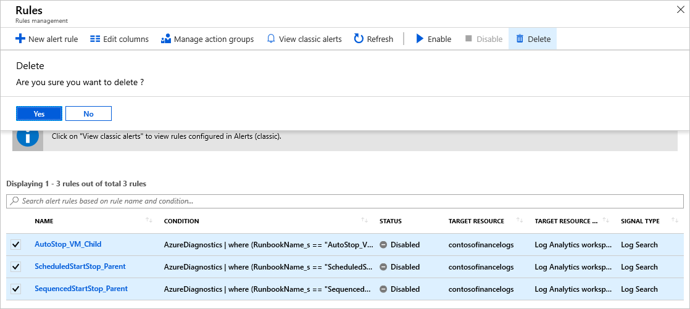

# Move a Log Analytics workspace to different subscription or resource group

Azure provides you the ability to move some resources to a new resource group or subscription. You can move resources through the Azure portal, PowerShell, the Azure CLI, or the REST API. To learn more about the process, see [Move resources to a new resource group or subscription](../../azure-resource-manager/resource-group-move-resources.md).
Azure Log Analytics is one of the resources that can be moved. In this article, you'll learn the steps to move Log Analytics workspace to another resource group or subscription in the same region. The workspace source and destination subscriptions must exist within the same Azure Active Directory tenant. To check that both subscriptions have the same tenant ID, use Azure PowerShell.

``` PowerShell
(Get-AzSubscription -SubscriptionName <your-source-subscription>).TenantId
(Get-AzSubscription -SubscriptionName <your-destination-subscription>).TenantId
```

To move a workspace to different subscription or resource group, you must unlink the Automation account from the workspace first. Unlinking an Automation account requires the removal of these solutions if they are installed in the workspace: 

- Update Management
- Change Tracking
- Start/Stop VMs during off-hours

Delete these solutions in Azure portal:

In your resource group, find each solution and select Delete. On the **Delete Resources** page, confirm the resources to be removed, and select **Delete**.


You can accomplish the same task with the [Remove-AzResource](/powershell/module/az.resources/remove-azresource?view=azps-2.8.0) cmdlet as shown in the following example:

``` PowerShell
Remove-AzResource -ResourceType 'Microsoft.OperationsManagement/solutions' -ResourceName "ChangeTracking(<workspace-name>)" -ResourceGroupName <resource-group-name>
Remove-AzResource -ResourceType 'Microsoft.OperationsManagement/solutions' -ResourceName "Updates(<workspace-name>)" -ResourceGroupName <resource-group-name>
Remove-AzResource -ResourceType 'Microsoft.OperationsManagement/solutions' -ResourceName "Start-Stop-VM(<workspace-name>)" -ResourceGroupName <resource-group-name>
```

For the **Start/Stop VMs** solution, you also need to remove the alert rules created by the solution. On the Rules page, you should see a list of the alerts configured in that resource group. The **Start/Stop VMs** solution creates three alert rules:

- AutoStop_VM_Child
- ScheduledStartStop_Parent
- SequencedStartStop_Parent

Select these three alert rules, and then select **Delete**. This action will remove these alert rules.



After these solutions were removed, unlink the Automation account. In the Azure portal, select **Automation account** > **Related Resources** > **Linked workspace**. Select **Unlink workspace** to unlink the workspace from your Automation account.


##Move your workspace through the Azure Portal

Click change Resource group or Subscription name in essential pen in your workspace. A new page opens with a list of resources - select the resources to move, complete the information then click OK. If you encounter an error, you can use the PowerShell cmdlet that produces a more verbose error message.


> [!IMPORTANT]
> After the move operation, removed solutions and Automation account link should be reconfigured to bring the workspace back to its previous state.


## Next steps
- For a list of which resources support move, see [Move operation support for resources](../../azure-resource-manager/move-support-resources.md).
