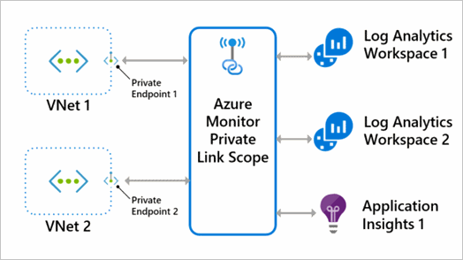
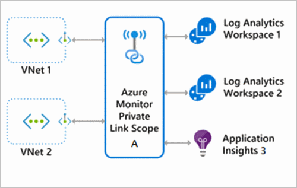
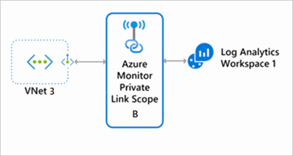
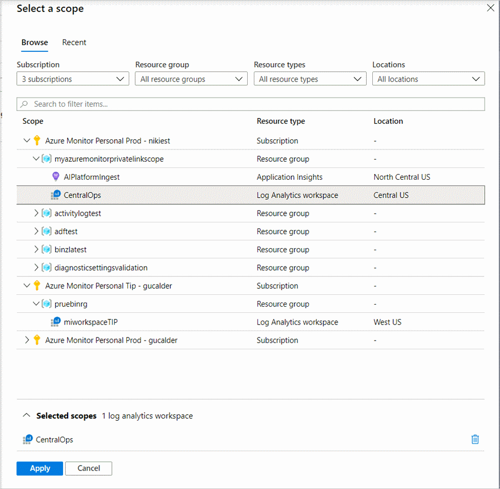
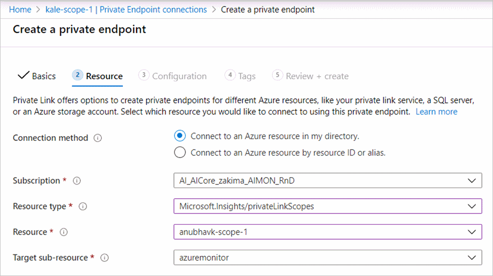
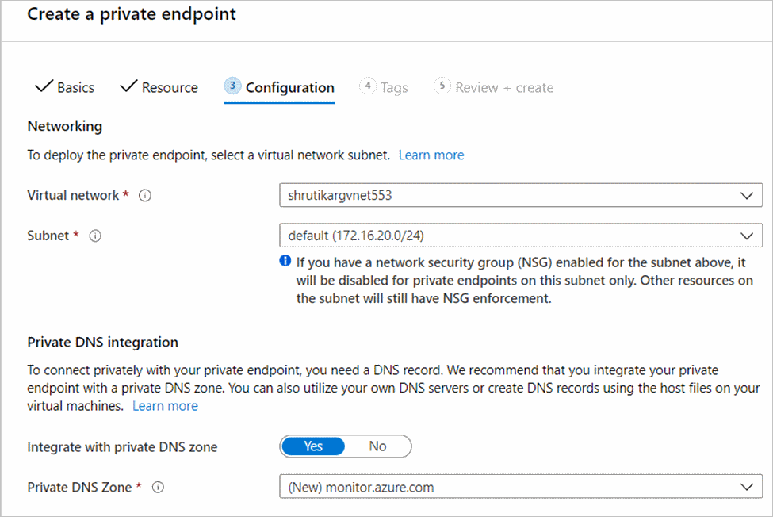
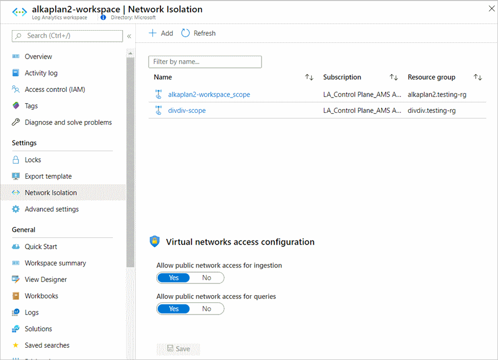

[Azure Private Link](../../private-link/private-link-overview) allows you to securely link Azure PaaS services to your virtual network using private endpoints. For many services, you just set up an endpoint per resource. However, Azure Monitor is a constellation of different interconnected services that work together to monitor your workloads. As a result, we have built a resource called an Azure Monitor Private Link Scope (AMPLS) that allows you to define the boundaries of your monitoring network and connect to your virtual network. This article will cover why to use and how to set up an Azure Monitor Private Link Scope.

## Advantages of Private Link with Azure Monitor

With Private Link you can:

- Connect to Azure Monitor without opening up any public network access
- Keep all traffic inside the Microsoft Network
- Restrict access to your monitoring data to only authorized private links
- Stop data exfiltration from your networks by only authorizing access to specific resources, and block access to all destinations
- Securely connect your private on-premises network to Azure Monitor using ExpressRoute and Private Link

For more information, see  [Key Benefits of Private Link](../../private-link/private-link-overview#key-benefits)

## How it works

Azure Monitor Private Link Scope is a grouping resource to connect one or more private endpoints (and therefore the virtual networks they are contained in) to one or more Azure Monitor resources. These resources include Log Analytics workspaces and Application Insights components. 



> [!NOTE]
> A single Azure Monitor resource can belong to multiple AMPLSs, but you cannot connect a single VNet to more than one AMPLS. 

## Planning AMPLS based on your network needs

Before setting up your AMPLS resources, consider your network isolation requirements, by evaluating your virtual networks' access to public internet, and access restrictions of each of your Azure Monitor resources (that is, Application Insights components and Log Analytics workspaces).

### Evaluate which Virtual Networks should connect to a Private Link

Start by evaluating which of your virtual networks (VNets) have restricted access to the internet. VNets that have free internet may not require a Private Link to access your Azure Monitor resources. The monitoring resources your VNets connect to may restrict incoming traffic and require a Private Link connection (either for log ingestion or query). In such cases, even a VNet that has access to the public internet will need connect to these resources over a Private Link, and through an AMPLS.

### Evaluate which Azure Monitor resources should have a Private Link

Review each of your Azure Monitor resources:

- Should the resource allow ingestion of logs from resources located on specific VNets only?
- Should the resource be queried only by clients located on specific VNETs?

If the answer to any of these questions is yes, set the restrictions as explained in [Configuring Log Analytics](#Configuring Log Analytics workspaces) workspaces and [Configuring Application Insights components](#Configuring Application Insights components) and associate these resources to a single or several AMPLS(s). Virtual networks that should access these monitoring resources need to have a Private Endpoint that connects to the relevant AMPLS.
Remember – you can connect the same workspaces or application to multiple AMPLS, to allow them to be reached by different networks.

### Group together Monitoring resources by network accessibility
Since each VNet can connect to only one AMPLS resource, you must group together monitoring resources that should be accessible to the same networks. The simplest way to manage this is to create one AMPLS per VNet, and select the resources to connect to that network. However, to reduce resources and improve manageability, you may want to reuse an AMPLS across network. For example, if your internal virtual networks VNet1 and VNet2 should connect to workspaces Workspace1 and Workspace2 and Application Insights component Application Insights 3, associate all three resources to the same AMPLS. If VNet3 should only access Workspace1, create another AMPLS resource, associate Workspace1 to it and connect VNet3 as shown in the following diagrams:





## Example connection of Azure Monitor to Private Link

Let's start by creating an Azure Monitor Private Link Scope resource.

1. Go to **Create a resource** in the Azure portal and search for **Azure Monitor Private Link Scope**. 
2. Click create. 
3. Pick a Subscription and Resource Group. 
4. Give the AMPLS a name. It is best to use a name that is clear what purpose and security boundary the Scope will be used for so that someone won't accidentally break network security boundaries. For example, "AppServerProdTelem". 
5. Click **Review + Create**. 
6. Let the validation pass, and then click **Create**.

## Connecting Azure Monitor resources

You can connect your AMPLS first to private endpoints and then to Azure Monitor resources or vice versa, but the connection process will go faster if you start with your Azure Monitor resources. Here's how we connect Azure Monitor Log Analytics workspaces and Application Insights components to an AMPLS

1. In your Azure Monitor Private Link scope, click on **Azure Monitor Resources** in the left-hand menu. Click the **Add** button.
2. Add the workspace or component. Clicking the Add button brings up a dialog where you can select Azure Monitor resources. You can browse through your subscriptions and resource groups, or you can type in their name to filter down to them. Select the workspace or component and click **Apply** to add them to your scope.

    

Connecting to a Private Endpoint
Now that we have resources connected to our AMPLS, let's create a private endpoint to connect our network. You can do this in the Private Link center [link to go here], or inside your Azure Monitor Private Link Scope, as done in this example. 

1. In your scope resource, click on **Private Endpoint connections** in the left hand resource menu Click on **Private Endpoint** to start the endpoint create process. You can also approve connections that were started in the Private Link center here by selecting them and clicking **Approve**.

    

2. Pick the subscription, resource group, and name of the endpoint, and the region it will live in. This needs to be the same region as the virtual network you will connect it to. 

3. Click **Next : Resource**. 

4. In the Resource screen,

   a. Pick the **Subscription** that contains your Azure Monitor Private Scope resource. 

   b. For **resource type**, choose **Microsoft.insights/privateLinkScopes**. 

   c. From the **resource** drop-down, choose your Private Link scope you created earlier. 

   d. Click **Next: Configuration >**.
      

5. On the configuration pane,

   a.    Choose the **virtual network** and **subnet** that you want to connect to your Azure Monitor resources. 
 
   b.    Choose **Yes** for **Integrate with private DNS zone**, and let it automatically create a new Private DNS Zone. 
 
   c.    Click **Review + create**.
 
   d.    Let validation pass. 
 
   e.    Click **Create**. 

    

You have now created a new private endpoint that is connected to this Azure Monitor Private Link scope.

## Configuring Log Analytics workspaces

In the Azure portal in your Azure Monitor Log Analytics workspace resource is a menu item Network Isolation on the left-hand side. You can control two different states from this menu. 



First, you can connect this Log Analytics resource to Azure Monitor Private Link scopes that you have access to. Click **Add** and select the Azure Monitor Private Link Scope.  Click **Apply** to connect it. All connected scopes show up in this screen. Making this connection allows network traffic in the connected virtual networks to reach this workspace. Making the connection has the same effect as connecting it from the scope as we did in [Connecting Azure Monitor resources](#connecting-azure-monitor-resources).  

Second, you can control how this resource can be reached from outside of the private link scopes listed above. 
If you set **Allow public network access for ingestion** to **No**, then machines outside of the connected scopes cannot upload data to this workspace. If you set **Allow public network access for queries** to **No**, then machines outside of the scopes cannot access data in this workspace. That data includes access to dashboards, query API, insights in the Azure portal, and more.

Restricting access in this manner only applies to data in the workspace. Configuration changes, including turning these access settings on or off, are managed by Azure Resource Manager. You should restrict access to Resource Manager using the appropriate roles, permissions, network controls, and auditing. For more information, see [Azure Monitor Roles, Permissions, and Security](https://docs.microsoft.com/en-us/azure/azure-monitor/platform/roles-permissions-security).

> [!NOTE] 
> Logs and metrics uploaded to a workspace via Diagnostic Settings (https://docs.microsoft.com/en-us/azure/azure-monitor/platform/diagnostic-settings) go over a secure private Microsoft channel, and are not controlled by these settings.

## Configuring Application Insights components

In the Azure portal in your Azure Monitor Application Insights Component resource is a menu item Network Isolation on the left-hand side. You can control two different states from this menu. 

**---------- TODO ------------- get screenshot----**


First, you can connect this Application Insights resource to Azure Monitor Private Link scopes that you have access to. Click **Add** and select the Azure Monitor Private Link Scope.  Click **Apply** to connect it. All connected scopes show up in this screen. Making this connection allows network traffic in the connected virtual networks to reach this component. Making the connection has the same effect as connecting it from the scope as we did in [Connecting Azure Monitor resources](#connecting-azure-monitor-resources).  

Second, you can control how this resource can be reached from outside of the private link scopes listed above. 
If you set **Allow public network access for ingestion** to **No**, then machines or SDKs outside of the connected scopes cannot upload data to this component. If you set **Allow public network access for queries** to **No**, then machines outside of the scopes cannot access data in this workspace. That data includes access to dashboards, query API, insights in the Azure portal, and more.

Restricting access in this manner only applies to data in the workspace. Configuration changes, including turning these access settings on or off, are managed by Azure Resource Manager. You should restrict access to Resource Manager using the appropriate roles, permissions, network controls, and auditing. For more information, see [Azure Monitor Roles, Permissions, and Security](https://docs.microsoft.com/en-us/azure/azure-monitor/platform/roles-permissions-security).

## Using customer-owned storage accounts for log ingestion

Storage accounts are used in the ingestion process of several data types of logs. By default, service-managed storage accounts are used. However, you can now use your own storage accounts and gain control over the access rights, keys, content, encryption, and retention of your logs during ingestion.

## Which data types are ingested over a storage account?

- Custom logs
- IIS logs
- Syslog
- Windows event logs
- Windows ETW logs
- Service fabric
- ASC Watson dump files

**---------- TODO Internal link. ------------- ----**

[To learn more, see Ingestion from customer storage – Bring your own storage (BYOS)](https://microsoft-my.sharepoint.com/:w:/p/noakuper/EaLomLpNFA9GrWFbTGN_Jm0Bgw779xCC-Ww03hN9T0V4fQ?e=HVj1hH)

## Restrictions and Limitations with Azure Monitor Private Link

### Log Analytics Windows Agent

Use Agent version >= 18.20.18038.0

### Log Analytics Linux Agent

Use Agent version >= 1.12.25. 
If they cannot, do below on the VM

```cmd
$ sudo /opt/microsoft/omsagent/bin/omsadmin.sh -X
$ sudo /opt/microsoft/omsagent/bin/omsadmin.sh -w <workspace id> -s <workspace key>
```

### ARM Queries

Experience that query the ARM API will not work unless you add the Service Tag **AzureResourceManager** to your firewall

### AI SDK Downloads from CDN

Customers should bundle the JavaScript code in their script, so that the browser does not reach out to CDN to download the code.
An example is provided on [GitHub](https://github.com/microsoft/ApplicationInsights-JS#npm-setup-ignore-if-using-snippet-setup)

### LA Solution download

Please put xxx in your allow list. FQD?
