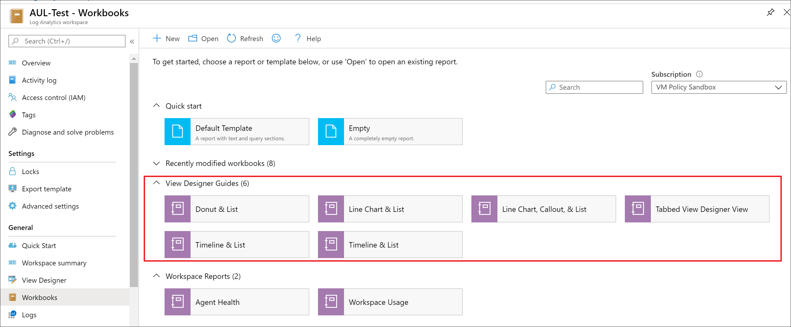
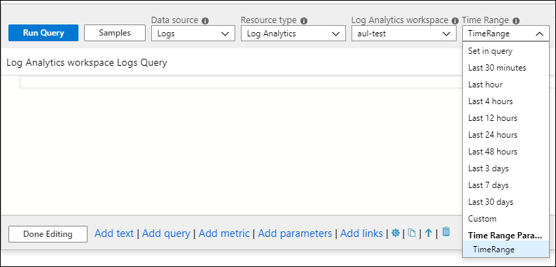
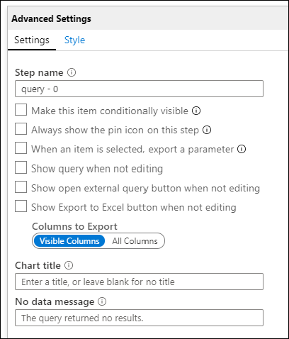

# View designer to workbooks conversion steps

## Quick Start with preset View Designer Templates

Workbooks in Log Analytics workspaces already have templates made to match some of the views in view designer. Under the **View Designer Guides** category, select the **View Designer Transition Guide** to learn about your options or select one of the many preset templates.

[Click here](https://portal.azure.com/#blade/HubsExtension/BrowseResourceBlade/resourceType/Microsoft.OperationalInsights%2Fworkspaces) to view your Log Analytics workspaces and get started with workbooks.



## Enabling Time Range Filter
View designer has a built-in default time range filter, however, in workbooks this setting is not enabled by default. Workbooks do allow users to create their own time range filters that might be more applicable to their data logs. The steps to generate the filter are listed below:

Select the **Add parameters** option. The default **Style** is set to *Pills*.


 Select the **Add Parameter** button.


From the sidebar menu, in the **Parameter name** textbox, type *TimeRange*. Set **Parameter Type** as *Time Range Picker*. Select the **Required?** checkbox.


Save the parameter in the upper left hand corner of the sidebar menu. You can leave the dropdown as *unset* by default or select a default **TimeRange** value, such as *24 hours*. Select **Done Editing**.

Parameters can be used in queries by adding curly braces {} around your parameter name.

More details on parameters can be found in the [Workbooks documentation on parameters](https://github.com/microsoft/Application-Insights-Workbooks/blob/master/Documentation/Parameters/Parameters.md).

## Updating queries with the TimeRange Parameter

### Option 1: Select TimeRange from the Time Range Dropdown for each query



### Option 2: Update your log queries

In your query add the line: _\| where TimeGenerated {TimeRange}_.

For example:

**Original:** _search * \| summarize count() by Type_
**Updated:** _search * \| where TimeGenerated {TimeRange} \| summarize count() by Type_

## Including a List
Most of the View Designer views include a list, this standard list can be re-produced utilizing the following steps.


You will need to add a visualization by clicking **Add query** from the cell options


View Designer employs a default query that matches the syntax from the Original example. This can be updated by changing the query to the updated form.

**Original:** _search * | summarize **AggregatedValue** = count() by Type_\
**Updated:** _search * | summarize **Count** = count() by Type_

This will generate a list that looks similar to the following:


## Enabling sparklines
A common feature for grids is to add sparklines to summarize various data patterns over time. View Designer offers the Enable Sparklines feature for all lists, as does Workbooks.

To include sparklines in your data that match View Designer, you will need to join the data with your original query. You will need to add the following line

```KQL
_| join kind = inner (search * 
| make-series Trend = count() default=0 on TimeGenerated from{TimeRange:start} to {TimeRange:end} step {TimeRange:grain} by Type) on Type_
```
Then under **Column Settings**


Update the **Column renderer** dropdown to be a Spark area


Then save the settings and re-running the query will now update your table to include a sparkline.

For example:

```KQL
//Original
_search *
| summarize AggregatedValue = count() by Type) on Type_
```
```KQL
// Updated
_search * 
| summarize AggregatedValue = count() by Type
| join kind = inner (search * 
    | make-series Trend = count() default=0 on TimeGenerated from \{TimeRange:start} to {TimeRange:end} step {TimeRange:grain} by Type) on Type
| project Type, AggregatedValue, Trend_
```

Resulting grid will look similar to below:


## Advanced Cell Settings
To mirror view designer, some common steps such as changing the size of workbook cells or adding pins and external links to logs might be utilized.

To access **Advanced Settings** select the gear icon at the bottom of each cell.


This will display a menu with various options:



To add a pin and a link to an external query select the corresponding checkboxes. To add a title to your cell, type the desired title into the **Chart title** section.

By default any corkbooks cell is set to take up the entire page width, but users can adjust this by scaling the cell down, by clicking under the **Style** tab of the Advanced Settings menu


 
## Additional Parameters

Similar to the **TimeRange** Filter, you select **Add Parameter**
For selecting a Subscription, type “Subscription” into the **Parameter name** field in the side menu and select *Subscription Picker* from the **Parameter type** dropdown


For selecting a Resource, type *Resource* into the **Parameter name** field 
in the side menu and select “Resource Picker” from the **Parameter type** dropdown.


This will insert dropdowns to let you access your various subscriptions and resources.


### [Next Section: Tile Conversions](view-designer-tile-conversions.md)
