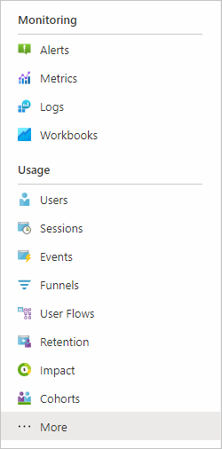

# Bring your own storage to save workbooks

There are times when you may have a query or some business logic that you want to secure. Workbooks provides an option to secure the workbooks by saving the workbooks content to your storage. The storage account can then be encrypted with Microsoft-managed keys or you can manage the encryption by supplying your own keys. [See Azure documentation on Storage Service Encryption.](../../storage/common/storage-service-encryption.md)

## Saving workbook with managed identities

1. Before you can save the workbook to your storage, you'll need to create a managed identity (All Services -> Managed Identities) and give it `Storage Blob Data Contributor` access to your storage account. [See Azure documentation on Managed Identities.](../../active-directory/managed-identities-azure-resources/how-to-manage-ua-identity-portal.md)

    

2. Create a new workbook.
3. Select the **Save** button to save the workbook.
4. There's an option to `Save content to an Azure Storage Account`, select the checkbox to save to an Azure Storage Account.

    

5. Select the desire Storage account and Container. The Storage account list is from the Subscription selected above.

    

6. Then select **Change** to select a managed identity previously created.

    

7. After you've selected your storage options, press **Save** to save your workbook.

## Limitations

- When saving to custom storage, you cannot pin individual parts of the workbook to a dashboard as the individual pins would contain protected information in the dashboard itself. When using custom storage, you can only pin links to the workbook itself to dashboards.
- Once a workbook has been saved to custom storage, it will always be saved to custom storage and this cannot be turned off. To save elsewhere, you can use "Save As" and elect to not save the copy to custom storage.
- Workbooks in Application Insights resource are "legacy" workbooks and does not support custom storage. The latest Workbooks in Application Insights resource is the "...More" selection. Legacy workbooks don't have Subscription options when saving.

   

## Next steps

- Learn how to create a [Map](workbooks-map-visualizations.md) visualization in workbooks.
- Learn how to use [groups in workbooks](../visualizations/workbooks-groups.md).