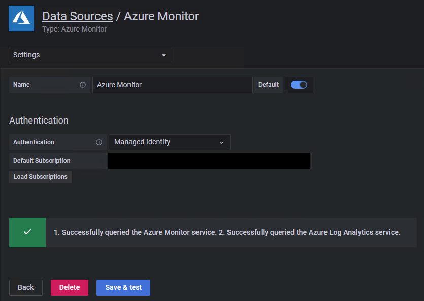
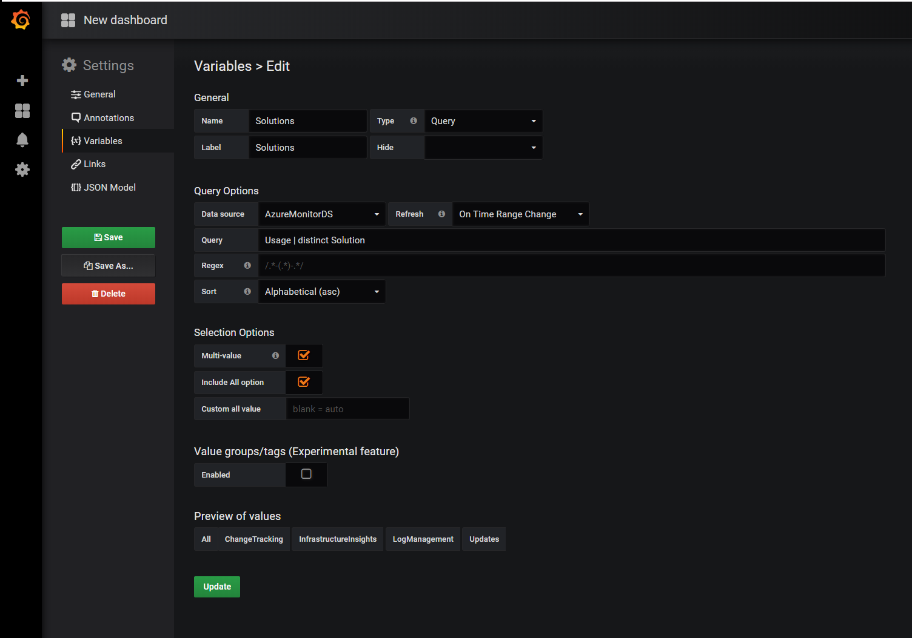
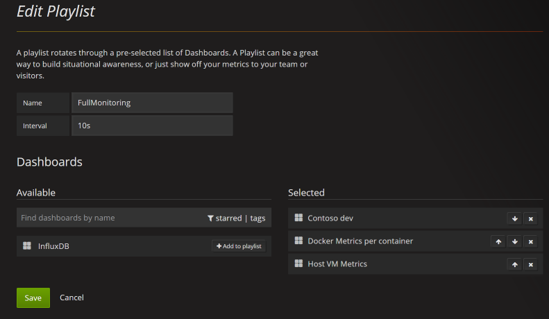

# Monitor your Azure services in Grafana
You can monitor Azure services and applications using [Grafana](https://grafana.com/) and the included [Azure Monitor data source plugin](https://grafana.com/docs/grafana/latest/datasources/azuremonitor/). The plugin retrieves data from three Azure services:
- Azure Monitor Metrics for numeric time series data from data from Azure resources. 
- Azure Monitor Logs for log and performance data from Azure resources that enables you to query using the powerful Kusto Query Language (KQL).
- Azure Resource Graph to quickly query and identify Azure resources across subscriptions. 

You can then display this performance and availability data on your Grafana dashboard.

Use the following steps to set up a Grafana server and build dashboards for metrics and logs from Azure Monitor.

## Set up Grafana

### Set up Azure Managed Grafana (Preview)
Azure Managed Grafana is optimized for the Azure environment and works seamlessly with Azure Monitor. Enabling you to:

- Manage user authentication and access control using Azure Active Directory identities
- Pin charts from the Azure portal directly to Azure Managed Grafana dashboards

Use this [quickstart guide](../../managed-grafana/quickstart-managed-grafana-portal.md) to create an Azure Managed Grafana workspace using the Azure portal.

### Set up Grafana locally
To set up a local Grafana server, [download and install Grafana in your local environment](https://grafana.com/grafana/download).

## Sign in to Grafana

> [!IMPORTANT]
> The Internet Explorer browser and older Microsoft Edge browsers are not compatible with Grafana, you must use a chromium-based browser including Microsoft Edge. See [supported browsers for Grafana](https://grafana.com/docs/grafana/latest/installation/requirements/#supported-web-browsers).

1. Log in to Grafana using the endpoint URL of your Azure Managed Grafana workspace or your server's IP address.

## Configure Azure Monitor data source plugin

Azure Managed Grafana includes an Azure Monitor datasource plugin. By default, the plugin is pre-configured with a Managed Identity that can query and visualize monitoring data from all resources in the subscription in which the Grafana workspace was deployed. Skip ahead to Build a Grafana dashboard.


You can expand the resources that can be viewed by your Azure Managed Grafana workspace by [configuring additional permissions](../../managed-grafana/how-to-permissions.md) to assign the included Managed Identity the [Monitoring reader role](../roles-permissions-security.md) on other subscriptions or resources.

 If you are using an instance that is not Azure Managed Grafana, you have to setup an Azure Monitor datasource.

1. Select **Add data source**, filter by name *Azure* and select the **Azure Monitor** data source.


2. Pick a name for the data source and choose between Managed Identity or App Registration for authentication.

If your are hosting Grafana on your own Azure VM or Azure App Service with managed identity enabled, you may use this approach for authentication. However, if your Grafana instance is not hosted on Azure or does not have managed identity enabled, you will need to use App Registration with an Azure service principal to setup authentication.

### Use Managed Identity

3. Enable managed identity on your VM or App Service and change the Grafana server managed identity support setting to true.
    * The managed identity of your hosting VM or App Service needs to have the [Monitoring reader role](../roles-permissions-security.md) assigned for the subscription, resource group or resources of interest.
    * Additionally, you will need to update the setting 'managed_identity_enabled = true' in the Grafana server config. See [Grafana Configuration](https://grafana.com/docs/grafana/latest/administration/configuration/) for details. Once both steps are complete, you can then save and test access.

4. Select **Save & test**, and Grafana will test the credentials. You should see a message similar to the following one.  
    
   

### Or use App Registration

5. Create a service principal - Grafana uses an Azure Active Directory service principal to connect to Azure Monitor APIs and collect data. You must create, or use an existing service principal, to manage access to your Azure resources.
    * See [these instructions](../../active-directory/develop/howto-create-service-principal-portal.md) to create a service principal. Copy and save your tenant ID (Directory ID), client ID (Application ID) and client secret (Application key value).
    * View [Assign application to role](../../active-directory/develop/howto-create-service-principal-portal.md) to assign the [Monitoring reader role](../roles-permissions-security.md) to the Azure Active Directory application on the subscription, resource group or resource you want to monitor. 
  
6. Provide the connection details you'd like to use.
    * When configuring the plugin, you can indicate which Azure Cloud you would like the plugin to monitor (Public, Azure US Government, Azure Germany, or Azure China).
        > [!NOTE]
        > Some data source fields are named differently than their correlated Azure settings:
        > * Tenant ID is the Azure Directory ID
        > * Client ID is the Azure Active Directory Application ID
        > * Client Secret is the Azure Active Directory Application key value

7. Select **Save & test**, and Grafana will test the credentials. You should see a message similar to the following one.  
    
   

## Build a Grafana dashboard

1. Go to the Grafana Home page, and select **New Dashboard**.

2. In the new dashboard, select the **Graph**. You can try other charting options but this article uses *Graph* as an example.

3. A blank graph shows up on your dashboard. Click on the panel title and select **Edit** to enter the details of the data you want to plot in this graph chart.
    

4. Select the Azure Monitor data source you've configured.
   * Visualizing Azure Monitor metrics - select **Azure Monitor** in the service dropdown. A list of selectors shows up, where you can select the resources and metric to monitor in this chart. To collect metrics from a VM, use the namespace **Microsoft.Compute/VirtualMachines**. Once you have selected VMs and metrics, you can start viewing their data in the dashboard.
     
   * Visualizing Azure Monitor log data - select **Azure Log Analytics** in the service dropdown. Select the workspace you'd like to query and set the query text. You can copy here any log query you already have or create a new one. As you type in your query, IntelliSense will show up and suggest autocomplete options. Select the visualization type, **Time series** **Table**, and run the query.
    
     > [!NOTE]
     >
     > The default query provided with the plugin uses two macros: "$__timeFilter() and $__interval. 
     > These macros allow Grafana to dynamically calculate the time range and time grain, when you zoom in on part of a chart. You can remove these macros and use a standard time filter, such as *TimeGenerated > ago(1h)*, but that means the graph would not support the zoom in feature.
    
     

5. Following is a simple dashboard with two charts. The one on left shows the CPU percentage of two VMs. The chart on the right shows the transactions in an Azure Storage account broken down by the Transaction API type.
    

## Pin charts from the Azure Portal to Azure Managed Grafana

In addition to building you panels in Grafana, you can also quickly pin Azure Monitor visualizations from the Azure Portal to new or existing Grafana dashboards by adding panels to your Grafana dashboard directly from Azure Monitor. Navigate to Metrics for your resource, create a chart and click **Save to dashboard**, followed by **Pin to Grafana**. Choose the workspace  and dashboard and click **Pin** to complete the operation.


## Optional: Monitor your custom metrics in the same Grafana server

You can also install Telegraf and InfluxDB to collect and plot both custom and agent-based metrics same Grafana instance. There are many data source plugins that you can use to bring these metrics together in a dashboard.

You can also reuse this set up to include metrics from your Prometheus server. Use the Prometheus data source plugin in Grafana's plugin gallery.

Here are good reference articles on how to use Telegraf, InfluxDB, Prometheus, and Docker
 - [How To Monitor System Metrics with the TICK Stack on Ubuntu 16.04](https://www.digitalocean.com/community/tutorials/how-to-monitor-system-metrics-with-the-tick-stack-on-ubuntu-16-04)

 - [A monitoring solution for Docker hosts, containers, and containerized services](https://stefanprodan.com/2016/a-monitoring-solution-for-docker-hosts-containers-and-containerized-services/)

Here is an image of a full Grafana dashboard that has metrics from Azure Monitor and Application Insights.


## Advanced Grafana features

### Variables
Some query values can be selected through UI dropdowns, and updated in the query. 
Consider the following query as an example:
```
Usage 
| where $__timeFilter(TimeGenerated) 
| summarize total_KBytes=sum(Quantity)*1024 by bin(TimeGenerated, $__interval) 
| sort by TimeGenerated
```

You can configure a variable that will list all available **Solution** values, and then update your query to use it.
To create a new variable, click the dashboard's Settings button in the top right area, select **Variables**, and then **New**.
On the variable page, define the data source and query to run in order to get the list of values.


Once created, adjust the query to use the selected value(s) and your charts will respond accordingly:
```
Usage 
| where $__timeFilter(TimeGenerated) and Solution in ($Solutions)
| summarize total_KBytes=sum(Quantity)*1024 by bin(TimeGenerated, $__interval) 
| sort by TimeGenerated
```
    


### Create dashboard playlists

One of the many useful features of Grafana is the dashboard playlist. You can create multiple dashboards and add them to a playlist configuring an interval for each dashboard to show. Select **Play** to see the dashboards cycle through. You may want to display them on a large wall monitor to provide a status board for your group.



## Clean up resources

If you've setup a Grafana environment on Azure, you are charged when resources are running whether you are using them or not. To avoid incurring additional charges, clean up the resource group created in this article.

1. From the left-hand menu in the Azure portal, click **Resource groups** and then click **Grafana**.
2. On your resource group page, click **Delete**, type **Grafana** in the text box, and then click **Delete**.

## Next steps
* [Overview of Azure Monitor Metrics](../data-platform.md)