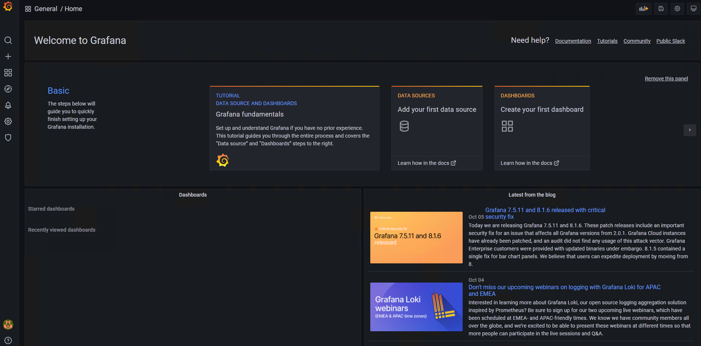
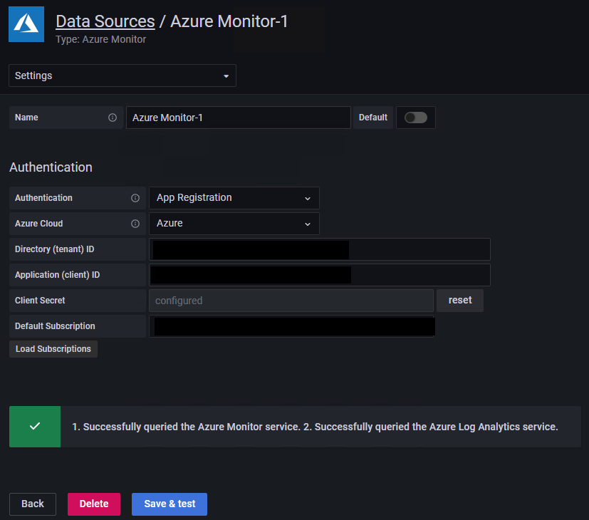

# Monitor your Azure services in Grafana
You can monitor Azure services and applications using [Grafana](https://grafana.com/) and the included [Azure Monitor data source plugin](https://grafana.com/docs/grafana/latest/datasources/azuremonitor/). The plugin retrieves data from three Azure services:
- Azure Monitor Metrics for numeric time series data from data from Azure resources. 
- Azure Monitor Logs for log and performance data from Azure resources that enables you to query using the powerful Kusto Query Language (KQL).
- Azure Resource Graph to quickly query and identify Azure resources across subscriptions. 

You can then display this performance and availability data on your Grafana dashboard.

Use the following steps to set up a Grafana server and build dashboards for metrics and logs from Azure Monitor.

## Set up a Grafana server

### Set up Grafana locally
To set up a local Grafana server, [download and install Grafana in your local environment](https://grafana.com/grafana/download).

### Set up Grafana on Azure through the Azure Marketplace
1. Go to Azure Marketplace and pick Grafana by Grafana Labs.

2. Fill in the names and details. Create a new resource group. Keep track of the values you choose for the VM username, VM password, and Grafana server admin password.  

3. Choose VM size and a storage account.

4. Configure the network configuration settings.

5. View the summary and select **Create** after accepting the terms of use.

6. After the deployment completes, select **Go to Resource Group**. You see a list of newly created resources.

    

    If you select the network security group (*grafana-nsg* in this case), you can see that port 3000 is used to access Grafana server.

7. Get the public IP address of your Grafana server - go back to the list of resources and select **Public IP address**.

## Sign in to Grafana

> [!IMPORTANT]
> The Internet Explorer browser and older Microsoft Edge browsers are not compatible with Grafana, you must use a chromium-based browser including Microsoft Edge. See [supported browsers for Grafana](https://grafana.com/docs/grafana/latest/installation/requirements/#supported-web-browsers).

1. Using the IP address of your server, open the Login page at *http://\<IP address\>:3000* or the *\<DNSName>\:3000* in your browser. While 3000 is the default port, note you might have selected a different port during setup. You should see a login page for the Grafana server you built.

    

2. Sign in with the user name *admin* and the Grafana server admin password you created earlier. If you're using a local setup, the default password would be *admin*, and you'd be requested to change it on your first login.

## Configure data source plugin

Once successfully logged in, you should see the option to add your first data source.



1. Select **Add data source**, filter by name *Azure* and select the **Azure Monitor** data source.


2. Pick a name for the data source and choose between Managed Identity or App Registration for authentication.

If your Grafana instance is hosted on an Azure VM or Azure App Service with managed identity enabled, you may use this approach for authentication. However, if your Grafana instance is not hosted on Azure or does not have managed identity enabled, you will need to use App Registration with an Azure service principal to setup authentication.

### Use Managed Identity

3. Enable managed identity on your VM or App Service and change the Grafana server managed identity support setting to true.
    * The managed identity of your hosting VM or App Service needs to have the [Monitoring reader role](/azure/azure-monitor/roles-permissions-security) assigned for the subscription, resource group or resources of interest.
    * Additionally, you will need to update the setting 'managed_identity_enabled = true' in the Grafana server config. See [Grafana Configuration](https://grafana.com/docs/grafana/latest/administration/configuration/) for details. Once both steps are complete, you can then save and test access.

4. Select **Save & test**, and Grafana will test the credentials. You should see a message similar to the following one.  
    
   

### Or use App Registration

5. Create a service principal - Grafana uses an Azure Active Directory service principal to connect to Azure Monitor APIs and collect data. You must create, or use an existing service principal, to manage access to your Azure resources.
    * See [these instructions](/azure/active-directory/develop/howto-create-service-principal-portal) to create a service principal. Copy and save your tenant ID (Directory ID), client ID (Application ID) and client secret (Application key value).
    * See [Assign application to role](/azure/active-directory/develop/howto-create-service-principal-portal#assign-a-role-to-the-application) to assign the [Monitoring reader role](/azure/azure-monitor/roles-permissions-security) to the Azure Active Directory application on the subscription, resource group or resource you want to monitor.
  
6. Provide the connection details you'd like to use.
    * When configuring the plugin, you can indicate which Azure Cloud you would like the plugin to monitor (Public, Azure US Government, Azure Germany, or Azure China).
        > [!NOTE]
        > Some data source fields are named differently than their correlated Azure settings:
        > * Tenant ID is the Azure Directory ID
        > * Client ID is the Azure Active Directory Application ID
        > * Client Secret is the Azure Active Directory Application key value

7. Select **Save & test**, and Grafana will test the credentials. You should see a message similar to the following one.  
    
   

## Use Azure Monitor data source dashboards

The Azure Monitor plugin includes several out of the box dashboards that you may import to get started.

1. Click on the **Dashboards** tab to see a list of available dashboards.

2. Click on **Import** to download a dashboard.

3. Click on the name of the imported dashboard to open it.

4. Use the drop-down selectors at the top of the dashboard to choose the subscription, resource group and resource of interest.

   

## Build Grafana dashboards

1. Go to the Grafana Home page, and select **Create your first dashboard**.

2. In the new dashboard, select the **Add an empty panel**.

3. An empty *Time series* panel appears on your dashboard with a query editor shown below. Select the Azure Monitor data source you've configured.
   * Collecting Azure Monitor metrics - select **Metrics** in the service dropdown. A list of selectors shows up, where you can select the resources and metric to monitor in this chart. To collect metrics from a VM, use the namespace **Microsoft.Compute/VirtualMachines**. Once you have selected VMs and metrics, you can start viewing their data in the dashboard.
     
   * Collecting Azure Monitor log data - select **Logs** in the service dropdown. Select the resource or Log Analytics workspace you'd like to query and set the query text. Note that The Azure Monitor plugin allows you to query the logs for specific resources or from a Log Analytics workspace. In the query editor below, you can copy any log query you already have or create a new one. As you type in your query, IntelliSense will show up and suggest autocomplete options. Finally, select the visualization type, **Time series**, and run the query.
    
     > [!NOTE]
     >
     > The default query provided with the plugin uses two macros: "$__timeFilter() and $__interval. 
     > These macros allow Grafana to dynamically calculate the time range and time grain, when you zoom in on part of a chart. You can remove these macros and use a standard time filter, such as *TimeGenerated > ago(1h)*, but that means the graph would not support the zoom in feature.
    
   The following example shows a query being run on an Application Insights resource for the average response time for all requests.

     

## Advanced Grafana features

### Variables
Some resource and query values can be selected through UI dropdowns, and updated in the in the resource or the query.
Consider the following query that shows the usage of a Log Analytics workspace as an example:
```
Usage 
| where $__timeFilter(TimeGenerated) 
| summarize total_KBytes=sum(Quantity)*1024 by bin(TimeGenerated, $__interval) 
| sort by TimeGenerated
```

You can configure a variable that will list all available **workspaces**, and then update the resource that is queried based on a user selection.
To create a new variable, click the dashboard's Settings button in the top right area, select **Variables**, and then **New**.
On the variable page, define the data source and query to run in order to get the list of values.


Once created, change the resource for your query to use the selected value(s) and your charts will respond accordingly:


See the full list of the [template variables](https://grafana.com/docs/grafana/latest/datasources/azuremonitor/template-variables/) available in the Azure Monitor plugin.

### Create dashboard playlists

One of the many useful features of Grafana is the dashboard playlist. You can create multiple dashboards and add them to a playlist configuring an interval for each dashboard to show. Navigate to the Dashboards menu item and select **Playlists** to create a playlist of existing dashboards cycle through. You may want to display them on a large wall monitor to provide a status board for your group.


## Clean up resources

If you've setup a Grafana environment on Azure, you are charged when VMs are running whether you are using them or not. To avoid incurring additional charges, clean up the resource group created in this article.

1. From the left-hand menu in the Azure portal, click **Resource groups** and then click **Grafana**.
2. On your resource group page, click **Delete**, type **Grafana** in the text box, and then click **Delete**.

## Next steps
* [Overview of Azure Monitor Metrics](../data-platform.md)
