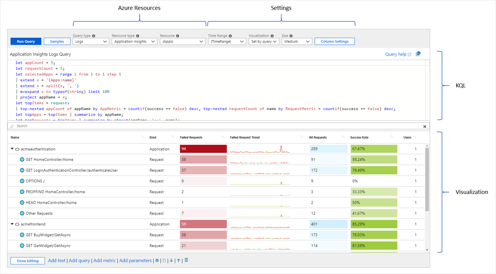
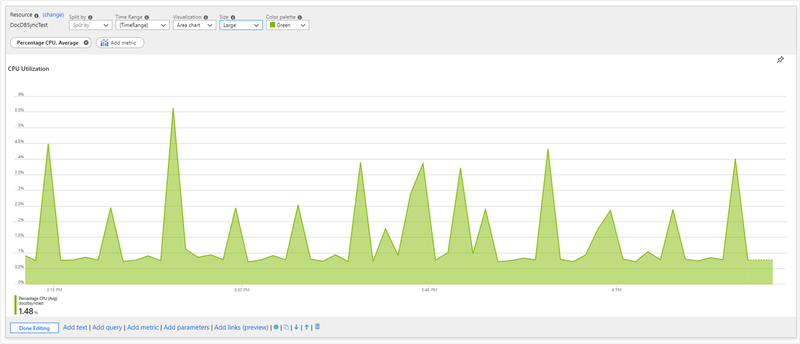
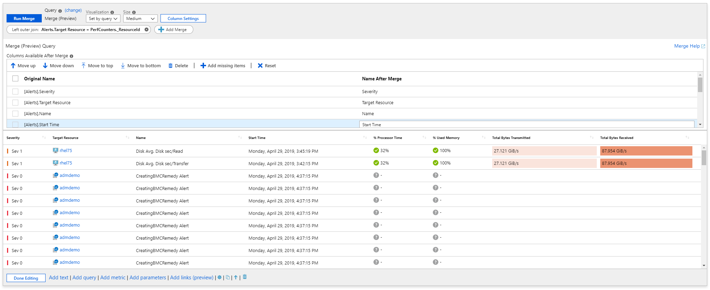
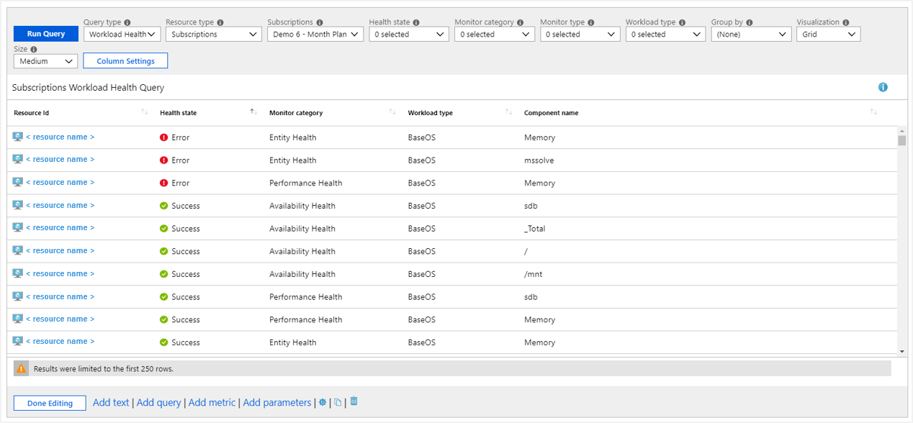

# Azure Workbooks data sources

Workbooks can extract data from these data sources:

 - [Logs](#logs)
 - [Metrics](#metrics)
 - [Azure Resource Graph](#azure-resource-graph)
 - [Azure Resource Manager](#azure-resource-manager)
 - [Azure Data Explorer](#azure-data-explorer)
 - [JSON](#json)
 - [Merge](#merge)
 - [Custom endpoint](#custom-endpoint)
 - [Workload health](#workload-health)
 - [Azure resource health](#azure-resource-health)
 - [Azure RBAC](#azure-rbac)
 - [Change Analysis (preview)](#change-analysis-preview)

## Logs

With workbooks, you can query logs from the following sources:

* Azure Monitor Logs (Application Insights resources and Log Analytics workspaces)
* Resource-centric data (activity logs)

You can use Kusto query language (KQL) queries that transform the underlying resource data to select a result set that can be visualized as text, charts, or grids.



You can easily query across multiple resources to create a unified rich reporting experience.

## Metrics

Azure resources emit [metrics](../essentials/data-platform-metrics.md) that can be accessed via workbooks. Metrics can be accessed in workbooks through a specialized control that allows you to specify the target resources, the desired metrics, and their aggregation. You can then plot this data in charts or grids.




## Azure Resource Graph

Workbooks support querying for resources and their metadata by using Azure Resource Graph. This functionality is primarily used to build custom query scopes for reports. The resource scope is expressed via a KQL subset that Resource Graph supports, which is often sufficient for common use cases.

To make a query control use this data source, use the **Query type** dropdown and select **Azure Resource Graph**. Then select the subscriptions to target. Use **Query control** to add the Resource Graph KQL subset that selects an interesting resource subset.


## Azure Resource Manager

Azure Workbooks supports Azure Resource Manager REST operations. With this capability, you can query the management.azure.com endpoint without the need to provide your own authorization header token.

To make a query control use this data source, use the **Data source** dropdown and select **Azure Resource Manager**. Provide the appropriate parameters such as **Http method**, **url path**, **headers**, **url parameters**, and **body**.

> [!NOTE]
> Only GET, POST, and HEAD operations are currently supported.

## Azure Data Explorer

Workbooks now have support for querying from [Azure Data Explorer](/azure/data-explorer/) clusters with the powerful [Kusto](/azure/kusto/query/index) query language.
For the **Cluster Name** field, add the region name following the cluster name. An example is *mycluster.westeurope*.


## JSON

The JSON provider allows you to create a query result from static JSON content. It's most commonly used in parameters to create dropdown parameters of static values. Simple JSON arrays or objects will automatically be converted into grid rows and columns. For more specific behaviors, you can use the **Results** tab and JSONPath settings to configure columns.

> [!NOTE]
> Do *not* include sensitive information in fields like headers, parameters, body, and URL, because they'll be visible to all the workbook users.

This provider supports [JSONPath](workbooks-jsonpath.md).

## Merge

Merging data from different sources can enhance the insights experience. An example is augmenting active alert information with related metric data. Merging data allows users to see not just the effect (an active alert) but also potential causes, for example, high CPU usage. The monitoring domain has numerous such correlatable data sources that are often critical to the triage and diagnostic workflow.

With workbooks, you can query different data sources. Workbooks also provide simple controls that you can use to merge or join data to provide rich insights. The *merge* control is the way to achieve it.

### Combine alerting data with Log Analytics VM performance data

The following example combines alerting data with Log Analytics VM performance data to get a rich insights grid.



### Use merge control to combine Resource Graph and Log Analytics data

Watch this tutorial on using the merge control to combine Resource Graph and Log Analytics data:

[](https://www.youtube.com/watch?v=7nWP_YRzxHg "Video showing how to combine data from different sources in workbooks.")

Workbooks support these merges:

* Inner unique join
* Full inner join
* Full outer join
* Left outer join
* Right outer join
* Left semi-join
* Right semi-join
* Left anti-join
* Right anti-join
* Union
* Duplicate table

## Custom endpoint

Workbooks support getting data from any external source. If your data lives outside Azure, you can bring it to workbooks by using this data source type.

To make a query control by using this data source, use the **Data source** dropdown and select **Custom Endpoint**. Provide the appropriate parameters such as **Http method**, **url**, **headers**, **url parameters**, and **body**. Make sure your data source supports [CORS](https://developer.mozilla.org/en-US/docs/Web/HTTP/CORS). Otherwise, the request will fail.

To avoid automatically making calls to untrusted hosts when you use templates, you need to mark the used hosts as trusted. You can either select **Add as trusted** or add it as a trusted host in workbook settings. These settings will be saved in [browsers that support IndexDb with web workers](https://caniuse.com/#feat=indexeddb).

This provider supports [JSONPath](workbooks-jsonpath.md).

## Workload health

Azure Monitor has functionality that proactively monitors the availability and performance of Windows or Linux guest operating systems. Azure Monitor models key components and their relationships, criteria for how to measure the health of those components, and which components alert you when an unhealthy condition is detected. With workbooks, you can use this information to create rich interactive reports.

To make a query control by using this data source, use the **Query type** dropdown to select **Workload Health**. Then select subscription, resource group, or VM resources to target. Use the health filter dropdowns to select an interesting subset of health incidents for your analytic needs.



## Azure resource health

Workbooks support getting Azure resource health and combining it with other data sources to create rich, interactive health reports.

To make a query control by using this data source, use the **Query type** dropdown and select **Azure health**. Then select the resources to target. Use the health filter dropdowns to select an interesting subset of resource issues for your analytic needs.


## Azure RBAC

The Azure role-based access control (RBAC) provider allows you to check permissions on resources. It's most commonly used in parameters to check if the correct RBACs are set up. A use case would be to create a parameter to check deployment permission and then notify the user if they don't have deployment permission.

Simple JSON arrays or objects will automatically be converted into grid rows and columns or text with a `hasPermission` column with either true or false. The permission is checked on each resource and then either `or` or `and` to get the result. The [operations or actions](../../role-based-access-control/resource-provider-operations.md) can be a string or an array.

  **String:**
   ```
   "Microsoft.Resources/deployments/validate/action"
   ```

   **Array:**
   ```
   ["Microsoft.Resources/deployments/read","Microsoft.Resources/deployments/write","Microsoft.Resources/deployments/validate/action","Microsoft.Resources/operations/read"]
   ```

## Change Analysis (preview)

To make a query control by using [Application Change Analysis](../app/change-analysis.md) as the data source, use the **Data source** dropdown and select **Change Analysis (preview)**. Then select a single resource. Changes for up to the last 14 days can be shown. Use the **Level** dropdown to filter between **Important**, **Normal**, and **Noisy** changes. This dropdown supports workbook parameters of the type [drop down](workbooks-dropdowns.md).

> [!div class="mx-imgBorder"]
> 

## Next steps

 - [Get started with Azure Workbooks](workbooks-getting-started.md)
 - [Create an Azure workbook](workbooks-create-workbook.md).
