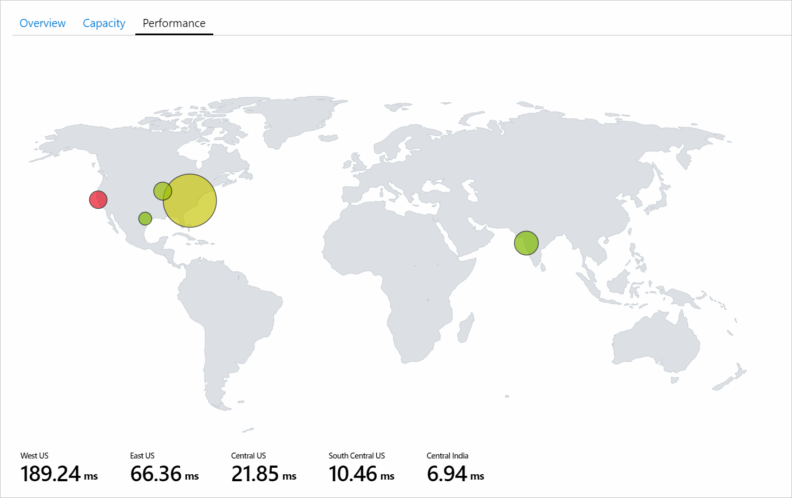
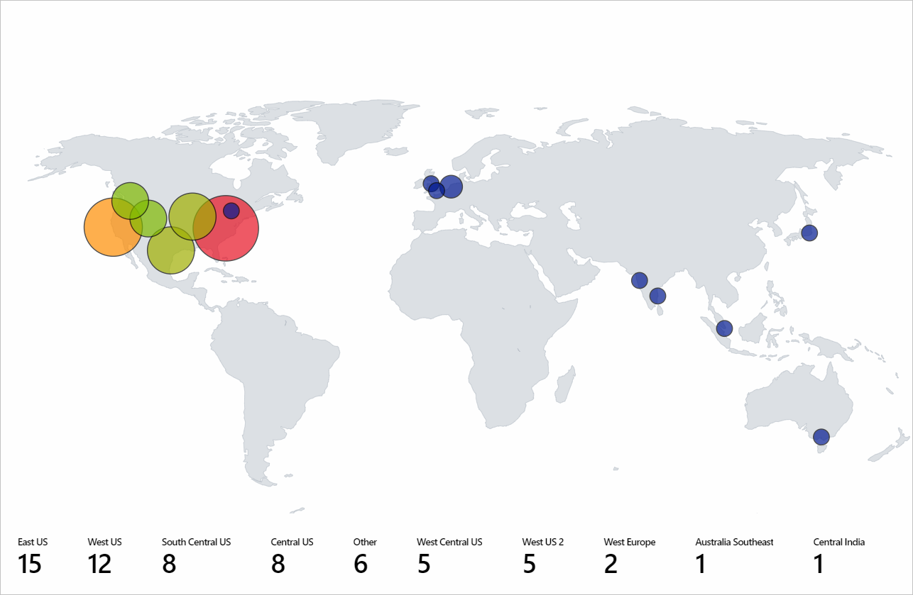
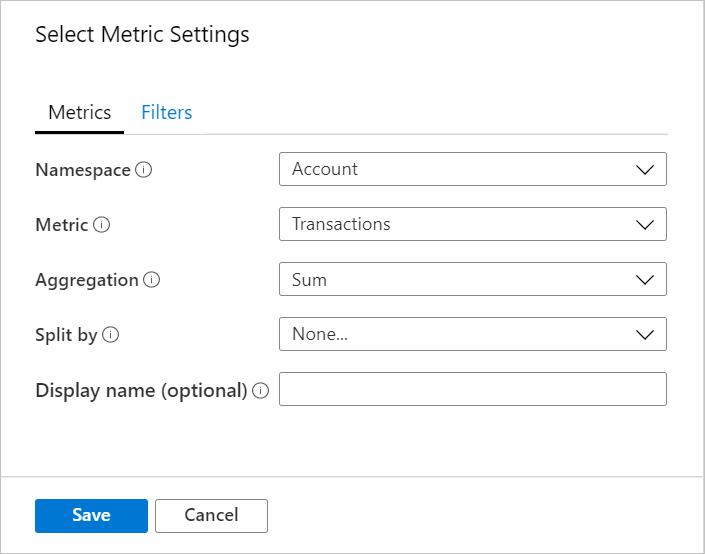
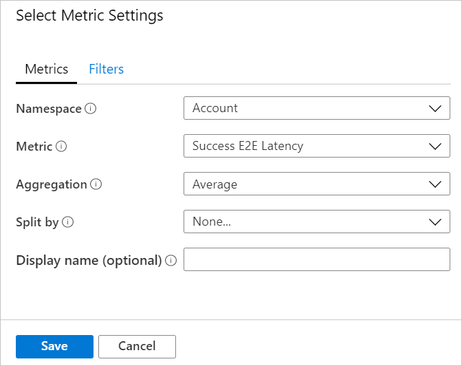
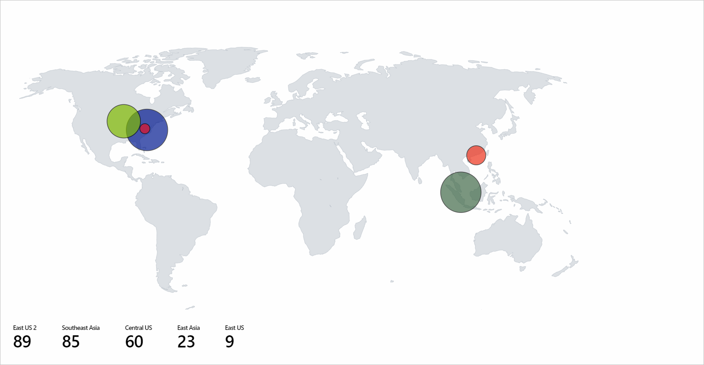

# Map visualization

The Azure Workbooks map visualization aids in pinpointing issues in specific regions and showing high-level aggregated views of the monitoring data. Maps aggregate all the data mapped to each location, country, or region.

The following screenshot shows the total transactions and end-to-end latency for different storage accounts. Here the size is determined by the total number of transactions. The color metrics below the map show the end-to-end latency.

At first glance, the number of transactions in the **West US** region is small compared to the **East US** region. But the end-to-end latency for the **West US** region is higher than the **East US** region. This information provides initial insight that something is amiss for **West US**.



## Add a map

A map can be visualized if the underlying data or metrics have:

- Latitude/longitude information.
- Azure resource information.
- Azure location information.
- Country/region, name, or country/region code.

### Use an Azure location

1. Switch the workbook to edit mode by selecting the **Edit** toolbar button.
1. Select **Add** > **Add query**.
1. Change **Data Source** to **Azure Resource Graph**. Then select any subscription that has a storage account.
1. Enter the following query for your analysis and then select **Run Query**.

    ```kusto
    where  type =~ 'microsoft.storage/storageaccounts'
    | summarize count() by location
    ```

1. Set **Size** to **Large**.
1. Set **Visualization** to **Map**.
1. All the settings are autopopulated. For custom settings, select the **Map Settings** button to open the settings pane.
1. The following screenshot of the map visualization shows storage accounts for each Azure region for the selected subscription.



### Use an Azure resource

1. Switch the workbook to edit mode by selecting the **Edit** toolbar button.
1. Select **Add** > **Add Metric**.
1. Use a subscription that has storage accounts.
1. Change **Resource Type** to **storage account**. In **Resource**, select multiple storage accounts.
1. Select **Add Metric** and add a transaction metric:
    1. **Namespace**: `Account`
    1. **Metric**: `Transactions`
    1. **Aggregation**: `Sum`

    
1. Select **Add Metric** and add the **Success E2E Latency** metric:
    1. **Namespace**: `Account`
    1. **Metric**: `Success E2E Latency`
    1. **Aggregation**: `Average`

    
1. Set **Size** to **Large**.
1. Set **Visualization** to **Map**.
1. In **Map Settings**, set the following settings:
    1. **Location info using**: `Azure Resource`
    1. **Azure resource field**: `Name`
    1. **Size by**: `microsoft.storage/storageaccounts-Transaction-Transactions`
    1. **Aggregation for location**: `Sum of values`
    1. **Coloring type**: `Heatmap`
    1. **Color by**: `microsoft.storage/storageaccounts-Transaction-SuccessE2ELatency`
    1. **Aggregation for color**: `Sum of values`
    1. **Color palette**: `Green to Red`
    1. **Minimum value**: `0`
    1. **Metric value**: `microsoft.storage/storageaccounts-Transaction-SuccessE2ELatency`
    1. **Aggregate other metrics by**: `Sum of values`
    1. Select the **Custom formatting** box:
        - **Unit**: `Milliseconds`
        - **Style**: `Decimal`
        - **Maximum fractional digits**: `2`

### Use country/region

1. Switch the workbook to edit mode by selecting the **Edit** toolbar button.
1. Select **Add** > **Add query**.
1. Change **Data source** to **Log**.
1. Select **Resource type** as **Application Insights**. Then select any Application Insights resource that has `pageViews` data.
1. Use the query editor to enter the KQL for your analysis and select **Run Query**.

    ```kusto
    pageViews
    | project duration, itemCount, client_CountryOrRegion
    | limit 20
    ```

1. Set **Size** to **Large**.
1. Set **Visualization** to **Map**.
1. All the settings will be autopopulated. For custom settings, select **Map Settings**.

### Use latitude/location

1. Switch the workbook to edit mode by selecting the **Edit** toolbar button.
1. Select **Add** > **Add query**.
1. Change **Data source** to **JSON**.
1. Enter the JSON data in the query editor and select **Run Query**.
1. Set **Size** to **Large**.
1. Set **Visualization** to **Map**.
1. In **Map Settings** under **Metric Settings**, set **Metric Label** to `displayName`. Then select **Save and Close**.

The following map visualization shows users for each latitude and longitude location with the selected label for metrics.



## Map settings

Map settings include layout, color, and metrics.

### Layout settings

| Setting | Explanation |
|:-------------|:-------------|
| `Location info using` | Select a way to get the location of items shown on the map. <br> **Latitude/Longitude**: Select this option if there are columns with latitude and longitude information. Each row with latitude and longitude data will be shown as a distinct item on the map. <br> **Azure location**: Select this option if there's a column that has Azure location (eastus, westeurope, centralindia) information. Specify that column and it will fetch the corresponding latitude and longitude for each Azure location. It will group the same location rows together based on the aggregation specified to show the locations on the map. <br> **Azure resource**: Select this option if there's a column that has Azure resource information such as an Azure Storage account and an Azure Cosmos DB account. Specify that column and it will fetch the corresponding latitude and longitude for each Azure resource. It will group the same location (Azure location) rows together based on the aggregation specified to show the locations on the map. <br> **Country/Region**: Select this option if there's a column that has country/region name/code (US, United States, IN, India, CN, China) information. Specify that column and it will fetch the corresponding latitude and longitude for each country/region/code. It will group rows together with the same Country-Region Code/Country-Region Name to show the locations on the map. Country Name and Country Code won't be grouped together as a single entity on the map.
| `Latitude/Longitude` | These two options will be visible if the `Location Info` field value is **Latitude/Longitude**. Select the column that has latitude in the `Latitude` field and longitude in the `Longitude` field, respectively. |
| `Azure location field` | This option will be visible if the `Location Info` field value is **Azure location**. Select the column that has the Azure location information. |
| `Azure resource field` | This option will be visible if the `Location Info` field value is **Azure resource**. Select the column that has the Azure resource information. |
| `Country/Region field` | This option will be visible if the `Location Info` field value is **Country/Region**. Select the column that has the country/region information. |
| `Size by` | This option controls the size of the items shown on the map. Size depends on the value in the column specified by the user. Currently, the radius of the circle is directly proportional to the square root of the column's value. If **None** is selected, all the circles will show the default region size.|
| `Aggregation for location` | This field specifies how to aggregate the `Size by` columns that have the same Azure Location/Azure Resource/Country-Region. |
| `Minimum region size` | This field specifies the minimum radius of the item shown on the map. It's used when there's a significant difference between the `Size by` column's values, which causes smaller items to be hardly visible on the map. |
| `Maximum region size` | This field specifies the maximum radius of the item shown on the map. It's used when the `Size by` column's values are extremely large and they're covering a huge area of the map.|
| `Default region size` | This field specifies the default radius of the item shown on the map. The default radius is used when the `Size by` column is **None** or the value is 0.|
| `Minimum value` | The minimum value used to compute region size. If not specified, the minimum value will be the smallest value after aggregation. |
| `Maximum value` | The maximum value used to compute region size. If not specified, the maximum value will be the largest value after aggregation.|
| `Opacity of items on Map` | This field specifies the transparency of items shown on the map. Opacity of 1 means no transparency. Opacity of 0 means that items won't be visible on the map. If there are too many items on the map, opacity can be set to a low value so that all the overlapping items are visible.|

### Color settings

| Coloring type | Explanation |
|:------------- |:-------------|
| `None` | All nodes have the same color. |
| `Thresholds` | In this type, cell colors are set by threshold rules, for example, _CPU > 90%  => Red, 60% > CPU > 90% => Yellow, CPU < 60% => Green_. <ul><li> `Color by`: The value of this column will be used by Thresholds/Heatmap logic.</li> <li>`Aggregation for color`: This field specifies how to aggregate the `Color by` columns that have the same Azure Location/Azure Resource/Country-Region. </li> <ul> |
| `Heatmap` | In this type, the cells are colored based on the color palette and `Color by` field. This type will also have the same `Color by` and `Aggregation for color` options as thresholds. |

### Metric settings

| Setting | Explanation |
|:------------- |:-------------|
| `Metric Label` | This option will be visible if the `Location Info` field value is **Latitude/Longitude**. With this feature, you can pick the label to show for the metrics shown below the map. |
| `Metric Value` | This field specifies a metric value to be shown below the map. |
| `Create 'Others' group after` | This field specifies the limit before an "Others" group is created. |
| `Aggregate 'Others' metrics by` | This field specifies the aggregation used for an "Others" group if it's shown. |
| `Custom formatting` | Use this field to set units, style, and formatting options for number values. This setting is the same as a [grid's custom formatting](../visualize/workbooks-grid-visualizations.md#custom-formatting).|

## Next steps

Learn how to create [honeycomb visualizations in workbooks](../visualize/workbooks-honey-comb.md).