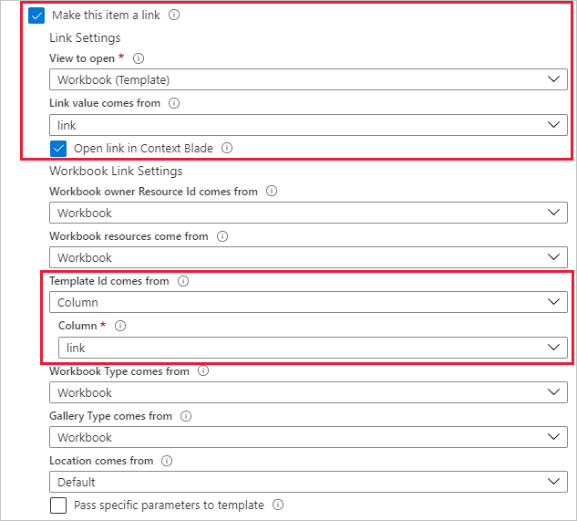

# Rendering Options
These rendering options can be used with grids, tiles, and graphs to produce the visualizations in optimal format.
## Column renderers

| Column Renderer | Explanation | More Options |
|:------------- |:-------------|:-------------|
| Automatic | The default - uses the most appropriate renderer based on the column type.  |  |
| Text| Renders the column values as text. | |
| Right Aligned| Renders the column values as right-aligned text. | |
| Date/Time| Renders a readable date time string. | |
| Heatmap| Colors the grid cells based on the value of the cell. | Color palette and min/max value used for scaling. |
| Bar| Renders a bar next to the cell based on the value of the cell. | Color palette and min/max value used for scaling. |
| Bar underneath | Renders a bar near the bottom of the cell based on the value of the cell. | Color palette and min/max value used for scaling. |
| Composite bar| Renders a composite bar using the specified columns in that row. Refer [Composite Bar](workbooks-composite-bar.md) for details. | Columns with corresponding colors to render the bar and a label to display at the top of the bar. |
|Spark bars| Renders a spark bar in the cell based on the values of a dynamic array in the cell. For example, the Trend column from the screenshot at the top. | Color palette and min/max value used for scaling. |
|Spark lines| Renders a spark line in the cell based on the values of a dynamic array in the cell. | Color palette and min/max value used for scaling. |
|Icon| Renders icons based on the text values in the cell. Supported values include:<br><ul><li>canceled</li><li>critical</li><li>disabled</li><li>error</li><li>failed</li> <li>info</li><li>none</li><li>pending</li><li>stopped</li><li>question</li><li>success</li><li>unknown</li><li>warning</li><li>uninitialized</li><li>resource</li><li>up</li> <li>down</li><li>left</li><li>right</li><li>trendup</li><li>trenddown</li><li>4</li><li>3</li><li>2</li><li>1</li><li>Sev0</li><li>Sev1</li><li>Sev2</li><li>Sev3</li><li>Sev4</li><li>Fired</li><li>Resolved</li><li>Available</li><li>Unavailable</li><li>Degraded</li><li>Unknown</li><li>Blank</li></ul>|  |
| Link | Renders a link that when clicked or performs a configurable action. Use this setting if you **only** want the item to be a link.  Any of the other types of renderers can also be a link by using the **Make this item a link** setting. For more information, see [Link Actions](#link-actions). |  |
| Location | Renders a friendly Azure region name based on a region ID. |  |
| Resource type | Renders a friendly resource type string based on a resource type ID.  |  |
| Resource| Renders a friendly resource name and link based on a resource ID.  | Option to show the resource type icon  |
| Resource group | Renders a friendly resource group name and link based on a resource group ID. If the value of the cell is not a resource group, it will be converted to one.  | Option to show the resource group icon  |
|Subscription| Renders a friendly subscription name and link based on a subscription ID.  if the value of the cell is not a subscription, it will be converted to one.  | Option to show the subscription icon.  |
|Hidden| Hides the column in the grid. Useful when the default query returns more columns than needed but a project-away is not desired |  |

## Link actions

If the **Link** renderer is selected or the **Make this item a link** checkbox is selected, the author can configure a link action to occur when the user selects the cell to taking the user to another view with context coming from the cell, or to open up a url.

## Using thresholds with links

The instructions below will show you how to use thresholds with links to assign icons and open different workbooks. Each link in the grid will open up a different workbook template for that Application Insights resource.

1. Switch the workbook to edit mode by selecting **Edit** toolbar item.
1. Select **Add** then **Add query**.
1. Change the **Data source** to "JSON" and **Visualization** to "Grid".
1. Enter the following query.

  ```json
    [ 
        { "name": "warning", "link": "Community-Workbooks/Performance/Performance Counter Analysis" },
        { "name": "info", "link": "Community-Workbooks/Performance/Performance Insights" },
        { "name": "error", "link": "Community-Workbooks/Performance/Apdex" }
    ]
  ```

1. Run query.
1. Select **Column Settings** to open the settings.
1. Select "name" from **Columns**.
1. Under **Column renderer**, choose "Thresholds".
1.  Enter and choose the following **Threshold Settings**.
   
    | Operator | Value   | Icons   |
    |----------|---------|---------|
    | ==       | warning | Warning |
    | ==       | error   | Failed  |

    

    Keep the default row as is. You may enter whatever text you like. The Text column takes a String format as an input and populates it with the column value and unit if specified. For example, if warning is the column value the text can be "{0} {1} link!", it will be displayed as "warning link!".
1. Select the **Make this item a link** box.
     - Under **View to open**, choose **Workbook (Template)**.
     - Under **Link value comes from**, choose **link**.
     - Select the **Open link in Context Blade** box.
     -  Choose the following settings in **Workbook Link Settings**
        - Under **Template Id comes from**, choose **Column**.
        - Under **Column** choose **link**.

  

1. Select **link** from **Columns**. Under **Settings**, next to **Column renderer**, select **(Hide column)**.
1. To change the display name of the **name** column, select the **Labels** tab. On the row with **name** as its **Column ID**, under **Column Label** enter the name you want displayed.
2. Select **Apply**.

  
