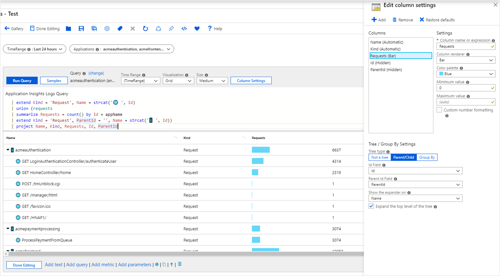
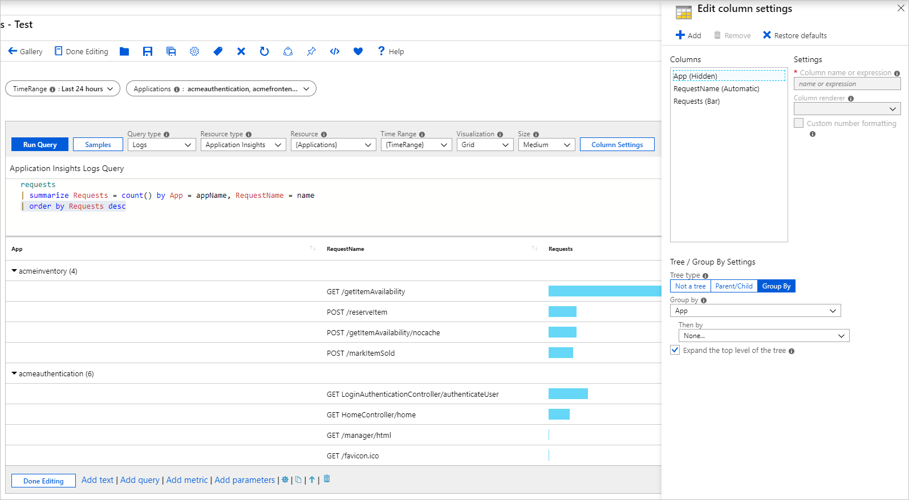

# Tree visualizations

Azure Monitor workbooks support hierarchical views via tree grids. Trees allow some rows to be expandable into the next level for a drill-down experience.

The following example shows container health metrics of a working set size that are visualized as a tree grid. The top-level nodes here are Azure Kubernetes Service (AKS) nodes. The next-level nodes are pods, and the final-level nodes are containers. Notice that you can still format your columns like you do in a grid with heatmaps, icons, and links. The underlying data source in this case is a Log Analytics workspace with AKS logs.

[](./media/workbooks-tree-visualizations/trees.png#lightbox)

## Add a tree grid

1. Switch the workbook to edit mode by selecting the **Edit** toolbar item.
1. Select **Add** > **Add query** to add a log query control to the workbook.
1. Select **Query type** as **Logs**. Select **Resource type** as, for example, **Application Insights**, and select the resources to target.
1. Use the query editor to enter the KQL for your analysis.

    ```kusto
    requests
    | summarize Requests = count() by ParentId = appName, Id = name
    | extend Kind = 'Request', Name = strcat('🌐 ', Id)
    | union (requests
    | summarize Requests = count() by Id = appName
    | extend Kind = 'Request', ParentId = '', Name = strcat('📱 ', Id))
    | project Name, Kind, Requests, Id, ParentId
    | order by Requests desc
    ```

1. Set **Visualization** to **Grid**.
1. Select the **Column Settings** button to open the **Edit column settings** pane.
1. In the **Tree/Group By Settings** section at the bottom, set:
    * **Tree type**: `Parent/Child`
    * **Id Field**: `Id`
    * **Parent Id Field**: `ParentId`
    * **Show the expander on**: `Name`
    * Select the **Expand the top level of the tree** checkbox.
1. In the **Columns** section at the top, set:
    * **Id - Column renderer**: `Hidden`
    * **Parent Id - Column renderer**: `Hidden`
    * **Requests - Column renderer**: `Bar`
    * **Color palette**: `Blue`
    * **Minimum value**: `0`
1. Select the **Save and Close** button at the bottom of the pane.

[](./media/workbooks-tree-visualizations/tree-settings.png#lightbox)

## Tree settings

| Setting | Explanation |
|:------------- |:-------------|
| `Id Field` | The unique ID of every row in the grid. |
| `Parent Id Field` | The ID of the parent of the current row. |
| `Show the expander on` | The column on which to show the tree expander. It's common for tree grids to hide their ID and parent ID fields because they aren't very readable. Instead, the expander appears on a field with a more readable value like the name of the entity. |
| `Expand the top level of the tree` | If selected, the tree grid expands at the top level. This option is useful if you want to show more information by default. |

## Grouping in a grid

You can use grouping to build hierarchical views similar to the ones shown in the preceding example with simpler queries. You do lose aggregation at the inner nodes of the tree, but that's acceptable for some scenarios. Use **Group By** to build tree views when the underlying result set can't be transformed into a proper tree form. Examples are alert, health, and metric data.

## Add a tree by using grouping

1. Switch the workbook to edit mode by selecting the **Edit** toolbar item.
1. Select **Add** > **Add query** to add a log query control to the workbook.
1. Select **Query type** as **Logs**. Select **Resource type** as, for example, **Application Insights**, and select the resources to target.
1. Use the query editor to enter the KQL for your analysis.

    ```kusto
    requests
    | summarize Requests = count() by App = appName, RequestName = name
    | order by Requests desc
    ```

1. Set **Visualization** to **Grid**.
1. Select the **Column Settings** button to open the **Edit column settings** pane.
1. In the **Tree/Group By Settings** section at the bottom, set:
    * **Tree type**: `Group By`
    * **Group by**: `App`
    * **Then by**: `None`
    * Select the **Expand the top level of the tree** checkbox.
1. In the **Columns** section at the top, set:
    * **App - Column renderer**: `Hidden`
    * **Requests - Column renderer**: `Bar`
    * **Color palette**: `Blue`
    * **Minimum value**: `0`
1. Select the **Save and Close** button at the bottom of the pane.

[](./media/workbooks-tree-visualizations/tree-group-create.png#lightbox)

## Next steps

* Learn how to create a [graph in workbooks](workbooks-graph-visualizations.md).
* Learn how to create a [tile in workbooks](workbooks-tile-visualizations.md).
