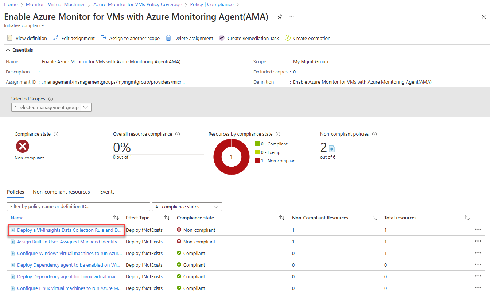
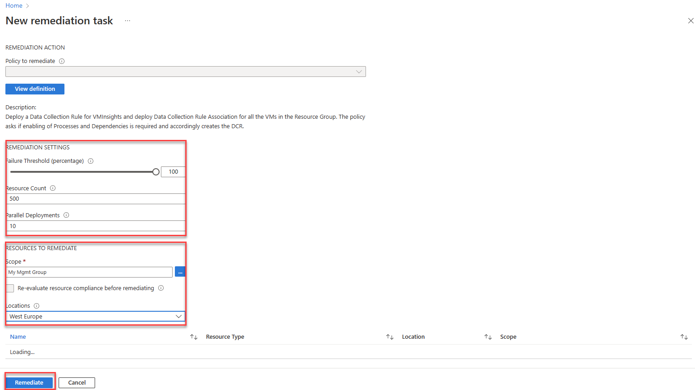

# Enable VM insights by using Azure Policy

[Azure Policy](/azure/governance/policy/overview) lets you set and enforce requirements for all new resources created in your Azure environment. VM insights policy initiatives, which are predefined sets of policies created for VM insights, install the agents required for VM insights and enable monitoring on all new virtual machines in your Azure environment. This article explains how to enable VM insights for Azure virtual machines, Virtual Machine Scale Sets, and hybrid virtual machines connected with Azure Arc using predefined VM insights policy initiates. 

> [!NOTE]
> To use Azure Policy with Azure virtual machine scale sets, or to work with Azure Policy directly to enable Azure virtual machines, see [Deploy Azure Monitor at scale using Azure Policy](../best-practices.md).

## VM insights initiatives
VM insights policy initiatives install Azure Monitor Agent and Dependency Agent on new virtual machines in your Azure environment. Assign these initiatives to a management group, subscription, or resource group to install the agents on Windows or Linux Azure virtual machines in the defined scope automatically.

The initiatives apply to new machines you create and machines you modify, but not to existing VMs. 

|Name |Description |
|:---|:---|
| Enable Azure Monitor for VMs with Azure Monitoring Agent (AMA) | Installs Azure Monitor Agent and Dependency agent on Azure VMs. |
| Enable Azure Monitor for VMSS with Azure Monitoring Agent (AMA) | Installs Azure Monitor Agent and Dependency agent on Azure Virtual Machine Scale Sets. |
| Enable Azure Monitor for Hybrid VMs with AMA | Installs Azure Monitor Agent and Dependency agent on hybrid VMs connected with Azure Arc. |
| Legacy - Enable Azure Monitor for VMs | Installs the Log Analytics agent and Dependency agent on Azure Virtual Machine Scale Sets. |
| Legacy - Enable Azure Monitor for virtual machine scale sets | Installs the Log Analytics agent and Dependency agent on Azure Virtual Machine Scale Sets. |

## Assign a VM insights policy initiative

To assign a VM insights policy initiative to a subscription or management group from the Azure portal:

1. Select **Azure Monitor** > **Virtual machines**. 
1. Select **Overview** > **Other onboarding options** and then **Enable** under **Enable using policy**.

    :::image type="content" source="media/vminsights-enable-policy/other-onboarding-options.png" lightbox="media/vminsights-enable-policy/other-onboarding-options.png" alt-text="Screenshot showing other onboarding options page of VM insights with the Enable using policy option.":::

1. Select **Assign Policy** to assign a policy to a subscription or management group.

    
    
    > [!NOTE]
    > This is the standard Azure Policy policy initiative screen, except that it's hardcoded with the scope you selected and the **Enable VM insights** initiative definition. 

1. (Optional) Change the **Assignment name** and add a **Description**. 
1. Select **Exclusions** if you want to exclude specific resources from the policy assignment. For example, your scope could be a management group, and you could specify a subscription in that management group to be excluded from the assignment.

    

1. On the **Parameters** tab, select a **Log Analytics workspace** to which all virtual machines in the assignment will send data. For virtual machines to send data to different workspaces, create multiple assignments, each with their own scope. 

    
   
    > [!NOTE]
    > If you select a workspace that's not within the scope of the assignment, grant *Log Analytics Contributor* permissions to the policy assignment's Principal ID. Otherwise, you might get a deployment failure like `The client '343de0fe-e724-46b8-b1fb-97090f7054ed' with object id '343de0fe-e724-46b8-b1fb-97090f7054ed' does not have authorization to perform action 'microsoft.operationalinsights/workspaces/read' over scope ...`

1. Select **Review + Create** to review the initiative assignment details and select **Create** to create the assignment. 

    Don't create a remediation task at this point because you'll probably need multiple remediation tasks to enable existing virtual machines. For more information about creating remediation tasks, see [Remediate compliance results](#remediate-compliance-results).

### Review compliance for a VM insights policy initiative 

After you assign an initiative, you can review and manage compliance for the initiative across your management groups and subscriptions. 

To see how many virtual machines exist in each of the management groups or subscriptions and their compliance status:

1. Select **Azure Monitor** > **Virtual machines**. 
1. Select **Overview** > **Other onboarding options** and then **Enable** under **Enable using policy**.

    

    This table describes the compliance information provided on the **Azure Monitor for VMs Policy Coverage** page.
    
    | Function | Description | 
    |----------|-------------| 
    | **Scope** | Management group and subscription to which the initiative applies.|
    | **Role** | Your role in the scope. The role can be **Reader**, **Owner**, or **Contributor**. This will be blank if you have access to the subscription but not to the management group it belongs to. Your role determines which data you can see and whether you can assign policies or initiatives (owner), edit them, or view compliance. |
    | **Total VMs** | Total number of VMs in the scope, regardless of their status. For a management group, this is the sum total of VMs in all related subscriptions or child management groups. |
    | **Assignment Coverage** | Percentage of VMs covered by the initiative. |
    | **Assignment Status** | **Success** - Azure Monitor Agent or Log Analytics agent and Dependency agent deployed on all machines in scope. **Warning** - The subscription isn't under a management group. **Not Started** - A new assignment was added. **Lock** - You don't have sufficient privileges to the management group. **Blank** - No VMs exist or a policy isn't assigned. |
    | **Compliant VMs** | Number of VMs that have both Azure Monitor Agent or Log Analytics agent and Dependency agent installed. This is blank if there are no assignments, no VMs in the scope, or if you don't have the relevant permissions. |
    | **Compliance** | The overall compliance number is the sum of distinct compliant resources divided by the sum of all distinct resources. |
    | **Compliance State** | **Compliant** - All VMs in the scope have the Azure Monitor Agent or Log Analytics agent and Dependency agent deployed to them, or any new VMs in the scope haven't yet been evaluated. **Non-compliant** - There are VMs that aren't enabled and may need remediation. **Not Started** - A new assignment was added. **Lock** - You don't have sufficient privileges to the management group. **Blank** - No policy assigned.  |

    When you assign the initiative, the scope you select in the assignment could be the scope listed or a subset of it. For instance, you might have created an assignment for a subscription (initiative scope) and not a management group (coverage scope). In this case, the value of **Assignment Coverage** indicates the VMs in the initiative scope divided by the VMs in coverage scope. In another case, you might have excluded some VMs, resource groups, or a subscription from policy scope. If the value is blank, it indicates that either the policy or initiative doesn't exist or you don't have permission. Information is provided under **Assignment Status**.

1. Select the ellipsis (...) > **View Compliance**.

    
    
    This opens the **Compliance** page, which lists assignments that match the specified filter and indicates whether they're compliant. 
    
    
    
1. Select an assignment to view its details. This opens the **Initiative compliance** page, which lists the policy definitions in the initiative and whether each is in compliance.
    
    

    Policy definitions are considered non-compliant if:

    * Azure Monitor Agent, Log Analytics agent, or Dependency agent aren't deployed. Create a remediation task to mitigate.
    * VM image (OS) isn't identified in the policy definition. Policies can only verify well-known Azure VM images. Check the documentation to see whether the VM OS is supported.
    * Some VMs in the initiative scope are connected to a Log Analytics workspace other than the one that's specified in the policy assignment.

1. Select a policy definition to open the **Policy compliance** page. 

## Remediate compliance results

If your assignment doesn't show 100% compliance, create remediation tasks to evaluate and enable existing VMs.

To create a remediation task:
   
1. Select **Create Remediation Task**. 

    

    
    

1. Select **Remediate** to create the remediation task and then **Remediate** to start it. You'll most likely need to create multiple remediation tasks, one for each policy definition. You can't create a remediation task for an initiative.

    
    
    
    Once the remediation tasks are complete, your VMs should be compliant with agents installed and enabled for VM insights. 
    

## Azure Policy
To use Azure Policy to enable monitoring for Virtual Machine Scale Sets, assign the **Enable Azure Monitor for Virtual Machine Scale Sets** initiative to an Azure management group, subscription, or resource group, depending on the scope of your resources to monitor. A [management group](../../governance/management-groups/overview.md) is useful for scoping policy, especially if your organization has multiple subscriptions.

Select the workspace that the data will be sent to. This workspace must have the *VMInsights* solution installed, as described in [Configure Log Analytics workspace for VM insights](vminsights-configure-workspace.md).

Create a remediation task if you have existing Virtual Machine Scale Sets that need to be assigned this policy.

## Next steps

Now that monitoring is enabled for your virtual machines, this information is available for analysis with VM insights. 

- To view discovered application dependencies, see [View VM insights Map](vminsights-maps.md). 
- To identify bottlenecks and overall utilization with your VM's performance, see [View Azure VM performance](vminsights-performance.md).
