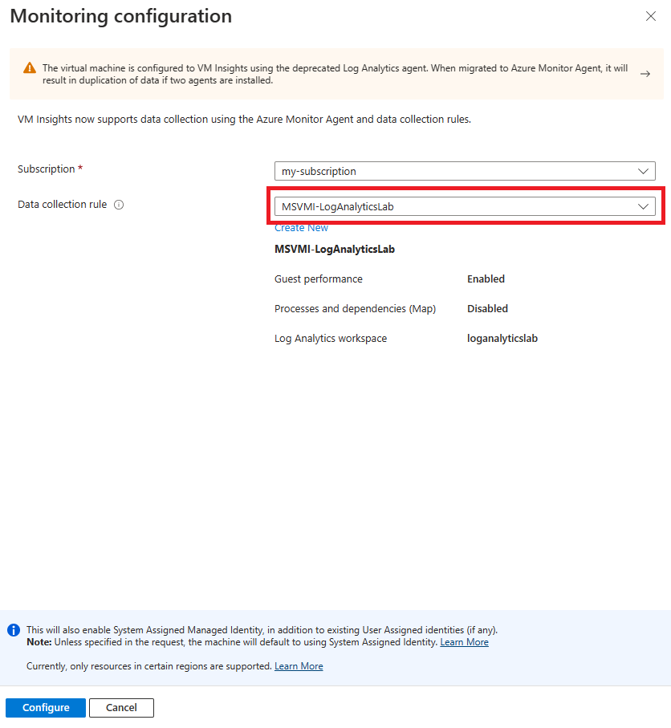
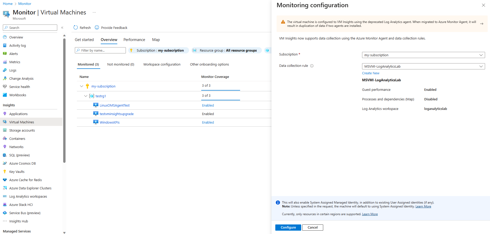

# Enable VM insights in the Azure portal
This article describes how to enable VM insights using the Azure portal for Azure virtual machines, Azure Virtual Machine Scale Sets, and hybrid virtual machines connected with [Azure Arc](../../azure-arc/overview.md).

> [!NOTE]
> Azure portal no longer supports enabling VM insights using the legacy Log Analytics agent. 

## Prerequisites

- [Log Analytics workspace](./vminsights-configure-workspace.md).
- See [Supported operating systems](./vminsights-enable-overview.md#supported-operating-systems) to ensure that the operating system of the virtual machine or Virtual Machine Scale Set you're enabling is supported. 
- See [Manage the Azure Monitor agent](../agents/azure-monitor-agent-manage.md#prerequisites) for prerequisites related to Azure Monitor agent.

## View monitored and unmonitored machines

To see which virtual machines in your directory are monitored using VM insights:

1. From the **Monitor** menu in the Azure portal, select **Virtual Machines** > **Overview**. 

    The **Overview** page lists all of the virtual machines and Virtual Machine Scale Sets in the selected subscriptions. 

1. Select the **Monitored** tab for the list of machines that have VM insights enabled.
    
1. Select the **Not monitored** tab for the list of machines that don't have VM insights enabled. 

    The **Not monitored** tab includes all machines that don't have VM insights enabled, even if the machines have Azure Monitor Agent or Log Analytics agent installed. If a virtual machine has the Log Analytics agent installed but not the Dependency agent, it will be listed as not monitored. In this case, Azure Monitor Agent will be started without being given the option for the Log Analytics agent.

## Enable VM insights for Azure Monitor Agent
> [!NOTE]
> As part of the Azure Monitor Agent installation process, Azure assigns a [system-assigned managed identity](../../app-service/overview-managed-identity.md?tabs=portal%2chttp#add-a-system-assigned-identity) to the machine if such an identity doesn't already exist.

To enable VM insights on an unmonitored virtual machine or Virtual Machine Scale Set using Azure Monitor Agent:

1. From the **Monitor** menu in the Azure portal, select **Virtual Machines** > **Not Monitored**. 
 
1. Select **Enable** next to any machine that you want to enable. If a machine is currently running, you must start it to enable it.

    :::image type="content" source="media/vminsights-enable-portal/enable-unmonitored.png" lightbox="media/vminsights-enable-portal/enable-unmonitored.png" alt-text="Screenshot with unmonitored machines in V M insights.":::
 
1. On the **Insights Onboarding** page, select **Enable**. 
 
1. On the **Monitoring configuration** page, select **Azure Monitor agent** and select a [data collection rule](vminsights-enable-overview.md#data-collection-rule) from the **Data collection rule** dropdown. 

1.  The **Data collection rule** dropdown lists only rules configured for VM insights. If a data collection rule hasn't already been created for VM insights, Azure Monitor creates a rule with: 

    - **Guest performance** enabled.
    - **Processes and dependencies** disabled.
   1.  Select **Create new** to create a new data collection rule. This lets you select a workspace and specify whether to collect processes and dependencies using the [VM insights Map feature](vminsights-maps.md).

   :::image type="content" source="media/vminsights-enable-portal/create-data-collection-rule.png" lightbox="media/vminsights-enable-portal/create-data-collection-rule.png" alt-text="Screenshot showing screen for creating new data collection rule.":::

    > [!NOTE]
    > If you select a data collection rule with Map enabled and your virtual machine is not [supported by the Dependency Agent](../vm/vminsights-dependency-agent-maintenance.md), Dependency Agent will be installed and will run in degraded mode.
1. Select **Configure** to start the configuration process. It takes several minutes to install the agent and start collecting data. You'll receive status messages as the configuration is performed.
 
1. If you use a manual upgrade model for your Virtual Machine Scale Set, upgrade the instances to complete the setup. You can start the upgrades from the **Instances** page, in the **Settings** section.

## Enable Azure Monitor Agent on monitored machines

To add Azure Monitor Agent to machines that are already enabled with the Log Analytics agent: 

1. From the **Monitor** menu in the Azure portal, select **Virtual Machines** > **Overview** > **Monitored**.
 
1. Select **Configure using Azure Monitor agent** next to any machine that you want to enable. If a machine is currently running, you must start it to enable it.

    :::image type="content" source="media/vminsights-enable-portal/add-azure-monitor-agent.png" lightbox="media/vminsights-enable-portal/add-azure-monitor-agent.png" alt-text="Screenshot showing monitoring configuration to Azure Monitor agent to monitored machine.":::

1. On the **Monitoring configuration** page, select **Azure Monitor agent** and select a rule from the **Data collection rule** dropdown. 

1. The **Data collection rule** dropdown lists only rules configured for VM insights. If a data collection rule hasn't already been created for VM insights, Azure Monitor creates a rule with: 

   - **Guest performance** enabled.
   - **Processes and dependencies** enabled for backward compatibility with the Log Analytics agent.
   1.  Select **Create new** to create a new data collection rule. This lets you select a workspace and specify whether to collect processes and dependencies using the [VM insights Map feature](vminsights-maps.md).

       > [!NOTE]
       > Selecting a data collection rule that does not use the Map feature does not uninstall Dependency Agent from the machine. If you do not need the Map feature, [uninstall Dependency Agent manually](../vm/vminsights-dependency-agent-maintenance.md#uninstall-dependency-agent).
   1.  With both agents installed, Azure Monitor displays a warning that you may be collecting duplicate data.

       [Screenshot showing warning message for both agents installed]:::image type="content" source="media/vminsights-enable-portal/both-agents-installed.png" lightbox="media/vminsights-enable-portal/both-agents-installed.png" alt-text="Screenshot showing warning message for both agents installed":::

       > [!WARNING]
       > Collecting duplicate data from a single machine with both the Azure Monitor agent and Log Analytics agent can result in:
       > - Additional cost of ingestion duplicate data to the Log Analytics workspace.
       > - The map feature of VM insights may be inaccurate since it does not check for duplicate data.
       > For more information, see [Migrate from Log Analytics agent](vminsights-enable-overview.md#migrate-from-log-analytics-agent-to-azure-monitor-agent).       
1. Once you've verified that the Azure Monitor agent has been enabled, remove the Log Analytics agent from the machine to prevent duplicate data collection. 

## Next steps

* See [Use VM insights Map](vminsights-maps.md) to view discovered application dependencies. 
* See [View Azure VM performance](vminsights-performance.md) to identify bottlenecks, overall utilization, and your VM's performance.

