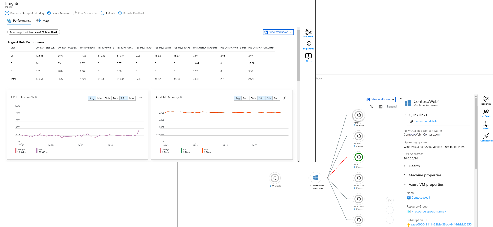

# Overview of VM insights

VM insights monitors the performance and health of your virtual machines and virtual machine scale sets, including their running processes and dependencies on other resources. It can help deliver predictable performance and availability of vital applications by identifying performance bottlenecks and network issues and can also help you understand whether an issue is related to other dependencies.

VM insights supports Windows and Linux operating systems on the following:

- Azure virtual machines
- Azure virtual machine scale sets
- Hybrid virtual machines connected with Azure Arc
- On-premises virtual machines
- Virtual machines hosted in another cloud environment
  

VM insights stores its data in Azure Monitor Logs, which allows it to deliver powerful aggregation and filtering and to analyze data trends over time. You can view this data in a single VM from the virtual machine directly, or you can use Azure Monitor to deliver an aggregated view of multiple VMs.

## Pricing
There's no direct cost for VM insights, but you're charged for its activity in the Log Analytics workspace. Based on the pricing that's published on the [Azure Monitor pricing page](https://azure.microsoft.com/pricing/details/monitor/), VM insights is billed for:

- Data ingested from agents and stored in the workspace.
- Health state data collected from guest health (preview)
- Alert rules based on log and health data.
- Notifications sent from alert rules.

The log size varies by the string lengths of performance counters, and it can increase with the number of logical disks and network adapters allocated to the VM. If you're already using Service Map, the only change you'll see is the additional performance data that's sent to the Azure Monitor `InsightsMetrics` data type.​

## Configuring VM insights
The steps to configure VM insights are as follows. Follow each link for detailed guidance on each step:

- [Create Log Analytics workspace.](../insights/vminsights-configure-workspace.md#create-log-analytics-workspace)
- [Add VMInsights solution to workspace.](../insights/vminsights-configure-workspace.md#add-vminsights-solution-to-workspace)
- [Install agents on virtual machine and virtual machine scale set to be monitored.](../insights/vminsights-enable-overview.md)

## Next steps

- See [Deploy VM insights](../insights/vminsights-enable-overview.md) for requirements and methods that to enable monitoring for your virtual machines.

