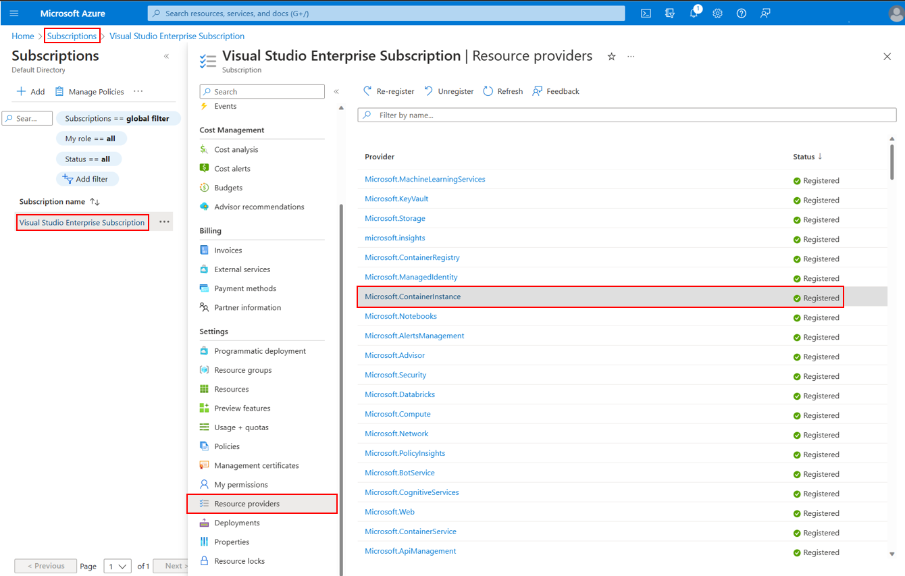
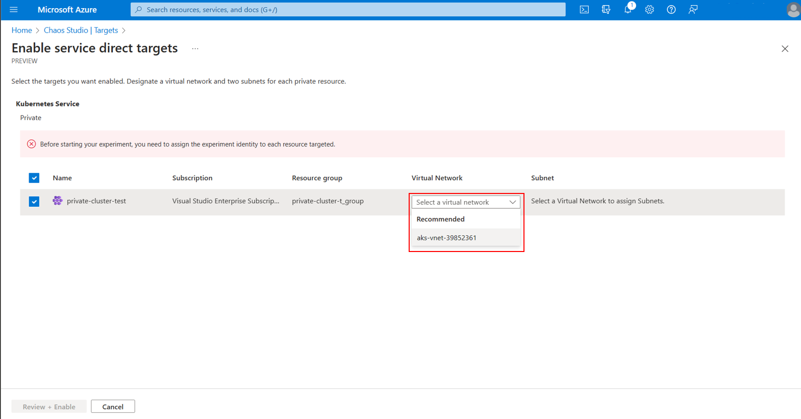
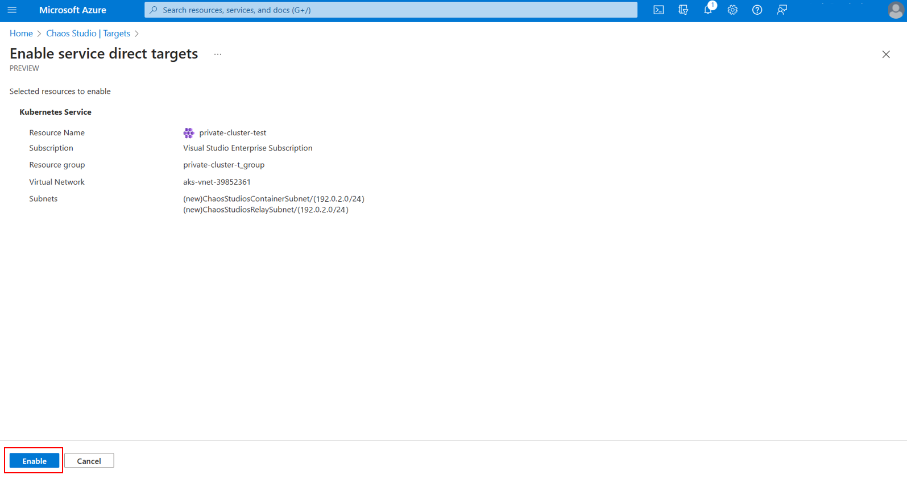

# VNet injection in Chaos Studio

Azure [Virtual Network](../virtual-network/virtual-networks-overview.md) (VNet) is the fundamental building block for your private network in Azure. VNet enables many types of Azure resources to securely communicate with each other, the internet, and on-premises networks. VNet is similar to a traditional network that you'd operate in your own data center, but brings with it additional benefits of Azure's infrastructure such as scale, availability, and isolation.

VNet injection allows a Chaos resource provider to inject containerized workloads into your VNet so that resources without public endpoints can be accessed via a private IP address on the VNet.

## Resource type support
Currently, you can only enable certain resource types for Chaos Studio VNet injection.
* **Azure Kubernetes Service** targets can be enabled with VNet injection through Azure Portal and Azure CLI.
* **Key Vault** targets can be enabled with VNet injection through the Azure CLI.


## Use Chaos Studio with a private AKS cluster

To configure VNet injection, use the following steps.

> [!NOTE]
> These instructions assume you already have a private AKS cluster. Learn more about private clusters here: [Create a private Azure Kubernetes Service cluster](../aks/private-clusters.md)

# [Azure CLI](#tab/cli)

1. Register the `Microsoft.ContainerInstance` and `Microsoft.Relay` resource providers with your subscription. If they're both already registered, you can skip this step.

    ```azurecli
    az provider register --namespace 'Microsoft.ContainerInstance' --wait
    ```

    ```azurecli
    az provider register --namespace 'Microsoft.Relay' --wait
    ```

    Verify the registration by running the following command:

    ```azurecli
    az provider show --namespace 'Microsoft.ContainerInstance' | grep registrationState
    ```

    ```azurecli
    az provider show --namespace 'Microsoft.Relay' | grep registrationState
    ```

    In the output, you should see something similar to:

    ```azurecli
    "registrationState": "Registered",
    ```

1. Re-register the `Microsoft.Chaos` resource provider with your subscription.

    ```azurecli
    az provider register --namespace 'Microsoft.Chaos' --wait
    ```

    Verify the registration by running the following command:

    ```azurecli
    az provider show --namespace 'Microsoft.Chaos' | grep registrationState
    ```

    In the output, you should see something similar to:

    ```azurecli
    "registrationState": "Registered",
    ```

1. Create two subnets in the VNet you want to inject into:

    - `ChaosStudioContainerSubnet`
        - Delegate the subnet to `Microsoft.ContainerInstance/containerGroups` service.
        - This subnet must have at least /28 in address space
    - `ChaosStudioRelaySubnet`
        - This subnet must have at least /28 in address space
        
    ```azurecli
    az network vnet subnet create -g MyResourceGroup --vnet-name MyVnetName --name ChaosStudioContainerSubnet --address-prefixes "10.0.0.0/28" --delegations "Microsoft.ContainerInstance/containerGroups"
    ```
    ```azurecli
    az network vnet subnet create -g MyResourceGroup --vnet-name MyVnetName --name ChaosStudioRelaySubnet --address-prefixes "10.0.0.0/28"
    ```

1. When enabling Targets for the AKS cluster, so you can use it in Chaos Experiments, set the `properties.subnets.containerSubnetId` and `properties.subnets.relaySubnetId` properties using the new subnets you created in step 3.

    Replace `$SUBSCRIPTION_ID` with your Azure subscription ID, `$RESOURCE_GROUP` and `$AKS_CLUSTER` with the resource group name and your AKS cluster resource name. Also, replace `$AKS_INFRA_RESOURCE_GROUP` and `$AKS_VNET` with your AKS's infrastructure resource group name and VNet name. Replace `$URL` with the corresponding `https://management.azure.com/` URL used for onboarding the target.

    ```azurecli
    CONTAINER_SUBNET_ID=/subscriptions/$SUBSCRIPTION_ID/resourceGroups/$AKS_INFRA_RESOURCE_GROUP/providers/Microsoft.Network/virtualNetworks/$AKS_VNET/subnets/ChaosStudioContainerSubnet
    RELAY_SUBNET_ID=/subscriptions/$SUBSCRIPTION_ID/resourceGroups/$AKS_INFRA_RESOURCE_GROUP/providers/Microsoft.Network/virtualNetworks/$AKS_VNET/subnets/ChaosStudioRelaySubnet
    BODY="{ \"properties\": { \"subnets\": { \"containerSubnetId\": \"$CONTAINER_SUBNET_ID\", \"relaySubnetId\": \"$RELAY_SUBNET_ID\" } } }"
    az rest --method put --url $URL --body "$BODY"
    ```

Now your private AKS cluster can be used with Chaos Studio! Use the following instructions to learn how to install Chaos Mesh and run the experiment: [Create a chaos experiment that uses a Chaos Mesh fault with the Azure CLI](chaos-studio-tutorial-aks-cli.md).

# [Azure portal](#tab/portal)

1. Make sure the `Microsoft.ContainerInstance` and `Microsoft.Relay` resource providers are registered with your subscription (if applicable) by using the [Register resource provider](../azure-resource-manager/management/resource-providers-and-types.md) instructions.
<!--

-->
1. Navigate to Azure Chaos Studio and select Targets. Find your desired AKS cluster and select "Enable targets", then "Enable service-direct targets".
<!--

-->
1. Select the cluster's Virtual Network. If your VNet already includes Subnets named `ChaosStudioContainerSubnet` and `ChaosStudioRelaySubnet`, select them. If they don't already exist, they will be automatically created for you.
<!--

-->
1. Select "Review + Enable" and "Enable".
<!--

-->

Now your private AKS cluster can be used with Chaos Studio! Use the following instructions to learn how to install Chaos Mesh and run the experiment: [Create a chaos experiment that uses a Chaos Mesh fault with the Azure portal](chaos-studio-tutorial-aks-portal.md).


## Limitations
* VNet injection is currently only possible in subscriptions/regions where Azure Container Instances and Azure Relay are available. They're deployed to target regions.
* When you create a Target resource that you'll enable with VNet injection, you need `Microsoft.Network/virtualNetworks/subnets/write` access to the virtual network. For example, if the AKS cluster is deployed to VNet_A, then you must have permissions to create subnets in VNet_A in order to enable VNet injection for the AKS cluster. You have to specify a subnet (in VNet_A) that the container will be deployed to.

After creating a Target resource with VNet injection enabled, you can expect the following response:

```json
{
  "properties": {
    "subnets": {
      "containerSubnetId": "/subscriptions/.../subnets/ChaosStudioContainerSubnet",
      "relaySubnetId": "/subscriptions/.../subnets/ChaosStudioRelaySubnet"
    }
  }
}
```
<!--

-->

## Next steps
Now that you understand how VNet injection can be achieved for Chaos Studio, you're ready to:
- [Create and run your first experiment](chaos-studio-tutorial-service-direct-portal.md)
- [Create and run your first Azure Kubernetes Service experiment](chaos-studio-tutorial-aks-portal.md)
