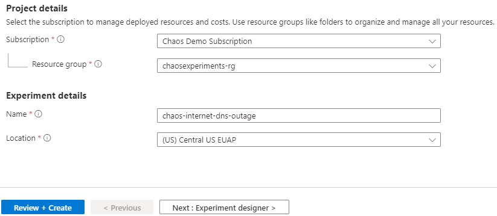

# Quickstart: Internet DNS outage using network security group fault

The network security group fault enables you to modify your existing network security group rules as part of a chaos experiment. Using this fault you can block network traffic to your Azure resources simulating a loss of connectivity or outages of dependant resources. In this quick start, you will create chaos experiment that blocks all traffic to external (internet) DNS servers for 15 minutes. Using this experiment you can validate that resources connected to the Azure virtual network associated with the target network security group do not have a dependency on external DNS servers, which enables you validate one of the risk threat model requirements.

## Prerequisites

- A network security group that is associated with the Azure resource you wish to target in your experiment.  
- Use the Bash environment in [Azure Cloud Shell.](../cloud-shell/quickstart.md).

## Create the network security group fault provider

First you register a fault provider on the subscription where your network security group is hosted for Chaos Studio to interact with it.

1. Create a file named **AzureNetworkSecurityGroupChaos.json** with the following contents and save it to your local machine.

      ```json
      { 
        "properties": {
          "enabled": true,
          "providerConfiguration": {
            "type": "AzureNetworkSecurityGroupChaos"
          }
        }
      }
      ```

1. Launch a [Cloud Shell](https://shell.azure.com/).
1. Replace **$SUBSCRIPTION_ID** with the Azure subscription ID containing the network security group you wish to use in your experiment and run the following command to ensure the provider will be registered on the correct subscription.

    ```bash
    az account set --subscription $SUBSCRIPTION_ID
    ```

1. Drag and drop the **AzureNetworkSecurityGroupChaos.json** into the cloud shell window to upload the file.
1. Replace **$SUBSCRIPTION_ID** used in the prior step and execute the following command to register the AzureNetworkSecurityGroupChaos fault provider.

    ```bash
    az rest --method put --url "https://management.azure.com/subscriptions/$SUBSCRIPTION_ID/providers/microsoft.chaos/chaosProviderConfigurations/AzureNetworkSecurityGroupChaos?api-version=2021-06-21-preview" --body @AzureNetworkSecurityGroupChaos.json --resource "https://management.azure.com"
    ```

1. (Optional) Delete the **AzureNetworkSecurityGroupChaos.json** file you had previously created as it is no longer required and close the Cloud Shell.

## Create a chaos experiment

Once the network security group fault provider has been created, you can now start creating experiments in Chaos Studio.

1. Open the Azure portal with the Chaos Studio feature flag:
    * If using an @microsoft.com account, [click this link](https://ms.portal.azure.com/?microsoft_azure_chaos_assettypeoptions={%22chaosStudio%22:{%22options%22:%22%22},%22chaosExperiment%22:{%22options%22:%22%22}}&microsoft_azure_chaos=true).
    * If using an external account, [click this link](https://portal.azure.com/?feature.customPortal=false&microsoft_azure_chaos_assettypeoptions={%22chaosStudio%22:{%22options%22:%22%22},%22chaosExperiment%22:{%22options%22:%22%22}}).
1. Click **Add an experiment**.

    

1. Enter the name you want to give the experiment and select the subscription, resource group, and location (region) where the experiment will be created.
1. Click **Next : Experiment designer >**.

    

1. Click **Add fault**.
1. Select **network security group Fault** from the faults dropdown menu.

    

1. Populate the following parameters.

    | Parameter | Value |
    | -- | -- |
    | Duration | `15` |
    | Name | `block_internet_dns` |
    | Source Address Prefix | `*` |
    | Destination Address Prefix | `Internet` |
    | Access | `Deny` |
    | Source Port Range | `*` |
    | Destination Port Range | `53` |
    | Priority | `1001` |
    | Direction | `Outbound` |

    

> [!NOTE]
> The name and priority fields may need to be adjusted if either already existing in preexisting rule on the target network security group.

> [!NOTE]
> The priority may need to be lowered if there are any rules that would explicitly allow port 53 traffic to the internet.

1. Click **Next : Target resources >**.
1. Select the network security groups to be targeted by this experiment.
1. Click **Add**

    

1. Click **Review + Create**

    

1. Click **Create**

    

## Grant the chaos experiment access to the network security group

As a safety precaution all chaos experiments must be granted access to the Azure resources targeted in the experiment.

1. Navigate to the resources targeted in the experiment.
1. Click **Access Control (IAM)**

    

1. Click **Add**

    

1. Click **Add role assignment**

    

1. In **Role** select `Network Contributor`

    

1. In **Select** enter the name of the chaos experiment and then click it.

    

1. Click **Save**

    

## Run the chaos experiment

1. Open the Azure portal with the Chaos Studio feature flag:
    * If using an @microsoft.com account, [click this link](https://ms.portal.azure.com/?microsoft_azure_chaos_assettypeoptions={%22chaosStudio%22:{%22options%22:%22%22},%22chaosExperiment%22:{%22options%22:%22%22}}&microsoft_azure_chaos=true).
    * If using an external account, [click this link](https://portal.azure.com/?feature.customPortal=false&microsoft_azure_chaos_assettypeoptions={%22chaosStudio%22:{%22options%22:%22%22},%22chaosExperiment%22:{%22options%22:%22%22}}).
1. Check the box next to the experiments name and click **Start Experiment**.

    

1. Click **Yes** to confirm you want to start the chaos experiment.

    
1. (Optional) Click on the experiment name to see a detailed view of the execution status of the experiment.
1. Once the experiment has been started, you can use your existing monitoring, telemetry, and/or logging tools to confirm what impact the execution chaos experiment has had on your service.

## Clean up resources

Follow these steps if you're not going to continue to use this experiment and wish to delete it.

Open the Azure portal with the Chaos Studio feature flag:
    * If using an @microsoft.com account, [click this link](https://ms.portal.azure.com/?microsoft_azure_chaos_assettypeoptions={%22chaosStudio%22:{%22options%22:%22%22},%22chaosExperiment%22:{%22options%22:%22%22}}&microsoft_azure_chaos=true).
    * If using an external account, [click this link](https://portal.azure.com/?feature.customPortal=false&microsoft_azure_chaos_assettypeoptions={%22chaosStudio%22:{%22options%22:%22%22},%22chaosExperiment%22:{%22options%22:%22%22}}).
1. Check the box next to the experiment name and click **Delete**.
1. Click **Yes** to confirm you want to delete the experiment.

Follow these steps if you're not going to continue to using any faults related to network security groups.

1. Launch a [Cloud Shell](https://shell.azure.com/).
1. Replace **$SUBSCRIPTION_ID** with the Azure subscription ID where the network security group fault provider was provisioned and run the following command.

    ```bash
    az rest --method delete --url "https://management.azure.com/subscriptions/$SUBSCRIPTION_ID/providers/microsoft.chaos/chaosProviderConfigurations/AzureNetworkSecurityGroupChaos?api-version=2021-06-21-preview" --resource "https://management.azure.com"
    ```
