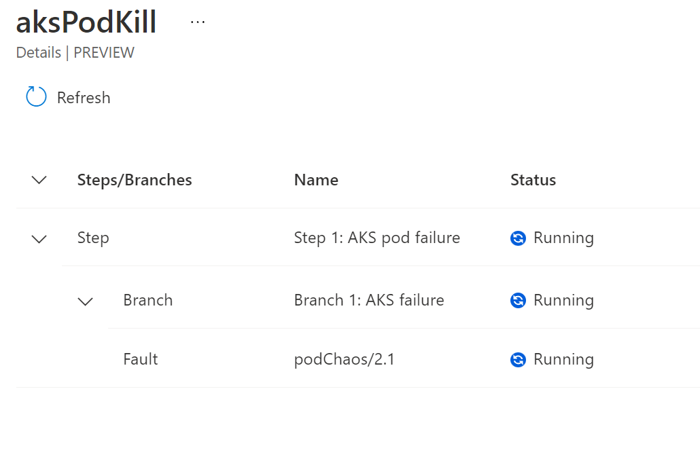
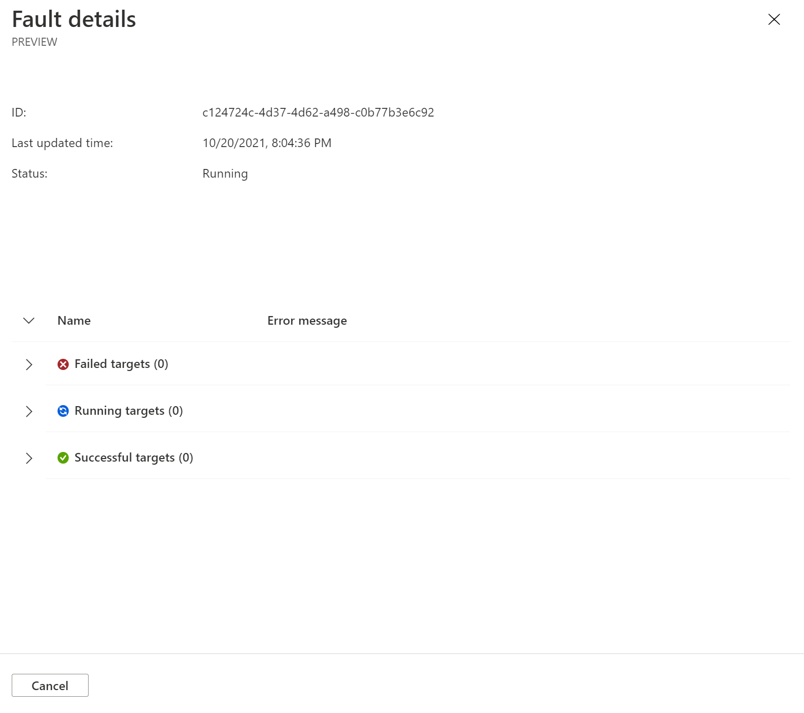
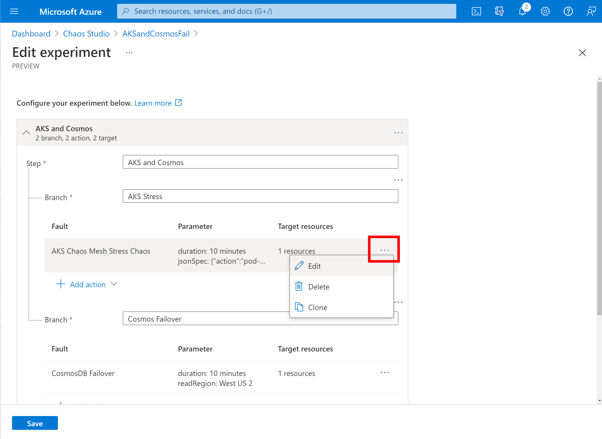

# Run and manage an experiment in Azure Chaos Studio

You can use a chaos experiment to verify that your application is resilient to failures by causing those failures in a controlled environment. This article provides an overview of how to use a chaos experiment that you have previously created.

## Start an experiment

1. Open the [Azure portal](https://portal.azure.com).

2. Search for **Chaos Studio (preview)** in the search bar.

3. Click on **Experiments**. This is the experiment list view you can start, stop, or delete experiments in bulk or create a new experiment.

    

4. Click on your experiment. The experiment overview page allows you to start, stop, and edit your experiment, view essential details about the resource, and view history. Click the **Start** button then click **OK** to start your experiment.

    

5. The experiment status shows *PreProcessingQueued*, then *WaitingToStart*, and finally *Running*.

## View experiment history and details

1. Once the experiment is running, click **Details** on the current run under **History** to see detailed status and errors.

    

2. The experiment details view shows the execution status of each step, branch, and fault. Click on a fault.

    

3. Fault details shows additional information about the fault execution including which targets have failed or succeeded and why. If there is an error running your experiment, debugging information appears here.

    

## Edit experiment

1. Return to the Experiment Overview and click the **Edit** button.

    

2. This is the same experiment designer as was used to create the experiment. You can add or remove steps, branches, and faults, and edit fault parameters and targets. To edit a fault, click on the **...** beside the fault.

    

3. When you are finished editing, click **Save**. If you want to discard your changes without saving, click the **Close (X)** button in the top right.
  

> [!WARNING]
> If you added targets to your experiment, remember to add a role assignment on the target resource for your experiment identity.

## Delete experiment
1. Return to the experiment list and check the experiment(s) you want to delete. Click **Delete** in the toolbar above the experiment list. You may need to click the ellipsis (...) to see the delete option depending on screen resolution.

    

2. Click **Yes** to confirm you want to delete the resource.

3. Alternatively, you can open an experiment and click the **Delete** button in the toolbar.
