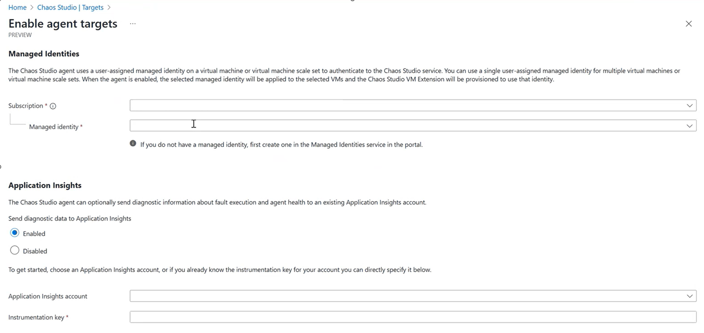
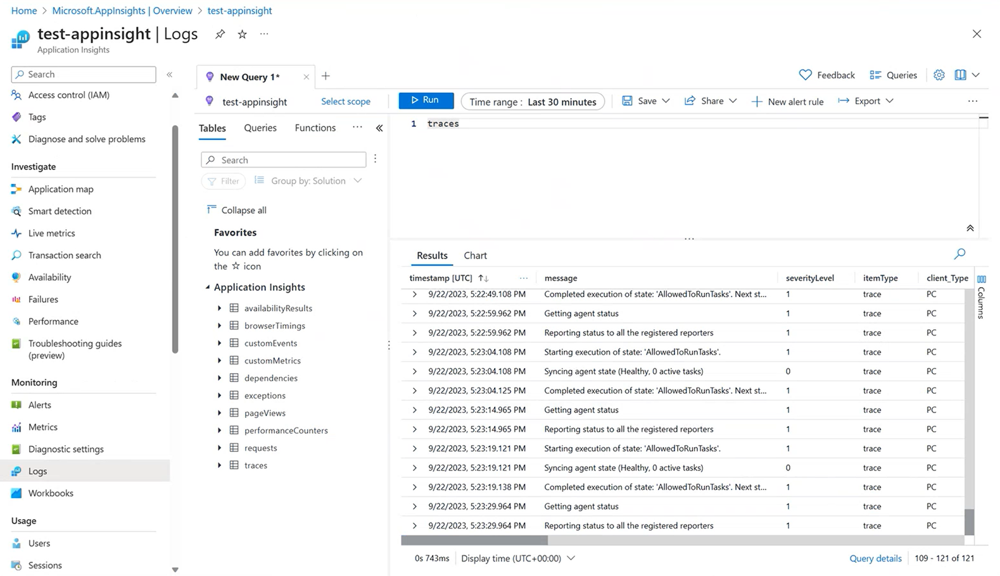

# How-to: Configure your experiment to emit Experiment Fault Events to App Insights
In this guide, we'll show you the steps needed to configure a Chaos Studio **Agent-based** Experiment to emit telemetry to App Insights. These events show the start and stop of each fault as well as the type of fault executed and the resource the fault was executed against. App Insights is the primary recommended logging solution for **Agent-based** experiments in Chaos Studio.

## Prerequisites
- An Azure subscription
- An existing Chaos Studio [**Agent-based** Experiment](chaos-studio-tutorial-agent-based-portal.md)
- [Required for Application Insights Resource as well] An existing [Log Analytics Workspace](../azure-monitor/logs/quick-create-workspace.md)
- An existing [Application Insights Resource](../azure-monitor/app/create-workspace-resource.md)
- [Required for Agent-based Chaos Experiments] A [User-Assigned Managed Identity](../active-directory/managed-identities-azure-resources/how-manage-user-assigned-managed-identities.md)

## Step 1: Copy the Instrumentation Key from your Application Insights Resource
Once you have met all the prerequisite steps, copy the **Instrumentation Key** found in the overview page of your Application Insights Resource (see screenshot)

 

## Step 2: Enable the Target Platform for your Agent-Based Fault with Application Insights
Navigate to the Chaos Studio overview page and click on the **Targets** blade under the "Experiments Management" section. Find the target platform. If it is already enabled as a target for agent-based experiments, you will need to disable it as a target and then "enable for agent-based targets" to bring up the resource configuration pane.
See screenshot below for an example:
 

 

## Step 3: Add your Application Insights account and Instrumentation key
At this point, the Agent target configuration page seen in the screenshot should come up . After configuring your managed identity, make sure Application Insights is "Enabled" and then select your desired Application Insights Account and enter the Instrumentation Key you copied in Step 1. Once you have filled out the required information, you can click "Review+Create" to deploy your resource. 

 

## Step 4: Run the chaos experiment
At this point, your Chaos Target is now configured to emit telemetry to the App Insights Resource you configured! If you navigate to your specific Application Insights Resource and open the "Logs" blade under the "Monitoring" section, you should see the Agent health status and any actions the Agent is taking on your Target Platform. You can now run your experiment and see logging in your Application Insights Resource. See screenshot for example of App Insights Resource running successfully on an Agent-based Chaos Target platform. 

 

To query your logs, navigate to the "Logs" tab in the Application Insights Resource to get your desired logging information your desired format.

 

