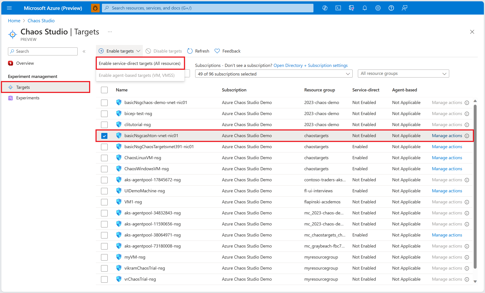
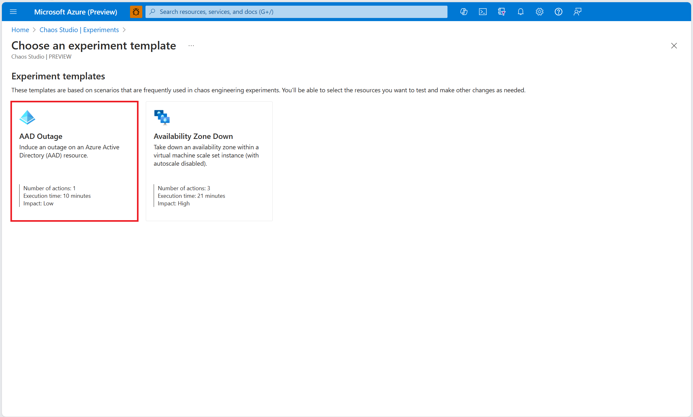
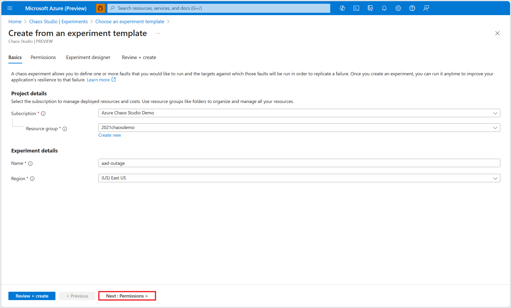

# Use a chaos experiment template to induce an outage on an Azure Active Directory instance

You can use a chaos experiment to verify that your application is resilient to failures by causing those failures in a controlled environment. In this article, you induce an outage on an Azure Active Directory resource using a pre-populated experiment template and Azure Chaos Studio Preview.

## Prerequisites

- An Azure subscription. [!INCLUDE [quickstarts-free-trial-note](../../includes/quickstarts-free-trial-note.md)]
- A network security group.

## Enable Chaos Studio on your network security group

Azure Chaos Studio Preview can't inject faults against a resource until that resource is added to Chaos Studio. To add a resource to Chaos Studio, create a [target and capabilities](chaos-studio-targets-capabilities.md) on the resource. Network security groups have only one target type (service-direct) and one capability (set rules). Other resources might have up to two target types. One target type is for service-direct faults. Another target type is for agent-based faults. Other resources might have many other capabilities.

1. Open the [Azure portal](https://portal.azure.com).
1. Search for **Chaos Studio** in the search bar.
1. Select **Targets** and find your network security group resource.
1. Select the network security group resource and select **Enable targets** > **Enable service-direct targets**.

      
1. Select **Review + Enable** > **Enable**.

You've now successfully added your network security group to Chaos Studio.

## Create an experiment from a template

Now you can create your experiment from a pre-filled experiment template. A chaos experiment defines the actions you want to take against target resources. The actions are organized and run in sequential steps. The chaos experiment also defines the actions you want to take against branches, which run in parallel.

1. In Chaos Studio, go to **Experiments** > **Create** > **New from template**.

   
1. Select **AAD Outage**.

   
1. Add a name for your experiment that complies with resource naming guidelines. Select **Next: Permissions**.

   
1. For your chaos experiment to run successfully, it must have [sufficient permissions on target resources](chaos-studio-permissions-security.md). Select a system-assigned managed identity or a user-assigned managed identity for your experiment. You can choose to enable custom role assignment if you would like Chaos Studio to add the necessary permissions to run (in the form of a custom role) to your experiment's identity. Select **Next: Experiment designer**.

   

