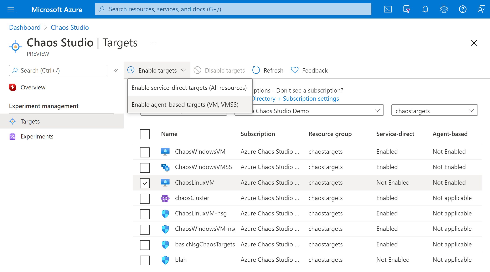
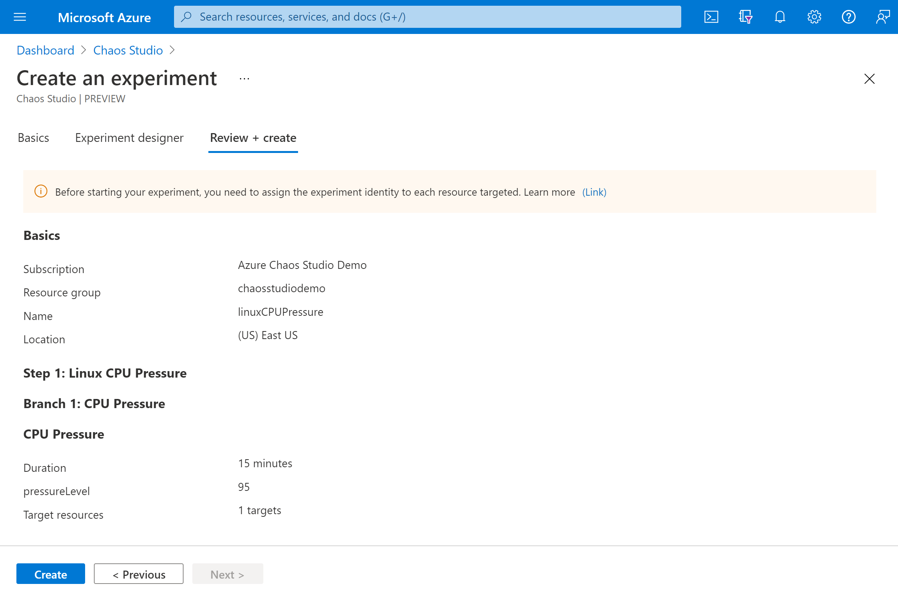
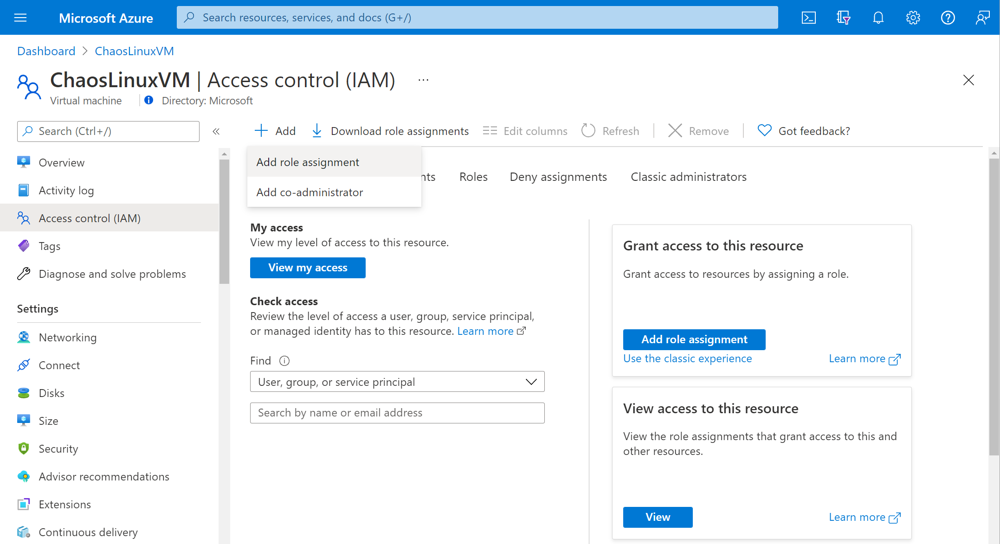

# Create a chaos experiment that uses an agent-based fault to add CPU pressure to a Linux VM

You can use a chaos experiment to verify that your application is resilient to failures by causing those failures in a controlled environment. In this guide, you will cause a high CPU event on a Linux virtual machine using a chaos experiment and Azure Chaos Studio. Running this experiment can help you defend against an application becoming resource-starved.

These same steps can be used to set up and run an experiment for any agent-based fault. An **agent-based** fault requires setup and installation of the chaos agent, unlike a service-direct fault, which runs directly against an Azure resource without any need for instrumentation.


## Prerequisites

- An Azure subscription. [!INCLUDE [quickstarts-free-trial-note](../../includes/quickstarts-free-trial-note.md)] 
- A Linux virtual machine. If you do not have a virtual machine, you can [follow these steps to create one](../virtual-machines/linux/quick-create-portal.md).
- A network setup that permits you to [SSH into your virtual machine](../virtual-machines/ssh-keys-portal.md)
- A user-assigned managed identity. If you do not have a user-assigned managed identity, you can [follow these steps to create one](../active-directory/managed-identities-azure-resources/how-manage-user-assigned-managed-identities.md)


## Enable Chaos Studio on your virtual machine

Chaos Studio cannot inject faults against a virtual machine unless that virtual machine has been onboarded to Chaos Studio first. You onboard a virtual machine to Chaos Studio by creating a [target and capabilities](chaos-studio-targets-capabilities.md) on the resource, then installing the chaos agent. Virtual machines have two target types - one that enables service-direct faults (where no agent is required), and one that enabled agent-based faults (which requires the installation of an agent). The chaos agent is an application installed on your virtual machine as a [virtual machine extension](../virtual-machines/extensions/overview.md) that allows you to inject faults in the guest operating system.

### Install stress-ng

The Chaos Studio agent for Linux requires stress-ng, an open-source application that can cause various stress events on a virtual machine. You can install stress-ng by [connecting to your Linux virtual machine](../virtual-machines/ssh-keys-portal.md) and running the appropriate installation command for your package manager, for example:

```bash
sudo apt-get update && sudo apt-get -y install unzip && sudo apt-get -y install stress-ng
```

or

```bash
sudo dnf -y install https://dl.fedoraproject.org/pub/epel/epel-release-latest-8.noarch.rpm && sudo yum -y install stress-ng
```

### Enable chaos target, capabilities, and agent

1. Open the [Azure portal](https://portal.azure.com).
2. Search for **Chaos Studio (preview)** in the search bar.
3. Click on **Targets** and navigate to your virtual machine.

4. Check the box next to your virtual machine and click **Enable targets** then **Enable agent-based targets** from the dropdown menu.

5. Select the **Managed Identity** that you will use to authenticate the chaos agent and optionally enable Application Insights to see experiment events and agent logs.

6. Click **Review + Enable** then click **Enable**.

7. After a few minutes, a notification will appear indicating that the resource(s) selected were successfully enabled. The Azure portal will add the user-assigned identity to the virtual machine, enable the agent target and capabilities, and install the chaos agent as a virtual machine extension.


You have now successfully onboarded your Linux virtual machine to Chaos Studio. In the **Targets** view you can also manage the capabilities enabled on this resource. Clicking the **Manage actions** link next to a resource will display the capabilities enabled for that resource.

## Create an experiment
With your virtual machine now onboarded, you can create your experiment. A chaos experiment defines the actions you want to take against target resources, organized into steps, which run sequentially, and branches, which run in parallel.

1. Click on the **Experiments** tab in the Chaos Studio navigation. In this view, you can see and manage all of your chaos experiments. Click on **Add an experiment**

2. Fill in the **Subscription**, **Resource Group**, and **Location** where you want to deploy the chaos experiment. Give your experiment a **Name**. Click **Next : Experiment designer >**

3. You are now in the Chaos Studio experiment designer. The experiment designer allows you to build your experiment by adding steps, branches, and faults. Give a friendly name to your **Step** and **Branch**, then click **Add fault**.

4. Select **CPU Pressure** from the dropdown, then fill in the **Duration** with the number of minutes to apply pressure and **pressureLevel** with the amount of CPU pressure to apply. Leave **virtualMachineScaleSetInstances** blank. Click **Next: Target resources >**

5. Select your virtual machine, and click **Next**

6. Verify that your experiment looks correct, then click **Review + create**, then **Create.**


## Give experiment permission to your virtual machine
When you create a chaos experiment, Chaos Studio creates a system-assigned managed identity that executes faults against your target resources. This identity must be given [appropriate permissions](chaos-studio-fault-providers.md) to the target resource for the experiment to run successfully.

1. Navigate to your virtual machine and click on **Access control (IAM)**.

2. Click **Add** then click **Add role assignment**.

3. Search for **Virtual Machine Contributor** and select the role. Click **Next**

4. Click **Select members** and search for your experiment name. Select your experiment and click **Select**. If there are multiple experiments in the same tenant with the same name, your experiment name will be truncated with random characters added.

5. Click **Review + assign** then **Review + assign**.

## Run your experiment
You are now ready to run your experiment. To see the impact, we recommend opening [an Azure Monitor metrics chart](../azure-monitor/essentials/tutorial-metrics-explorer.md) with your virtual machine's CPU pressure in a separate browser tab.

1. In the **Experiments** view, click on your experiment, and click **Start**, then click **OK**.

2. When the **Status** changes to **Running**, click **Details** for the latest run under **History** to see details for the running experiment.

## Next steps
Now that you have run an agent-based experiment, you are ready to:
- [Create an experiment that uses service-direct faults](chaos-studio-tutorial-service-direct.md)
- [Manage your experiment](chaos-studio-run-experiment.md)
