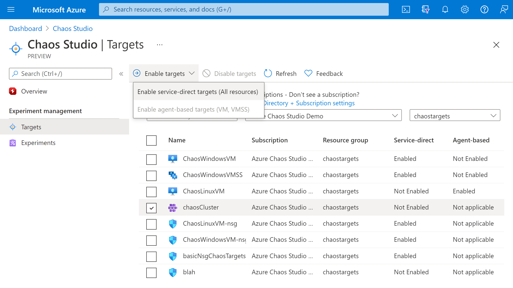
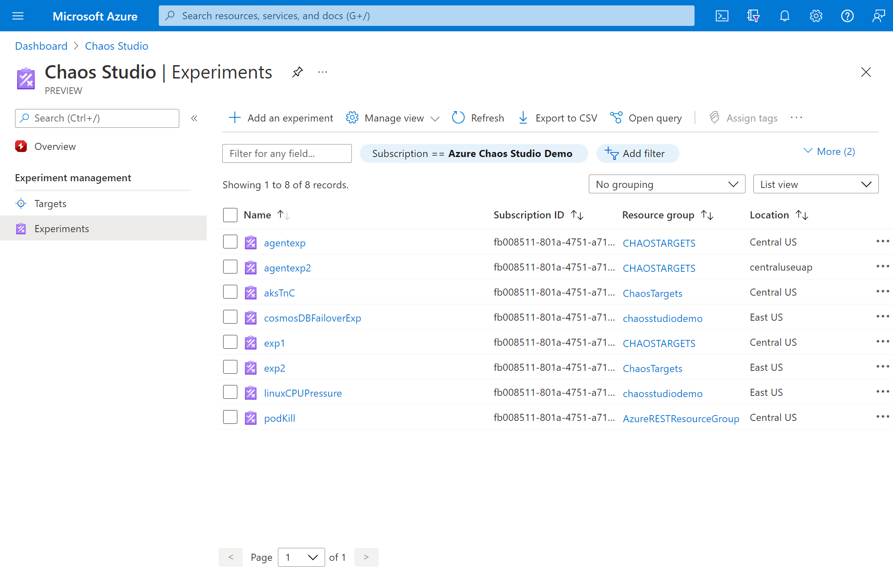
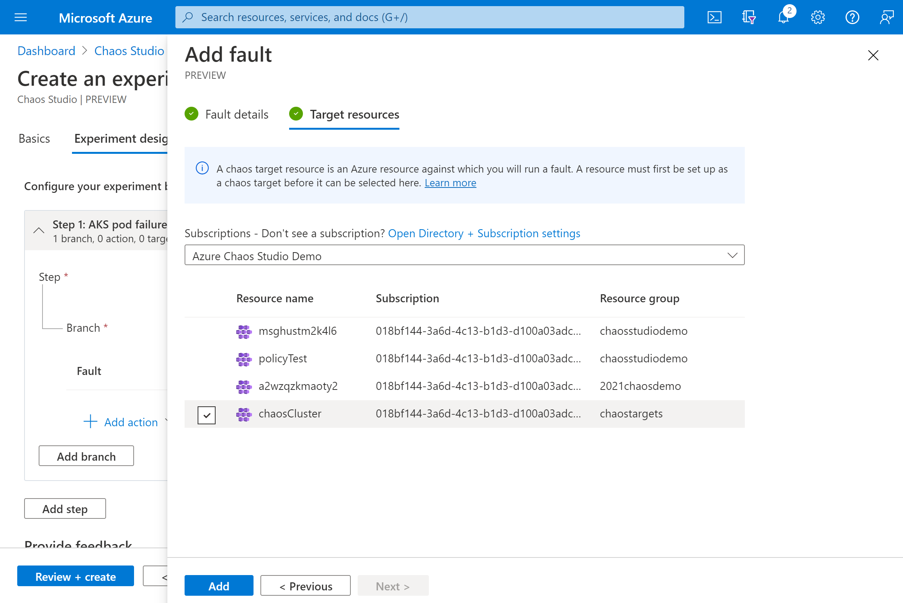
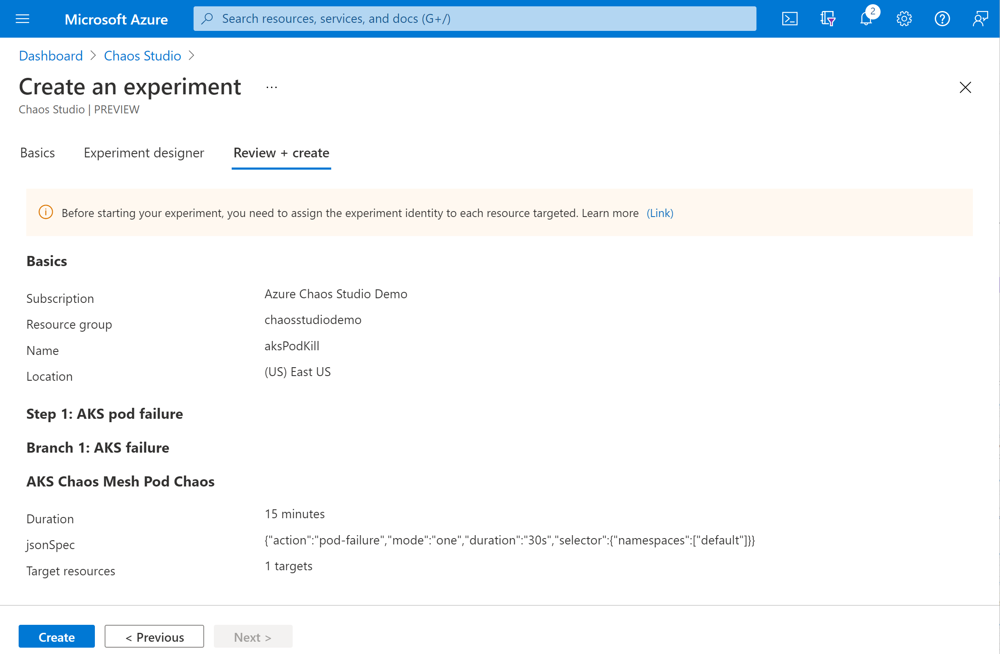
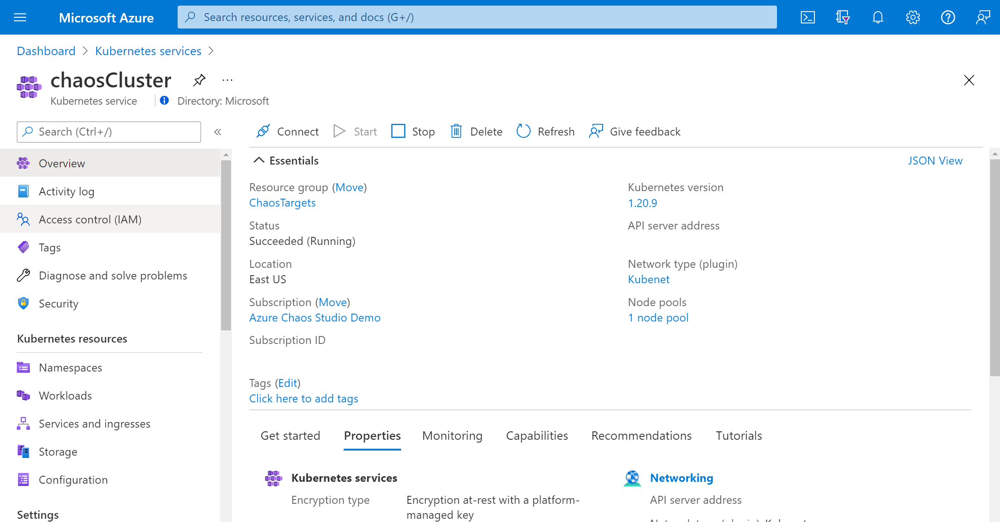
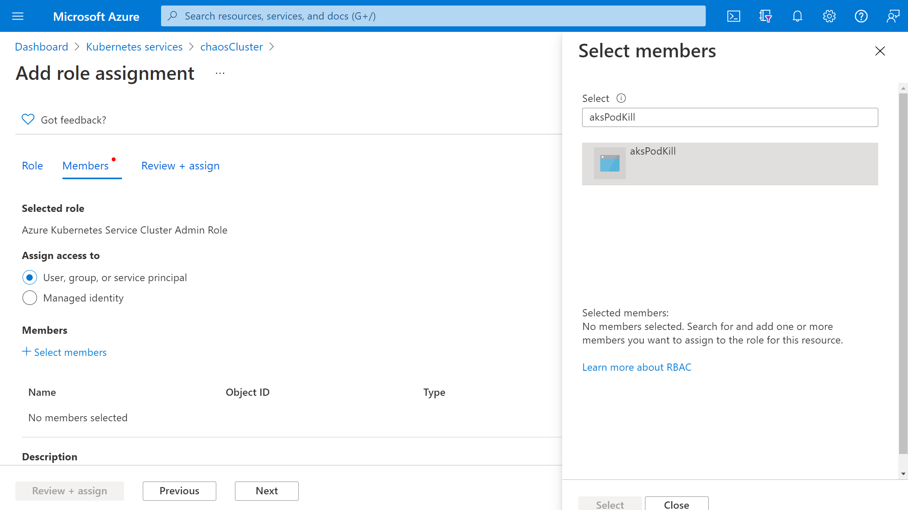
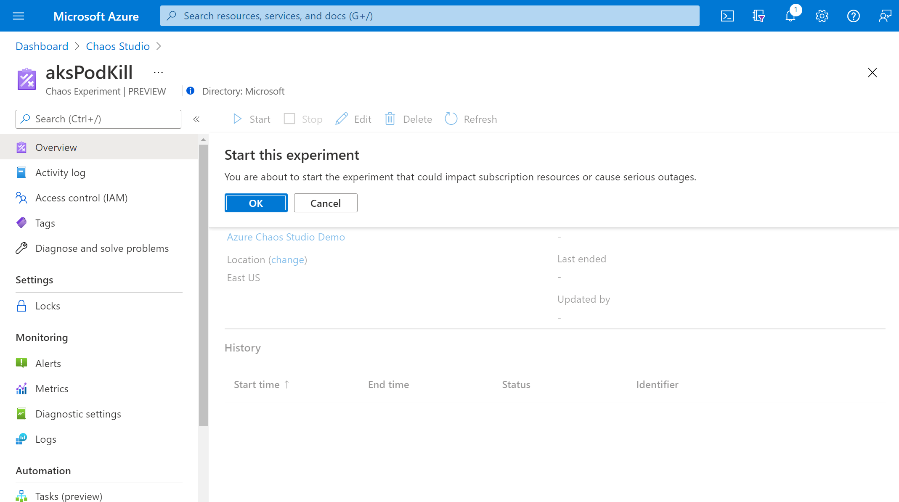

# Create a chaos experiment that uses a Chaos Mesh fault to kill AKS pods with the Azure portal

You can use a chaos experiment to verify that your application is resilient to failures by causing those failures in a controlled environment. In this article, you cause periodic Azure Kubernetes Service (AKS) pod failures on a namespace by using a chaos experiment and Azure Chaos Studio. Running this experiment can help you defend against service unavailability when there are sporadic failures.

Chaos Studio uses [Chaos Mesh](https://chaos-mesh.org/), a free, open-source chaos engineering platform for Kubernetes, to inject faults into an AKS cluster. Chaos Mesh faults are [service-direct](chaos-studio-tutorial-aks-portal.md) faults that require Chaos Mesh to be installed on the AKS cluster. You can use these same steps to set up and run an experiment for any AKS Chaos Mesh fault.

## Prerequisites

- An Azure subscription. [!INCLUDE [quickstarts-free-trial-note](~/reusable-content/ce-skilling/azure/includes/quickstarts-free-trial-note.md)]
- An AKS cluster with a Linux node pool. If you don't have an AKS cluster, see the AKS quickstart that uses the [Azure CLI](../aks/learn/quick-kubernetes-deploy-cli.md), [Azure PowerShell](../aks/learn/quick-kubernetes-deploy-powershell.md), or the [Azure portal](../aks/learn/quick-kubernetes-deploy-portal.md).

## Limitations

* You can use Chaos Mesh faults with private clusters by configuring [VNet Injection in Chaos Studio](chaos-studio-private-networking.md). Any commands issued to the private cluster, including the steps in this article to set up Chaos Mesh, need to follow the [private cluster guidance](../aks/private-clusters.md). Recommended methods include connecting from a VM in the same virtual network or using the [AKS command invoke](../aks/access-private-cluster.md) feature.
* AKS Chaos Mesh faults are only supported on Linux node pools.
* Currently, Chaos Mesh faults don't work if the AKS cluster has [local accounts disabled](../aks/manage-local-accounts-managed-azure-ad.md).
* If your AKS cluster is configured to only allow authorized IP ranges, you need to allow Chaos Studio's IP ranges. You can find them by querying the `ChaosStudio` [service tag with the Service Tag Discovery API or downloadable JSON files](../virtual-network/service-tags-overview.md). 

## Set up Chaos Mesh on your AKS cluster

Before you can run Chaos Mesh faults in Chaos Studio, you must install Chaos Mesh on your AKS cluster.

1. Run the following commands in an [Azure Cloud Shell](../cloud-shell/overview.md) window where you have the active subscription set to be the subscription where your AKS cluster is deployed. Replace `MyManagedCluster` and `MyResourceGroup` with the name of your cluster and resource group.

    ```azurecli
    az aks get-credentials --admin --name MyManagedCluster --resource-group MyResourceGroup
    ```
    
    ```bash
    helm repo add chaos-mesh https://charts.chaos-mesh.org
    helm repo update
    kubectl create ns chaos-testing
    helm install chaos-mesh chaos-mesh/chaos-mesh --namespace=chaos-testing --set chaosDaemon.runtime=containerd --set chaosDaemon.socketPath=/run/containerd/containerd.sock
    ```

1. Verify that the Chaos Mesh pods are installed by running the following command:

    ```bash
    kubectl get po -n chaos-testing
    ```

   You should see output similar to the following example (a chaos-controller-manager and one or more chaos-daemons):
    
    ```bash
    NAME                                        READY   STATUS    RESTARTS   AGE
    chaos-controller-manager-69fd5c46c8-xlqpc   1/1     Running   0          2d5h
    chaos-daemon-jb8xh                          1/1     Running   0          2d5h
    chaos-dashboard-98c4c5f97-tx5ds             1/1     Running   0          2d5h
    ```

You can also [use the installation instructions on the Chaos Mesh website](https://chaos-mesh.org/docs/production-installation-using-helm/).

## Enable Chaos Studio on your AKS cluster

Chaos Studio can't inject faults against a resource unless that resource is added to Chaos Studio first. You add a resource to Chaos Studio by creating a [target and capabilities](chaos-studio-targets-capabilities.md) on the resource. AKS clusters have only one target type (service-direct), but other resources might have up to two target types. One target type is for service-direct faults. Another target type is for agent-based faults. Each type of Chaos Mesh fault is represented as a capability like PodChaos, NetworkChaos, and IOChaos.

1. Open the [Azure portal](https://portal.azure.com).
1. Search for **Chaos Studio** in the search bar.
1. Select **Targets** and go to your AKS cluster.

   
1. Select the checkbox next to your AKS cluster. Select **Enable targets** and then select  **Enable service-direct targets** from the dropdown menu.

   

1. Confirm that the desired resource is listed. Select **Review + Enable**, then **Enable**.

1. A notification appears that indicates that the resources you selected were successfully enabled.

   

You've now successfully added your AKS cluster to Chaos Studio. In the **Targets** view, you can also manage the capabilities enabled on this resource. Select the **Manage actions** link next to a resource to display the capabilities enabled for that resource.

## Create an experiment
Now you can create your experiment. A chaos experiment defines the actions you want to take against target resources. The actions are organized and run in sequential steps. The chaos experiment also defines the actions you want to take against branches, which run in parallel.

1. Select the **Experiments** tab in Chaos Studio. In this view, you can see and manage all your chaos experiments. Select **Create** > **New experiment**.

   
1. Fill in the **Subscription**, **Resource Group**, and **Location** where you want to deploy the chaos experiment. Give your experiment a name. Select **Next: Experiment designer**.

   
1. You're now in the Chaos Studio experiment designer. The experiment designer allows you to build your experiment by adding steps, branches, and faults. Give a friendly name to your **Step** and **Branch** and select **Add action > Add fault**.

   
1. Select **AKS Chaos Mesh Pod Chaos** from the dropdown list. Fill in **Duration** with the number of minutes you want the failure to last and **jsonSpec** with the following information:

    To formulate your Chaos Mesh `jsonSpec`:
    1. See the Chaos Mesh documentation for a fault type, [for example, the PodChaos type](https://chaos-mesh.org/docs/simulate-pod-chaos-on-kubernetes/#create-experiments-using-yaml-configuration-files).
    1. Formulate the YAML configuration for that fault type by using the Chaos Mesh documentation.

        ```yaml
        apiVersion: chaos-mesh.org/v1alpha1
        kind: PodChaos
        metadata:
          name: pod-failure-example
          namespace: chaos-testing
        spec:
          action: pod-failure
          mode: all
          duration: '600s'
          selector:
            namespaces:
              - default
        ```
    1. Remove any YAML outside of the `spec` (including the spec property name) and remove the indentation of the spec details. The `duration` parameter isn't necessary, but is used if provided. In this case, remove it.

        ```yaml
        action: pod-failure
        mode: all
        selector:
          namespaces:
            - default
        ```
    1. Use a [YAML-to-JSON converter like this one](https://www.convertjson.com/yaml-to-json.htm) to convert the Chaos Mesh YAML to JSON and minimize it.

        ```json
        {"action":"pod-failure","mode":"all","selector":{"namespaces":["default"]}}
        ```
    1. Paste the minimized JSON into the **jsonSpec** field in the portal.

1. Select **Next: Target resources**.

      
1. Select your AKS cluster and select **Next**.

   
1. Verify that your experiment looks correct and select **Review + create** > **Create**.

   

## Give the experiment permission to your AKS cluster
When you create a chaos experiment, Chaos Studio creates a system-assigned managed identity that executes faults against your target resources. This identity must be given [appropriate permissions](chaos-studio-fault-providers.md) to the target resource for the experiment to run successfully.

1. Go to your AKS cluster and select **Access control (IAM)**.

   
1. Select **Add** > **Add role assignment**.

   
1. Search for **Azure Kubernetes Service Cluster Admin Role** and select the role. Select **Next**.

   
1. Choose **Select members** and search for your experiment name. Select your experiment and choose **Select**. If there are multiple experiments in the same tenant with the same name, your experiment name is truncated with random characters added.

   
1. Select **Review + assign** > **Review + assign**.

## Run your experiment
You're now ready to run your experiment. To see the effect, we recommend that you open your AKS cluster overview and go to **Insights** in a separate browser tab. Live data for the **Active Pod Count** shows the effect of running your experiment.

1. In the **Experiments** view, select your experiment. Select **Start** > **OK**.

   
1. When the **Status** changes to *Running*, select **Details** for the latest run under **History** to see details for the running experiment.

## Next steps
Now that you've run an AKS Chaos Mesh service-direct experiment, you're ready to:
- [Create an experiment that uses agent-based faults](chaos-studio-tutorial-agent-based-portal.md)
- [Manage your experiment](chaos-studio-run-experiment.md)
