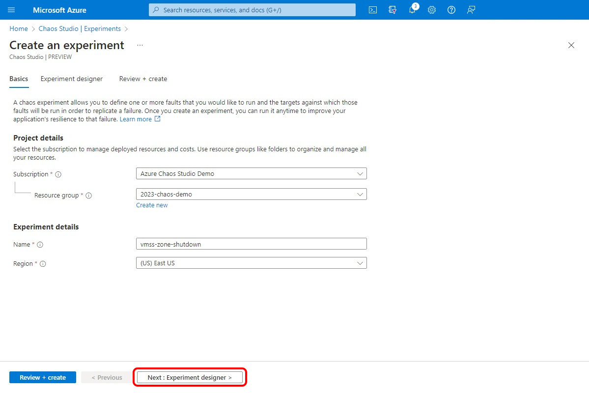
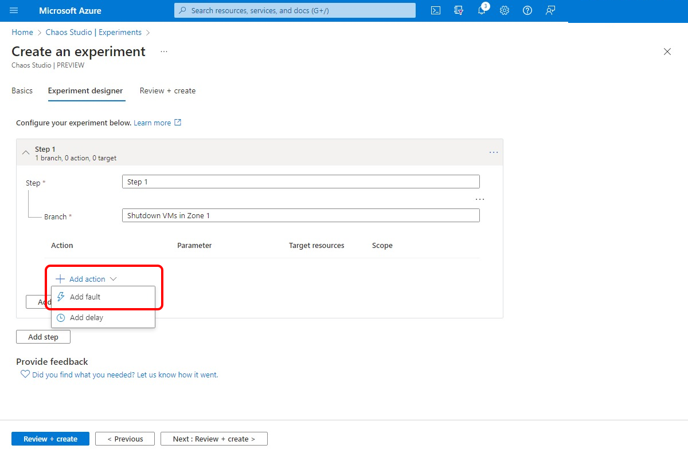
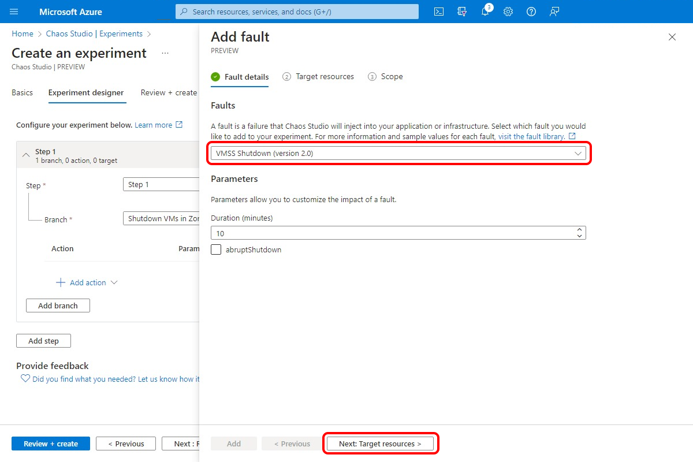
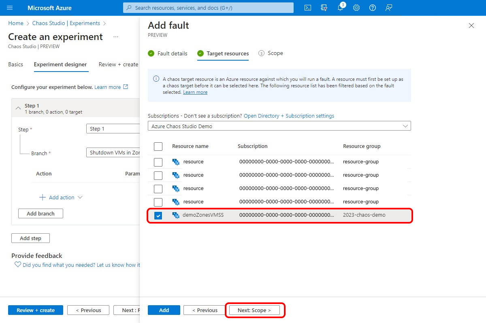
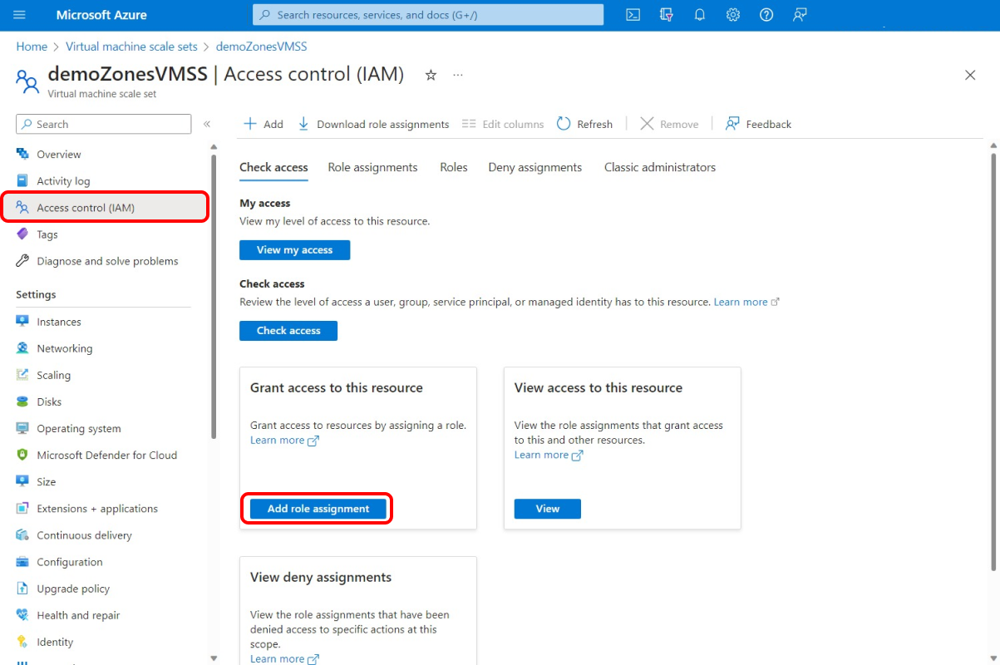
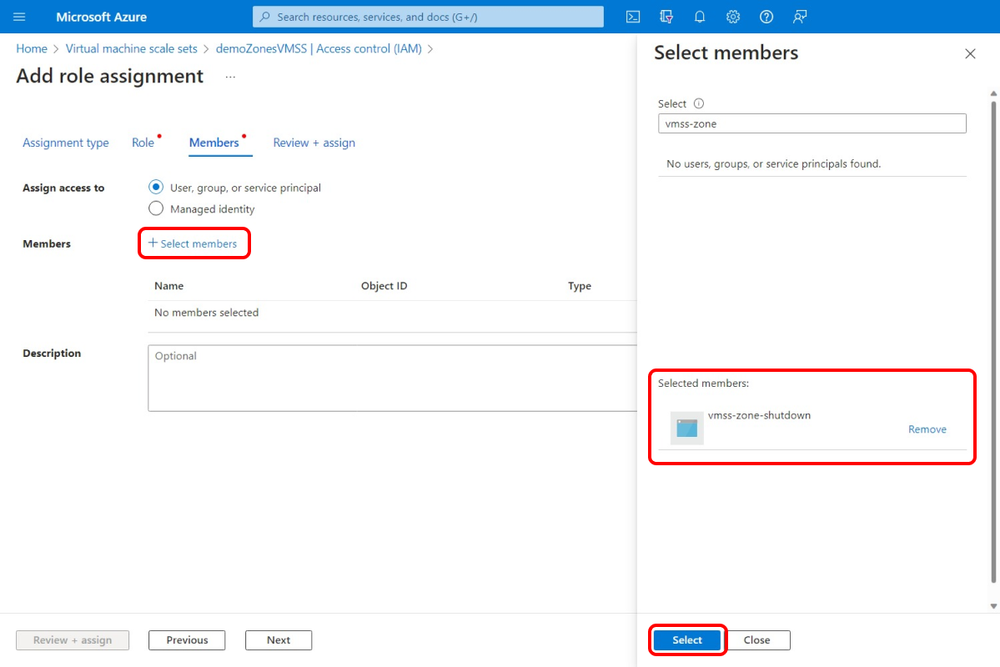
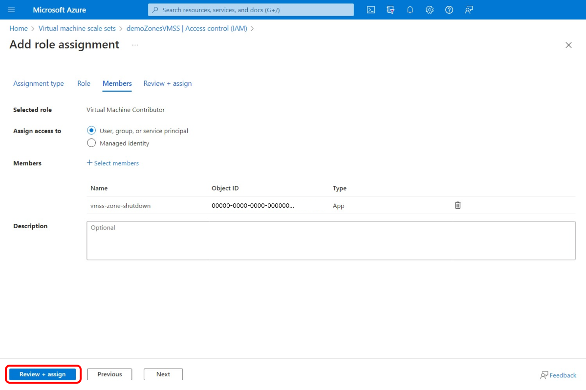
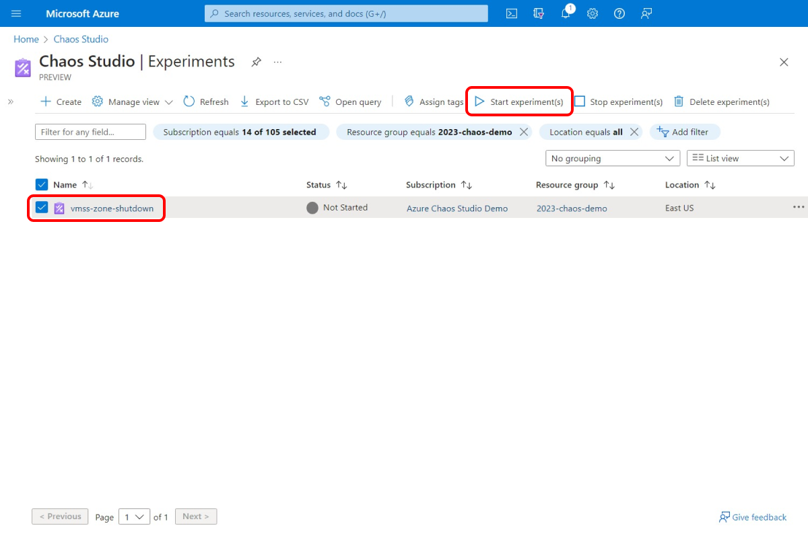
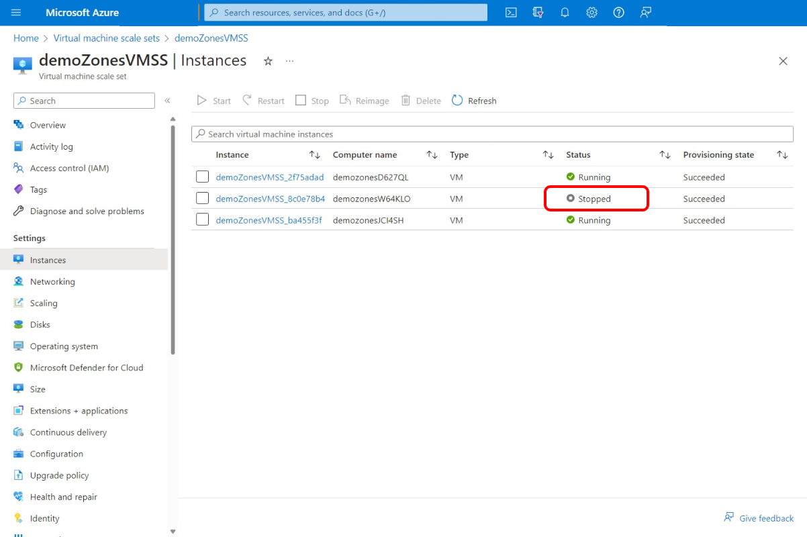

# Create a chaos experiment to shut down all targets in a zone

You can use dynamic targeting in a chaos experiment to choose a set of targets to run an experiment against. This guide shows how you can dynamically target a Virtual Machine Scale Set to shut down based on availability zone. Running this experiment can help you test failover to a Virtual Machine Scale Sets instance in a different region if there's an outage.

These same steps can be used to set up and run an experiment for any fault that supports dynamic targeting. Currently, only Virtual Machine Scale Sets shutdown supports dynamic targeting.

## Prerequisites

- An Azure subscription. [!INCLUDE [quickstarts-free-trial-note](../../includes/quickstarts-free-trial-note.md)] 
- An Azure Virtual Machine Scale Sets instance.
 
## Enable Chaos Studio on your Virtual Machine Scale Sets

Chaos Studio can't inject faults against a resource until that resource has been onboarded to Chaos Studio. To onboard a resource to Chaos Studio, create a [target and capabilities](chaos-studio-targets-capabilities.md) on the resource. Virtual Machine Scale Sets only has one target type (`Microsoft-VirtualMachineScaleSet`) and one capability (`shutdown`), but other resources may have up to two target types (one for service-direct faults and one for agent-based faults) and many capabilities.

1. Open the [Azure portal](https://portal.azure.com).
1. Search for **Chaos Studio** in the search bar.
1. Select **Targets** and find your Virtual Machine Scale Sets resource.
1. With the Virtual Machine Scale Sets resource selected, select **Enable targets** and **Enable service-direct targets**.

1. Select **Review + Enable** and **Enable**.

You've now successfully onboarded your Virtual Machine Scale Set to Chaos Studio.

## Create an experiment

With your Virtual Machine Scale Sets now onboarded, you can create your experiment. A chaos experiment defines the actions you want to take against target resources, organized into steps, which run sequentially, and branches, which run in parallel. 

1. Within Chaos Studio, navigate to **Experiments** and select **Create**.

1. Add a name for your experiment that complies with resource naming guidelines, and select **Next: Experiment designer**.

1. Within Step 1 and Branch 1, select **Add action**, then **Add fault**.

1. Select the **VMSS Shutdown (version 2.0)** fault. Choose your desired duration and whether you want the shutdown to be abrupt, then select **Next: Target resources**.

1. Choose the Virtual Machine Scale Sets resource that you want to use in the experiment, then select **Next: Scope**.

1. In the Zones dropdown, select the zone where you want Virtual Machines in the Virtual Machine Scale Sets instance to be shut down, then select **Add**.

1. Select **Review + create** and then **Create** to save the experiment.

## Give experiment permission to your Virtual Machine Scale Sets

When you create a chaos experiment, Chaos Studio creates a system-assigned managed identity that executes faults against your target resources. This identity must be given [appropriate permissions](chaos-studio-fault-providers.md) to the target resource for the experiment to run successfully. These steps can be used for any resource and target type by modifying the role assignment in step #3 to match the [appropriate role for that resource and target type](chaos-studio-fault-providers.md).

1. Navigate to your Virtual Machine Scale Sets resource and select **Access control (IAM)**, then select **Add role assignment**.

3. In the **Role** tab, choose **Virtual Machine Contributor** and then select **Next**.

1. Choose **Select members** and search for your experiment name. Choose your experiment and then **Select**. If there are multiple experiments in the same tenant with the same name, your experiment name is truncated with random characters added.

1. Select **Review + assign** then **Review + assign**.

## Run your experiment

You're now ready to run your experiment!

1. In **Chaos Studio**, navigate to the **Experiments** view, choose your experiment, and select **Start**.

1. Select **OK** to confirm that you want to start the experiment.
1. When the **Status** changes to **Running**, select **Details** for the latest run under **History** to see details for the running experiment. If any errors occur, you can view them within **Details** by selecting a failed Action and expanding **Failed targets**.

To see the impact, use a tool such as **Azure Monitor** or the **Virtual Machine Scale Sets** section of the portal to check if your Virtual Machine Scale Sets targets are shut down. If they're shut down, check to see that the services running on your Virtual Machine Scale Sets are still running as expected.

In this example, the chaos experiment successfully shut down the instance in Zone 1, as expected.

## Next steps

> [!TIP]
> If your Virtual Machine Scale Set uses an Autoscale policy, try improving this experiment by adding a parallel branch with the **Disable Autoscale** fault against the Virtual Machine Scale Set's `microsoft.insights/autoscaleSettings` resource.

Now that you've run a dynamically targeted Virtual Machine Scale Sets shutdown experiment, you're ready to:
- [Create an experiment that uses agent-based faults](chaos-studio-tutorial-agent-based-portal.md)
- [Manage your experiment](chaos-studio-run-experiment.md)